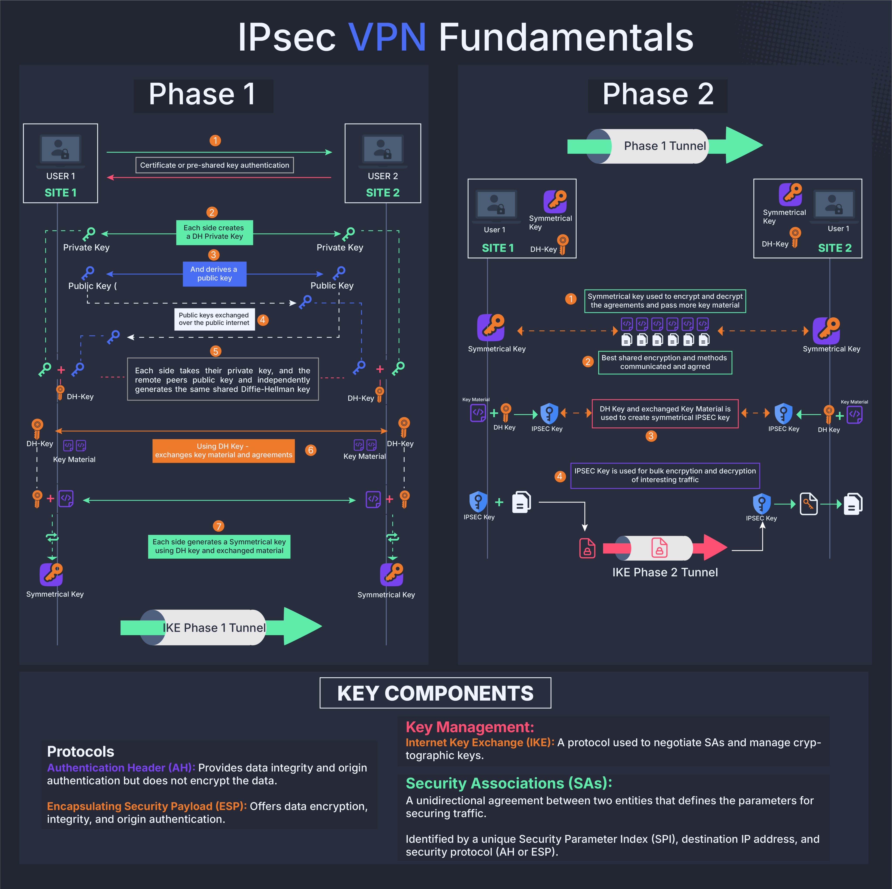

**Source:** [https://twitter.com/i/web/status/1913282849186206028](https://twitter.com/i/web/status/1913282849186206028)
**Original Post Date:** 2025-06-17 10:18:15

# IPSec VPN Fundamentals: Understanding IKE Phase 1 & Phase 2

## Introduction
The Internet Protocol Security (IPSec) framework is a critical component for securing network communications across untrusted networks. At its core lies the Internet Key Exchange (IKE) protocol, which establishes and maintains security associations through a two-phase process: Phase 1 creates a trusted tunnel between peers, while Phase 2 uses this tunnel to secure actual data traffic. Understanding these phases is essential for designing and troubleshooting enterprise VPNs.

## IKE Phase 1: Establishing the Secure Channel

Phase 1 (Main Mode) creates a secure channel between two peers through authentication, key exchange, and symmetric key establishment.

The process begins with mutual authentication using either pre-shared keys or digital certificates to verify peer identities.

1. Authentication using PSK or digital certificates
1. Diffie-Hellman key exchange for shared secret generation
1. Symmetric key establishment for Phase 1 tunnel

> **Note/Tip:** Always use strong pre-shared keys or properly configured certificate authorities to prevent authentication bypass.

> **Note/Tip:** Diffie-Hellman group selection (2 vs 5) impacts both security and performance - higher groups provide better security but consume more resources.

## IKE Phase 2: Securing Data Traffic

Phase 2 leverages the secure channel established in Phase 1 to create IPsec Security Associations (SAs) for encrypting actual data traffic.

Each SA is unidirectional, identified by a unique Security Parameter Index (SPI), and can use either AH or ESP protocols.

- Uses Phase 1's symmetric key for securing key exchange in Phase 2
- Derives new encryption keys using DH Key and exchanged material
- Establishes separate SAs for inbound and outbound traffic

> **Note/Tip:** Ensure rekeying intervals are configured appropriately to balance security and performance.

> **Note/Tip:** Monitor SA lifetimes to prevent tunnel disruptions due to expired keys.

## Security Protocols: AH vs ESP

IPSec offers two primary protocols for securing data: Authentication Header (AH) and Encapsulating Security Payload (ESP).

- AH provides integrity checking but no encryption, useful when transport mode is needed
- ESP offers both confidentiality and integrity protection, suitable for most modern deployments

> **Note/Tip:** Use ESP with AH if you need both encryption and separate integrity checks.

## Key Takeaways

- Phase 1 establishes a secure channel using IKE SA before any data traffic is exchanged
- Phase 2 creates separate IPsec SAs for each direction, leveraging Phase 1's security
- Choose between AH and ESP based on whether confidentiality is required alongside integrity checking

## Conclusion
Understanding the interplay between IKE Phases and IPsec protocols is crucial for building secure VPNs. Proper configuration of authentication methods, key exchange parameters, and SA lifetimes ensures both security and operational efficiency.

## External References

- [RFC 4301 - Security Architecture for the Internet Protocol](https://tools.ietf.org/html/rfc4301)
- [RFC 7296 - Internet Key Exchange Protocol Version 2 (IKEv2)](https://tools.ietf.org/html/rfc7296)

## Media

**Image Description:** ### Description of the Image: IPsec VPN Fundamentals

The image provides a detailed overview of the **IPsec (Internet Protocol Security) VPN (Virtual Private Network)** fundamentals, specifically focusing on the two phases of the **Internet Key Exchange (IKE)** protocol: **Phase 1** and **Phase 2**. The diagram is divided into two main sections, each illustrating the processes involved in these phases, along with key components and technical details.

---

### **1. Phase 1: IKE Phase 1 Tunnel**
#### **Objective:**
Establish a secure channel (IKE SA) between two peers (Site 1 and Site 2) for negotiating and managing security associations (SAs) in Phase 2.

#### **Steps:**
1. **Authentication:**
   - **User 1 (Site 1)** and **User 2 (Site 2)** authenticate each other using either:
     - A **pre-shared key (PSK)** or
     - A **digital certificate**.
   - This ensures the identity of the peers is verified.

2. **Key Exchange:**
   - Each peer generates a **private key** and derives a corresponding **public key** using the **Diffie-Hellman (DH) key exchange protocol**.
   - The public keys are exchanged over the public internet.

3. **Shared Secret Key Generation:**
   - Each peer uses their private key and the other peer's public key to independently generate the same **shared secret key** (DH Key).
   - This shared secret is used to derive a **symmetric key** for encrypting and decrypting data in Phase 1.

4. **Key Material Exchange:**
   - The peers exchange key material and agreements, which are encrypted using the symmetric key derived from the DH Key.

5. **Symmetric Key Establishment:**
   - A **symmetric key** is established for encrypting and decrypting data in the IKE Phase 1 tunnel.

6. **IKE Phase 1 Tunnel:**
   - The tunnel is established, providing a secure channel for further negotiations in Phase 2.

---

### **2. Phase 2: IKE Phase 2 Tunnel**
#### **Objective:**
Establish secure data channels (IPsec SAs) for encrypting and decrypting actual data traffic between the peers.

#### **Steps:**
1. **Symmetric Key Usage:**
   - The symmetric key established in Phase 1 is used to encrypt and decrypt data exchanged in Phase 2.

2. **Key Material Exchange:**
   - Additional key material is exchanged, which is used to derive new symmetric keys for data encryption and decryption.

3. **DH Key and Key Material Communication:**
   - The Diffie-Hellman key and exchanged key material are communicated securely.

4. **IPsec Key Derivation:**
   - The DH Key and exchanged key material are used to derive a **symmetric IPsec key** for encrypting and decrypting data.

5. **IPsec Key Usage:**
   - The IPsec key is used for bulk encryption and decryption of data traffic.

6. **IKE Phase 2 Tunnel:**
   - The tunnel is established, providing secure channels for data transmission.

---

### **Key Components and Technical Details**
#### **1. Protocols**
- **Authentication Header (AH):**
  - Provides data integrity and origin authentication.
  - Does not encrypt the data but ensures that the data has not been tampered with during transmission.
- **Encapsulating Security Payload (ESP):**
  - Offers data encryption, integrity, and origin authentication.
  - Encrypts the data payload and ensures its integrity.

#### **2. Key Management: IKE**
- **Internet Key Exchange (IKE):**
  - A protocol used to negotiate Security Associations (SAs) and manage cryptographic keys.
  - Ensures secure key exchange and management between peers.

#### **3. Security Associations (SAs)**
- **Unidirectional Agreements:**
  - Define the parameters for securing traffic between two entities.
- **Identification:**
  - Identified by a unique **Security Parameter Index (SPI)**, destination IP address, and the security protocol (AH or ESP).

---

### **Visual Elements**
- **Color Coding:**
  - **Green Arrows:** Represent the flow of data or processes.
  - **Orange Circles:** Highlight key steps or components.
  - **Purple Icons:** Represent symmetric keys.
  - **Blue Icons:** Represent public keys.
  - **Gray Boxes:** Contain detailed explanations of steps.

- **Icons and Symbols:**
  - **Locks:** Represent encryption or secure communication.
  - **Keys:** Represent private or public keys.
  - **Files:** Represent data or key material.

---

### **Summary**
The image provides a comprehensive visual explanation of the IPsec VPN process, breaking it down into two phases:
1. **Phase 1 (IKE Phase 1):** Establishes a secure channel for negotiating and managing security associations.
2. **Phase 2 (IKE Phase 2):** Establishes secure data channels for encrypting and decrypting actual data traffic.

The diagram includes detailed steps, key components, and technical protocols, making it a valuable resource for understanding the fundamentals of IPsec VPNs.
