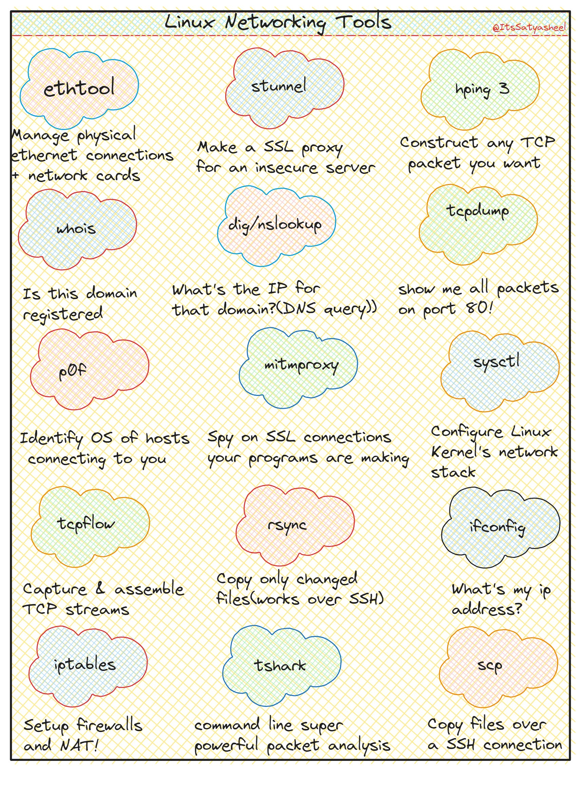

**Source:** [https://twitter.com/i/web/status/1868687533317718277](https://twitter.com/i/web/status/1868687533317718277)
**Original Post Date:** 2025-05-28 07:51:37

# Essential Linux Networking Tools: A Comprehensive Guide for System Administrators

## Introduction
Linux provides a rich set of networking tools that are fundamental to modern system administration. This comprehensive guide covers the most important utilities across categories such as network configuration, traffic analysis, file transfer, and security. Understanding these tools enables efficient network troubleshooting, performance optimization, and robust security implementation in Linux environments.

## Network Configuration & Diagnostics

Tools like ethtool and ifconfig provide essential capabilities for managing physical network interfaces and their configurations. These utilities are crucial for diagnosing hardware issues, configuring interface parameters, and monitoring network device status.

stunnel adds a layer of security by creating SSL proxies for insecure connections, making it an indispensable tool for secure communication.

```bash
# Check interface settings
sudo ethtool eth0
# Enable promiscuous mode
sudo ifconfig eth0 promisc
```

```bash
# Configure stunnel for secure connection
cat << EOF > /etc/stunnel/conf
[service]
accept = 443
connect = 80
EOF
```

- Use ethtool to verify link speeds and duplex settings
- ifconfig is deprecated - prefer ip command for new configurations

## Traffic Analysis & Monitoring

tcpdump and tshark are powerful packet capture tools that enable deep network analysis. tcpflow reconstructs TCP streams, providing a high-level view of data transfers.

p0f performs passive OS fingerprinting by analyzing unique patterns in network traffic.

```bash
# Capture HTTP traffic
tcpdump -i eth0 'tcp port 80'
# Reconstruct TCP session
tcpflow -r capture.pcap
```

## Security & Firewalling

iptables is the cornerstone of Linux firewall configuration, offering comprehensive packet filtering and NAT capabilities.

mitmproxy enables inspection of encrypted traffic in a controlled environment.

```bash
# Basic iptables rule
iptables -A INPUT -p tcp --dport 80 -j ACCEPT
```

## Key Takeaways

- ethtool is essential for physical network interface configuration and diagnostics.
- tcpdump provides low-level packet analysis capabilities.
- iptables forms the foundation of Linux firewalling.

## Conclusion
Mastering these Linux networking tools empowers system administrators to effectively manage, troubleshoot, and secure their networks. Regular practice with these utilities ensures efficient handling of network-related tasks in both development and production environments.

## External References

- [Linux Network Administrator's Guide](https://www.tldp.org/LDP/nag2/nag2.pdf)
- [iptables Manual Pages](https://man7.org/linux/man-pages/man8/iptables.8.html)


## Media

**Image Description:** The image is a colorful, hand-drawn infographic titled **"Linux Networking Tools"**. It is designed to showcase a variety of Linux networking tools, each represented in a cloud-shaped bubble with a brief description of its functionality. The background is a light yellow with a subtle grid pattern, and the text and bubbles are organized in a grid-like layout. The tools are categorized into different functional groups, and each tool is highlighted with a distinct color for easy differentiation. Below is a detailed breakdown:

---

### **Main Subject: Linux Networking Tools**
The infographic lists and describes various Linux networking tools, each with a brief explanation of its purpose. The tools are organized into rows and columns, with each tool represented in a cloud-shaped bubble.

---

### **Tools and Descriptions:**

#### **Row 1:**
1. **ethtool (Blue)**
   - **Description:** Manage physical Ethernet connections and network cards.
   - **Purpose:** Used for configuring and diagnosing network interfaces.

2. **stunnel (Red)**
   - **Description:** Make an SSL proxy for an insecure server.
   - **Purpose:** Encrypts and decrypts network connections using SSL/TLS.

3. **haproxy (Green)**
   - **Description:** Construct any TCP packet you want.
   - **Purpose:** A high-performance TCP/HTTP load balancer and proxy server.

#### **Row 2:**
4. **whois (Pink)**
   - **Description:** Check if a domain is registered.
   - **Purpose:** Queries domain registration information.

5. **dig/nslookup (Blue)**
   - **Description:** Find the IP for a domain (DNS query).
   - **Purpose:** DNS lookup tools to resolve domain names to IP addresses.

6. **tcpdump (Green)**
   - **Description:** Show all packets on port 80.
   - **Purpose:** Captures network traffic for analysis.

#### **Row 3:**
7. **p0f (Pink)**
   - **Description:** Identify the OS of hosts connecting to you.
   - **Purpose:** Passive OS fingerprinting tool.

8. **mitmproxy (Blue)**
   - **Description:** Spy on SSL connections your programs are making.
   - **Purpose:** An interactive, SSL-capable, man-in-the-middle proxy for HTTP(S).

9. **sysctl (Green)**
   - **Description:** Configure Linux kernel's network stack.
   - **Purpose:** Modify kernel parameters related to networking.

#### **Row 4:**
10. **tcpflow (Green)**
    - **Description:** Capture and assemble TCP streams.
    - **Purpose:** Captures and reconstructs TCP streams for analysis.

11. **rsync (Pink)**
    - **Description:** Copy only changed files (works over SSH).
    - **Purpose:** Efficiently synchronizes files and directories between systems.

12. **ifconfig (Blue)**
    - **Description:** What's my IP address?
    - **Purpose:** Displays and configures network interfaces.

#### **Row 5:**
13. **iptables (Pink)**
    - **Description:** Setup firewalls and NAT.
    - **Purpose:** Configures firewall rules and network address translation.

14. **tshark (Green)**
    - **Description:** Command-line network analyzer.
    - **Purpose:** Captures and analyzes network traffic (similar to Wireshark).

15. **scp (Orange)**
    - **Description:** Copy files over SSH.
    - **Purpose:** Securely copies files between systems using SSH.

---

### **Design Elements:**
1. **Cloud-Shaped Bubbles:** Each tool is enclosed in a cloud-shaped bubble, making the layout visually appealing and easy to scan.
2. **Color-Coding:** Different tools are color-coded to group similar functionalities:
   - **Blue:** Tools related to network configuration and diagnostics.
   - **Red/Pink:** Tools related to identification and analysis.
   - **Green:** Tools related to packet capture and network traffic analysis.
   - **Orange:** Tools related to file transfer and SSH.
3. **Hand-Drawn Style:** The text and bubbles are hand-drawn, giving the infographic a personal and approachable feel.
4. **Grid Pattern:** The background has a subtle grid pattern, which helps in organizing the tools neatly.

---

### **Additional Notes:**
- The title at the top, **"Linux Networking Tools"**, is prominently displayed in a bold font.
- The username or handle **"@ItsSatyashree"** is mentioned in the top-right corner, indicating the creator of the infographic.
- The descriptions are concise and to the point, making it easy for readers to understand the purpose of each tool.

---

### **Overall Purpose:**
The infographic serves as a quick reference guide for Linux networking tools, highlighting their primary functions in a visually engaging manner. It is useful for both beginners and experienced users who want a quick overview of essential networking utilities in Linux.
