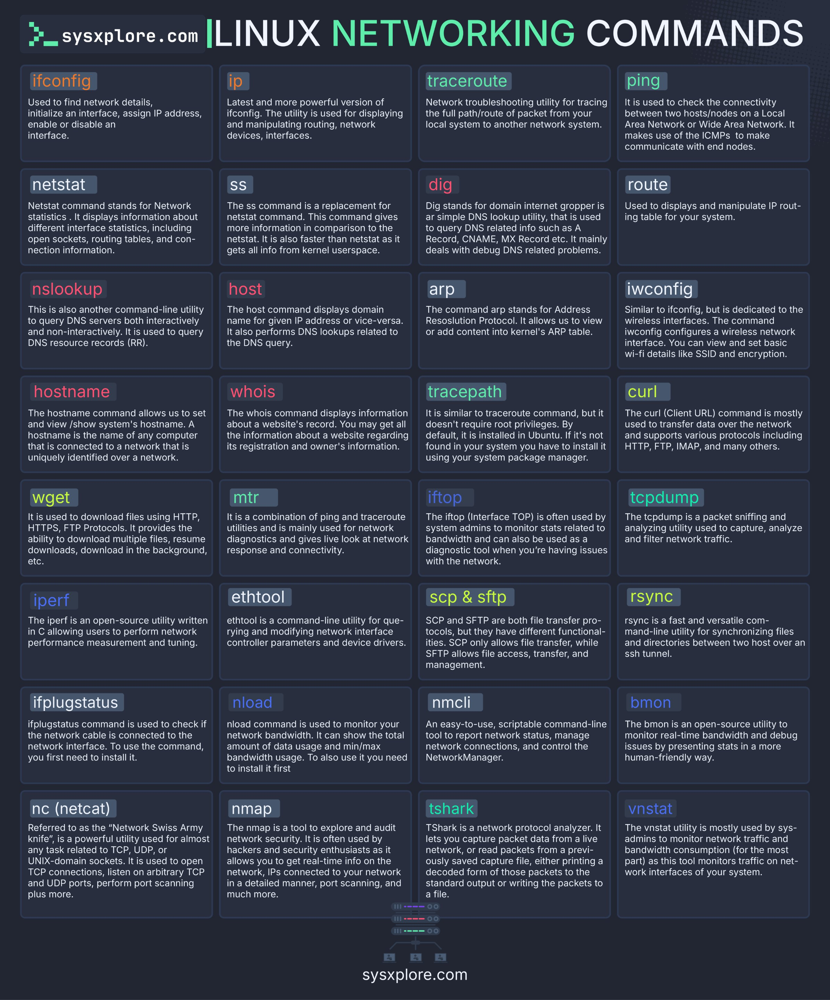

**Source:** [https://twitter.com/i/web/status/1878048744999997441](https://twitter.com/i/web/status/1878048744999997441)
**Original Post Date:** 2025-05-27 18:10:17

# Linux Networking Command Reference Guide: Categorized Tools for System Administration

## Introduction
This reference guide compiles essential Linux networking commands organized into functional categories. Designed for system administrators, network engineers, and developers, it provides quick access to tools needed for managing interfaces, diagnosing networks, querying DNS information, monitoring bandwidth, transferring files securely, optimizing performance, and troubleshooting connectivity issues.

## Interface Management Tools

Network interface management commands are fundamental for system administration. The 'ip' command supersedes the older 'ifconfig', offering enhanced functionality for displaying and manipulating network devices, routing tables, and interface states.

- 'ip': Modern replacement for ifconfig with advanced features
- 'iwconfig': Manages wireless interfaces and Wi-Fi configurations
- 'ifplugstatus': Monitors physical connection status of network interfaces

> **Note/Tip:** Prefer 'ip' over deprecated 'ifconfig' for better IPv6 support and advanced features

## Network Diagnostics and Troubleshooting

This category includes essential tools for testing connectivity, tracing routes, and monitoring network performance. Commands like 'ping', 'traceroute', and 'nmap' are crucial for identifying network issues.

```bash
traceroute -n 8.8.8.8
mtr --report-mode google.com
```

- 'mtr': Combines ping and traceroute for real-time diagnostics
- 'netstat': Displays network connections, routing tables, and interface statistics

## DNS and Domain Information Tools

DNS management commands are vital for resolving domain names to IP addresses. 'dig' offers more detailed DNS information than the simpler 'nslookup'.

- 'dig': Queries DNS records with comprehensive output
- 'host': Performs simple forward/reverse DNS lookups
- 'whois': Retrieves domain registration and ownership details

## File Transfer and Network Management

Secure file transfer tools like 'scp' and 'rsync' are essential for maintaining system configurations across networks. 'NetworkManager' provides centralized network management.

- 'scp': Secure copy over SSH for single files
- 'rsync': Efficient file synchronization with incremental updates
- 'nmcli': Command-line interface to NetworkManager

## Key Takeaways

- Organize command usage by function for efficient problem-solving
- Modern tools like 'ip' and 'mtr' offer more functionality than legacy commands
- Use secure transfer protocols (scp, sftp) instead of unencrypted alternatives

## Conclusion
Mastering these networking commands is essential for effective Linux system administration. The categorized approach enables quick reference during troubleshooting or configuration tasks, while understanding the relationships between commands provides deeper insight into network operations.

## External References

- [SysXplorer Command Reference](https://sysxplorere.com/linux-networking-commands)
- [Linux Man Pages Online](https://man7.org/linux/man-pages/)


## Media

**Image Description:** ### Description of the Image

The image is a comprehensive cheat sheet or reference guide titled **"Linux Networking Commands"**, designed to provide an overview of various Linux networking commands. The layout is organized in a grid format, with each command listed in a separate box. The background is dark, and the text is primarily in white, with command names highlighted in different colors for easy readability. The website **sysxplorere.com** is mentioned at the top and bottom of the image.

### Main Subject
The main subject of the image is a collection of **Linux Networking Commands**, each accompanied by a brief description of its purpose and usage. The commands are categorized into different functional groups, such as interface management, network diagnostics, DNS queries, bandwidth monitoring, file transfer, and more.

### Structure and Layout
The image is divided into a grid of 20 rows and 4 columns, resulting in 80 individual boxes, each containing a command and its description. The commands are listed alphabetically, and each box is structured as follows:
1. **Command Name**: Highlighted in a colored box.
2. **Description**: A brief explanation of the command's purpose and usage.

### Key Commands and Their Descriptions
Below is a detailed breakdown of the commands and their functionalities, categorized by their primary use:

#### **1. Interface Management**
- **ifconfig**: Used to find network details, initialize an interface, assign IP addresses, enable or disable interfaces.
- **ip**: A more powerful and modern version of `ifconfig`. Used for displaying and manipulating network devices, interfaces, routing, and more.
- **iwconfig**: Configures and displays wireless interfaces, including Wi-Fi details like SSID and encryption.
- **ifplugstatus**: Checks if the network cable is connected to the network interface.
- **nc (netcat)**: A versatile networking utility for reading from and writing to network connections, often referred to as the "Swiss Army knife" of networking tools.

#### **2. Network Diagnostics**
- **ping**: Checks connectivity between two hosts/nodes by sending ICMP packets.
- **traceroute**: Traces the full path/route of a packet from the local system to a remote system.
- **tracepath**: Similar to `traceroute`, but does not require root privileges.
- **mtr (MyTraceroute)**: Combines `ping` and `traceroute` for network diagnostics, providing live look at network bandwidth and connectivity.
- **nload**: Monitors network bandwidth usage in real-time.
- **nmap**: A powerful tool for network exploration and security auditing, used for port scanning and network discovery.
- **tshark**: A network protocol analyzer that captures and decodes network packets in real-time.

#### **3. DNS and Domain Information**
- **nslookup**: Queries DNS servers for domain information, both interactively and non-interactively.
- **dig**: A DNS lookup utility that queries DNS-related records like A, CNAME, MX, etc.
- **host**: Displays domain name information for a given IP address or vice versa.
- **whois**: Displays information about a website's registration and ownership details.

#### **4. Routing and ARP**
- **netstat**: Displays network statistics, including interface statistics, open sockets, routing tables, and connection information.
- **ss**: A replacement for `netstat`, providing more detailed information about sockets.
- **route**: Displays and manipulates the IP routing table.
- **arp**: Displays and manipulates the kernel's ARP table, which maps IP addresses to MAC addresses.

#### **5. Bandwidth Monitoring**
- **iftop**: Monitors bandwidth usage in real-time, showing live stats of network traffic.
- **bmon**: An open-source utility for monitoring real-time bandwidth usage and debugging network issues.

#### **6. File Transfer**
- **scp**: Securely copies files between hosts over an SSH connection.
- **sftp**: Provides secure file transfer capabilities over SSH.
- **rsync**: Synchronizes files and directories between two hosts over a network, supporting incremental transfers.
- **wget**: Downloads files from the web using HTTP, HTTPS, or FTP protocols, supporting resumable downloads.

#### **7. Network Performance**
- **iperf**: Measures network performance by sending and receiving data between two hosts.
- **ethtool**: Queries and modifies network interface controller parameters and device drivers.
- **ncat**: A versatile networking utility for reading from and writing to network connections.

#### **8. Network Manager**
- **nmcli**: A command-line tool for managing NetworkManager, which handles network connections and configurations.
- **vnstati**: Monitors network traffic and bandwidth usage, presenting statistics in a human-readable format.

#### **9. Debugging and Troubleshooting**
- **mtr**: Combines `ping` and `traceroute` for network diagnostics, providing live look at network bandwidth and connectivity.
- **tshark**: Captures and decodes network packets in real-time, useful for debugging network issues.
- **tcpdump**: A packet sniffer that captures network traffic for analysis.

### Additional Notes
- The commands are organized alphabetically, making it easy to locate a specific command.
- Each command box includes a brief but concise description, highlighting its primary use and functionality.
- The image serves as a quick reference guide for Linux system administrators, network engineers, and developers working with networking tasks.

### Design and Formatting
- **Color Coding**: Command names are highlighted in different colors (e.g., green, blue, purple) for easy identification.
- **Consistent Layout**: Each command box follows the same structure, ensuring uniformity and readability.
- **Dark Theme**: The dark background with white text enhances readability, especially for long periods of use.

### Conclusion
This image is a well-organized and comprehensive cheat sheet for Linux networking commands. It provides a quick reference for system administrators, developers, and network engineers, covering a wide range of networking tasks from basic interface management to advanced network diagnostics and file transfer. The use of color coding and a consistent layout makes it user-friendly and easy to navigate.
