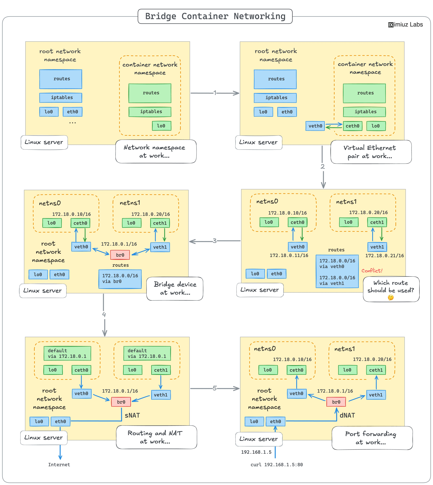

**Source:** [https://twitter.com/i/web/status/1887896876709556688](https://twitter.com/i/web/status/1887896876709556688)
**Original Post Date:** 2025-06-17 09:53:41

# Container Networking Architecture: Bridge Mode and Network Address Translation

## Introduction
Linux container networking relies heavily on network namespaces and bridge devices to provide isolated yet interconnected network environments. This article explores the architectural components and mechanisms from basic networking setup through advanced routing and translation techniques using bridge mode configuration.

## Stage 1: Basic Networking in Linux Containers

Container networking begins with isolated network namespaces, each containing essential components like routes, iptables, and interfaces. The root namespace manages the physical interface (eth0) while container namespaces maintain virtual Ethernet interfaces.

Virtual communication between host and containers is established through veth pairs - one end in the host's namespace, the other in the container's namespace.

## Stage 2: Bridge Device Configuration

The bridge device (br0) acts as a virtual switch connecting multiple network namespaces. Each namespace receives an IP address from the same subnet (172.18.0.x/16), enabling direct container-to-container communication.

Virtual Ethernet interfaces (cethX and vethX) connect containers to the bridge, forming a logical network topology for inter-container traffic.

- Container netns0: 172.18.0.10/16
- Container netns1: 172.18.0.20/16
- Bridge br0: 172.18.0.1/16

## Stage 3: Internet Access via NAT

Source Network Address Translation (SNAT) translates container internal IPs to the host's external IP address for outgoing traffic.

The bridge routes internal traffic, while the host's eth0 interface handles external communication with a public IP (192.168.1.5).

## Stage 4: Port Forwarding and DNAT

Destination Network Address Translation (DNAT) enables external access to container services by translating incoming requests to internal container IPs.

Port forwarding rules on the host's eth0 interface map specific ports to corresponding container ports.

> **Note/Tip:** Configure DNAT rules carefully to avoid port conflicts and ensure proper security policies

> **Note/Tip:** Use SNAT with masquerading for consistent external IP presentation

## Key Takeaways

- Bridge mode provides isolated yet interconnected container networks through virtual switching.
- NAT mechanisms enable secure communication between internal containers and the public internet.
- Port forwarding rules facilitate controlled access to container services from external clients.

## Conclusion
Understanding container networking architecture, including bridge devices, virtual interfaces, and NAT translation is crucial for building scalable and secure containerized applications. This foundation enables efficient network resource isolation while maintaining necessary connectivity patterns.

## External References

- [Linux Bridge Documentation](https://man7.org/linux/man-pages/man8/bridge-utils-interfaces.5.html)
- [Docker Networking Guide](https://docs.docker.com/network/)

## Media

**Image Description:** ### Description of the Image: Bridge Container Networking Diagram

The image is a detailed diagram illustrating the networking concepts and mechanisms involved in container networking, specifically focusing on **bridge networking** in a Linux environment. The diagram is divided into multiple sections, each highlighting a different stage or aspect of the networking process. Below is a detailed breakdown:

---

#### **1. Overview of the Diagram**
The title at the top reads: **"Bridge Container Container Networking Networking"**, which emphasizes the focus on container networking using bridge interfaces. The diagram is credited to **IXimiu Labs**.

The diagram is structured into several stages, each labeled with a number (1 to 5), illustrating the progression of networking concepts from basic networking to advanced routing and NAT (Network Address Translation).

---

#### **2. Stage 1: Basic Networking in a Linux Server**
- **Root Network Namespace**:
  - Contains standard networking components:
    - **routes**: Routing table.
    - **iptables**: Firewall rules.
    - **lo0**: Loopback interface.
    - **eth0**: Physical network interface.
  - This represents the default networking setup of a Linux server.

- **Container Network Namespace**:
  - A separate network namespace for a container.
  - Contains:
    - **routes**: Routing table specific to the container.
    - **iptables**: Firewall rules for the container.
    - **lo0**: Loopback interface.
    - **ceth0**: Virtual Ethernet interface connected to the container.
  - The container is isolated from the root network namespace but can communicate through the virtual Ethernet interface.

- **Connection**:
  - The container's **ceth0** is connected to the root network namespace's **veth0** (virtual Ethernet pair).
  - This establishes a virtual network connection between the container and the host.

---

#### **3. Stage 2: Virtual Ethernet Pair**
- **Virtual Ethernet Pair**:
  - The **veth0** interface in the root network namespace is paired with the **ceth0** interface in the container network namespace.
  - This creates a virtual Ethernet connection, allowing communication between the host and the container.

- **Root Network Namespace**:
  - Contains the **veth0** interface, which is the other end of the virtual Ethernet pair.
  - The **veth0** interface is connected to the container's **ceth0**.

- **Container Network Namespace**:
  - The **ceth0** interface is connected to the **veth0** interface in the root network namespace.

---

#### **4. Stage 3: Bridge Device**
- **Bridge Device (br0)**:
  - A bridge device (**br0**) is introduced in the root network namespace.
  - The bridge acts as a virtual switch, allowing multiple network interfaces to communicate with each other.

- **Network Namespaces (netns0 and netns1)**:
  - Two network namespaces (**netns0** and **netns1**) are created, each representing a container.
  - Each namespace has:
    - **lo0**: Loopback interface.
    - **ceth0/ceth1**: Virtual Ethernet interfaces connected to the bridge.
  - The **veth0** and **veth1** interfaces in the root network namespace are connected to the bridge (**br0**).

- **IP Addresses**:
  - **netns0**: Assigned IP address **172.18.0.10/16**.
  - **netns1**: Assigned IP address **172.18.0.20/16**.
  - The bridge (**br0**) has an IP address of **172.18.0.1/16**.

- **Routing**:
  - The bridge (**br0**) routes traffic between the two network namespaces (**netns0** and **netns1**).

---

#### **5. Stage 4: Routing and NAT**
- **Routing**:
  - The root network namespace now includes a routing table that directs traffic to the bridge (**br0**).
  - The bridge (**br0**) is used as the default gateway for the container network namespaces.

- **SNAT (Source Network Address Translation)**:
  - SNAT is applied to the **veth0** interface in the root network namespace.
  - This translates the source IP addresses of packets from the containers to the IP address of the host's physical interface (**eth0**).

- **Physical Interface (eth0)**:
  - The **eth0** interface is connected to the Internet with an IP address of **192.168.1.5**.

- **Internet Communication**:
  - Containers can communicate with the Internet through the host's **eth0** interface, with SNAT translating their internal IP addresses to the host's external IP address.

---

#### **6. Stage 5: Port Forwarding and DNAT**
- **DNAT (Destination Network Address Translation)**:
  - DNAT is applied to the **veth0** interface in the root network namespace.
  - This translates the destination IP addresses of incoming packets from the Internet to the internal IP addresses of the containers.

- **Port Forwarding**:
  - The host's **eth0** interface is configured to forward specific ports to the containers.
  - For example, port **80** on the host is forwarded to port **80** on a container.

- **External Access**:
  - External clients can access services running in the containers by connecting to the host's **eth0** interface.
  - For example, `curl 192.168.1.5:80` will be forwarded to a container running a service on port **80**.

---

#### **7. Key Technical Details**
- **Network Namespaces**: Used to isolate network resources for containers.
- **Virtual Ethernet Pairs (veth)**: Used to connect the host and container network namespaces.
- **Bridge Device (br0)**: Acts as a virtual switch to route traffic between network namespaces.
- **SNAT and DNAT**: Used for translating IP addresses and ports to enable communication between containers and the Internet.
- **Routing**: Configured to direct traffic between the host and containers.

---

#### **8. Summary**
The diagram illustrates the step-by-step process of setting up container networking using bridge interfaces in a Linux environment. It covers:
1. Basic networking in a Linux server.
2. Virtual Ethernet pairs for connecting containers to the host.
3. Bridge devices for inter-container communication.
4. Routing and SNAT for Internet access.
5. DNAT and port forwarding for external access to container services.

This comprehensive approach ensures that containers can communicate with each other and the Internet while maintaining network isolation and security.
