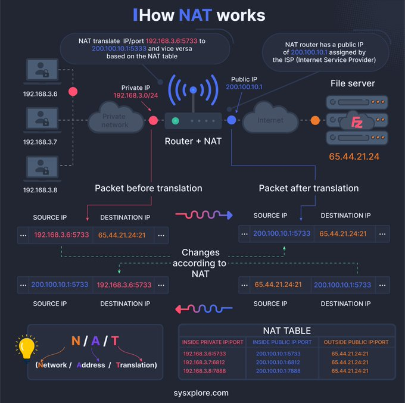

**Source:** [https://twitter.com/i/web/status/1871289767524257992](https://twitter.com/i/web/status/1871289767524257992)
**Original Post Date:** 2025-05-27 16:16:08

# Network Address Translation (NAT): Understanding Private-to-Public IP Mapping

## Introduction
Network Address Translation (NAT) is a critical networking mechanism that enables multiple devices on a private network to share a single public IP address. This knowledge base item explores how NAT works through its key components, the translation process, and the crucial role of the NAT table in maintaining bidirectional communication.

## Network Components and Architecture

A typical private network uses addresses from the RFC 1918 reserved ranges (e.g., 192.168.x.x). In this example, devices use IPs 192.168.3.6 through 192.168.3.8 within subnet 192.168.3.0/24.

The router functions as a gateway between the private network and the internet, equipped with a single public IP (e.g., 200.100.10.1) provided by the ISP. This configuration allows multiple internal devices to share one external address.

> **Note/Tip:** Always use RFC 1918 addresses for private networks to prevent conflicts with public IP ranges.

> **Note/Tip:** Ensure proper subnet mask implementation (24-bit in this case) for accurate network segmentation

## Packet Translation Process

Outbound packets undergo source address translation: the router replaces private IPs with its public IP, maintaining port mappings to track return traffic.

Return packets are processed by consulting the NAT table for reverse mapping to restore original private addresses and ports.

```json
{
  "original": {
    "source_ip": "192.168.3.6",
    "destination_ip": "65.44.21.24",
    "port": 5733
  },
  "translated": {
    "source_ip": "200.100.10.1",
    "destination_ip": "65.44.21.24",
    "port": 5733
  }
}
```

## NAT Table Operations

The NAT table maintains a mapping of private-public address pairs and their associated ports, ensuring bidirectional communication.

Each entry includes the original private IP:port combination, the translated public IP:port pair, and the external server's IP:port.

- Inside Private IP:Port (e.g., 192.168.3.6:5733)
- Inside Public IP:Port (e.g., 200.100.10.1:5733)
- Outside Public IP:Port (e.g., 65.44.21.24:21)

> **Note/Tip:** Monitor NAT table size to prevent address exhaustion in high-traffic scenarios

> **Note/Tip:** Implement proper port allocation strategies to avoid conflicts

## Visual Representation Elements

The infographic uses color coding (red for private, blue for public IPs) and directional arrows to illustrate packet flow.

Key components are clearly labeled: user devices, router with NAT function, internet cloud representation, and external servers.

## Key Takeaways

- NAT enables multiple devices to share a single public IP address through translation of private IPs
- The NAT table is crucial for maintaining bidirectional communication between private and public networks
- Proper port management and mapping are essential for effective NAT operation

## Conclusion
Understanding NAT's components, translation process, and table operations is fundamental for designing robust network architectures. This knowledge ensures efficient IP address utilization while maintaining secure external connectivity.

## External References

- [RFC 3022 - Traditional IP Network Address Translator](https://tools.ietf.org/html/rfc3022)
- [Cisco NAT Documentation](https://www.cisco.com/c/en/us/td/docs/security/firepower/65/configuration/guide/config_nat.html)


## Media

**Image Description:** The image is an infographic that explains how Network Address Translation (NAT) works. It provides a detailed visual representation of the process, including the flow of data packets, the role of the NAT table, and the transformation of private IP addresses to public IP addresses. Below is a detailed breakdown of the image:

---

### **Main Subject: How NAT Works**
The infographic illustrates the process of NAT, which is a method used by routers to translate private IP addresses within a local network into a single public IP address for communication over the internet. This allows multiple devices on a private network to share a single public IP address, enhancing security and conserving IP addresses.

---

### **Key Components and Flow**
1. **Private Network:**
   - The local network is represented with private IP addresses:
     - `192.168.3.6`
     - `192.168.3.7`
     - `192.168.3.8`
   - These addresses are part of the private subnet `192.168.3.0/24`.

2. **Router + NAT:**
   - The router acts as the gateway between the private network and the internet.
   - It performs NAT by translating private IP addresses into a single public IP address.

3. **Public IP Address:**
   - The router has a public IP address (`200.100.10.1`) assigned by the ISP (Internet Service Provider).
   - This public IP is used to represent the entire private network on the internet.

4. **Internet:**
   - The internet is depicted as a cloud, showing the connection between the router and external servers.

5. **File Server:**
   - An external file server is shown with a public IP address (`65.44.21.24`).
   - This server is accessed by devices on the private network via the router.

---

### **Packet Translation Process**
The infographic illustrates the transformation of packets as they travel between the private network and the internet:

1. **Packet Before Translation:**
   - **Source IP:** `192.168.3.6`
   - **Destination IP:** `65.44.21.24`
   - **Port:** `5733` (for example)

2. **Router + NAT:**
   - The router modifies the packet:
     - **Source IP:** Changed from `192.168.3.6` to the router's public IP (`200.100.10.1`).
     - **Port:** Changed to a unique port number (e.g., `5733` in this case) to maintain a mapping in the NAT table.

3. **Packet After Translation:**
   - **Source IP:** `200.100.10.1`
   - **Destination IP:** `65.44.21.24`
   - **Port:** `5733`

4. **Return Packet:**
   - When the file server responds:
     - **Source IP:** `65.44.21.24`
     - **Destination IP:** `200.100.10.1`
     - **Port:** `5733`
   - The router uses the NAT table to translate the packet back to the original private IP address (`192.168.3.6`) and port.

---

### **NAT Table**
The NAT table is a crucial component that keeps track of the mappings between private and public IP addresses and ports. The table in the infographic shows:

| **Inside Private IP:Port** | **Inside Public IP:Port** | **Outside Public IP:Port** |
|----------------------------|---------------------------|---------------------------|
| `192.168.3.6:5733`         | `200.100.10.1:5733`       | `65.44.21.24:21`          |
| `192.168.3.6:6761`         | `200.100.10.1:6761`       | `65.44.21.24:21`          |
| `192.168.3.8:7888`         | `200.100.10.1:7888`       | `65.44.21.24:21`          |

- **Inside Private IP:Port:** The private IP address and port of the device on the local network.
- **Inside Public IP:Port:** The public IP address and port used by the router for the translation.
- **Outside Public IP:Port:** The public IP address and port of the external server.

---

### **Visual Elements**
- **Icons and Labels:**
  - Users are represented by avatars connected to the private network.
  - The router is labeled as "Router + NAT."
  - The internet is depicted as a cloud.
  - The file server is shown with a public IP address.

- **Arrows and Flow:**
  - Arrows indicate the direction of data packets, showing the flow from the private network to the internet and back.

- **Color Coding:**
  - Private IP addresses are marked in red.
  - Public IP addresses are marked in blue.
  - The NAT table is highlighted in a separate section for clarity.

---

### **Summary**
The infographic effectively explains the NAT process by showing:
1. How private IP addresses are translated to a single public IP address.
2. The role of the NAT table in maintaining the mapping between private and public addresses.
3. The bidirectional flow of packets between the private network and the internet.

This visual representation is highly informative for understanding how NAT enhances network security and resource management.
