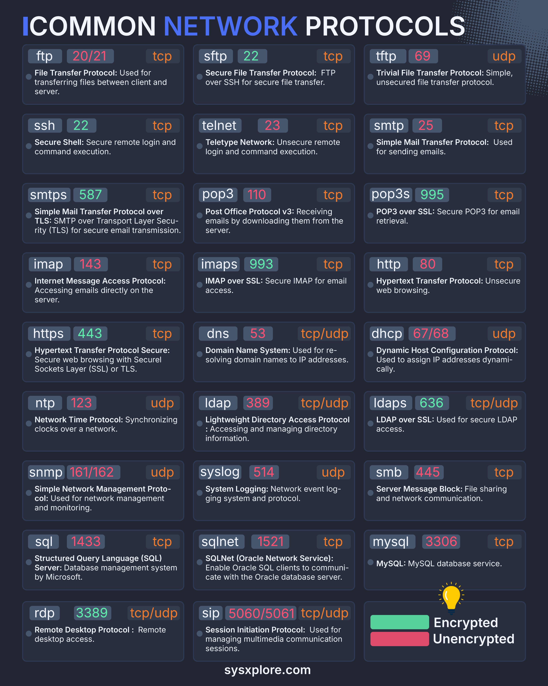

**Source:** [https://twitter.com/i/web/status/1875424373278117903](https://twitter.com/i/web/status/1875424373278117903)
**Original Post Date:** 2025-06-17 09:32:56

# Essential Network Protocols Overview: Security Status and Applications

## Introduction
Understanding network protocols is fundamental to designing secure and efficient communication systems. This overview covers essential protocols used in various networking scenarios, highlighting their security characteristics, default ports, and typical use cases. Knowledge of these protocols enables informed decisions about network architecture and security measures.

## File Transfer Protocols

FTP operates on ports 20/21 using TCP but lacks encryption. SFTP leverages SSH (port 22) for secure file transfers, while TFTP uses UDP port 69 for simple, unencrypted transfers.

1. Use SFTP instead of FTP to ensure encrypted data transfer
1. TFTP is suitable only for low-security environments

> **Note/Tip:** Never use unencrypted protocols like FTP in production environments

## Remote Access and Email Protocols

SSH (port 22) provides secure remote access, while Telnet lacks encryption. For email, SMTPS (port 587), POP3S (995), and IMAPS (993) offer encrypted alternatives to their unencrypted counterparts.

1. Always use TLS-enabled versions of email protocols for authentication
1. SSH provides secure remote command execution

## Web and DNS Protocols

HTTPS (port 443) ensures secure web browsing through TLS, while HTTP (80) is unencrypted. DNS operates on port 53 using TCP/UDP but lacks encryption by default.

- Modern web applications should exclusively use HTTPS
- DNSSEC provides additional security for domain resolution

## Directory Services and Database Management

LDAP (port 389) requires LDAPS (636) for secure access. Database protocols like SQL (1433), SQLNet (1521), and MySQL (3306) operate unencrypted by default.

1. Implement SSL/TLS for database connections in production
1. LDAP should use LDAPS when sensitive data is involved

## Key Takeaways

- Always prioritize encrypted protocols (HTTPS, SFTP, SMTPS) over their unencrypted counterparts
- Understand port numbers and transport protocols for proper firewall configuration
- Implement encryption where security-critical data is transmitted
- Differentiate between TCP-based reliable delivery and UDP's faster but less reliable communication

## Conclusion
Selecting appropriate network protocols based on security requirements and use cases is crucial for building robust, secure systems. Always consider encryption status and protocol capabilities when designing networking infrastructure.

## External References

- [Source Chart](sysxplore.com/network-protocols-chart)

## Media

**Image Description:** ### Image Description

The image is a comprehensive chart titled **"COMMON NETWORK PROTOCOLS"**, which lists and explains various network protocols used in computer networking. The chart is organized in a grid format, with each protocol listed in a separate box. Each box contains the following details:

1. **Protocol Name**: The name of the protocol in bold.
2. **Port Number(s)**: The port number(s) associated with the protocol.
3. **Transport Protocol**: Whether the protocol uses TCP (Transmission Control Protocol) or UDP (User Datagram Protocol).
4. **Description**: A brief explanation of the protocol's purpose and usage.

### Key Features of the Chart

#### **Layout**
- The chart is divided into a grid with multiple rows and columns.
- Each protocol is presented in a separate box with a dark background and white or light-colored text for readability.
- The boxes are color-coded to indicate whether the protocol is **encrypted** (green) or **unencrypted** (red).

#### **Color Coding**
- **Green**: Indicates that the protocol is encrypted (e.g., HTTPS, IMAPS, LDAPS, etc.).
- **Red**: Indicates that the protocol is unencrypted (e.g., HTTP, FTP, TELNET, etc.).

#### **Protocols Listed**
The chart includes a wide range of protocols, categorized into different functional groups such as file transfer, remote access, email, web, DNS, time synchronization, directory services, logging, file sharing, database management, and multimedia communication.

### Detailed Breakdown of Protocols

#### **File Transfer Protocols**
1. **FTP (File Transfer Protocol)**
   - **Port**: 20/21
   - **Transport**: TCP
   - **Description**: Used for transferring files between client and server.
   - **Status**: Unencrypted (red)

2. **SFTP (Secure File Transfer Protocol)**
   - **Port**: 22
   - **Transport**: TCP
   - **Description**: FTP over SSH for secure file transfer.
   - **Status**: Encrypted (green)

3. **TFTP (Trivial File Transfer Protocol)**
   - **Port**: 69
   - **Transport**: UDP
   - **Description**: Simple, unsecured file transfer protocol.
   - **Status**: Unencrypted (red)

#### **Remote Access Protocols**
4. **SSH (Secure Shell)**
   - **Port**: 22
   - **Transport**: TCP
   - **Description**: Secure remote login and command execution.
   - **Status**: Encrypted (green)

5. **Telnet**
   - **Port**: 23
   - **Transport**: TCP
   - **Description**: Unsecure remote login and command execution.
   - **Status**: Unencrypted (red)

#### **Email Protocols**
6. **SMTP (Simple Mail Transfer Protocol)**
   - **Port**: 25
   - **Transport**: TCP
   - **Description**: Used for sending emails.
   - **Status**: Unencrypted (red)

7. **SMTPS (SMTP over TLS)**
   - **Port**: 587
   - **Transport**: TCP
   - **Description**: SMTP over Transport Layer Security (TLS) for secure email transmission.
   - **Status**: Encrypted (green)

8. **POP3 (Post Office Protocol v3)**
   - **Port**: 110
   - **Transport**: TCP
   - **Description**: Receiving emails by downloading them from the server.
   - **Status**: Unencrypted (red)

9. **POP3S (POP3 over SSL)**
   - **Port**: 995
   - **Transport**: TCP
   - **Description**: Secure POP3 for email retrieval.
   - **Status**: Encrypted (green)

10. **IMAP (Internet Message Access Protocol)**
    - **Port**: 143
    - **Transport**: TCP
    - **Description**: Accessing emails directly on the server.
    - **Status**: Unencrypted (red)

11. **IMAPS (IMAP over SSL)**
    - **Port**: 993
    - **Transport**: TCP
    - **Description**: Secure IMAP for email access.
    - **Status**: Encrypted (green)

#### **Web Protocols**
12. **HTTP (Hypertext Transfer Protocol)**
    - **Port**: 80
    - **Transport**: TCP
    - **Description**: Unsecure web browsing.
    - **Status**: Unencrypted (red)

13. **HTTPS (Hypertext Transfer Protocol Secure)**
    - **Port**: 443
    - **Transport**: TCP
    - **Description**: Secure web browsing with TLS.
    - **Status**: Encrypted (green)

#### **DNS and Network Configuration**
14. **DNS (Domain Name System)**
    - **Port**: 53
    - **Transport**: TCP/UDP
    - **Description**: Resolving domain names to IP addresses.
    - **Status**: Unencrypted (red)

15. **DHCP (Dynamic Host Configuration Protocol)**
    - **Port**: 67/68
    - **Transport**: UDP
    - **Description**: Assigning IP addresses dynamically.
    - **Status**: Unencrypted (red)

#### **Time Synchronization**
16. **NTP (Network Time Protocol)**
    - **Port**: 123
    - **Transport**: UDP
    - **Description**: Synchronizing clocks over a network.
    - **Status**: Unencrypted (red)

#### **Directory Services**
17. **LDAP (Lightweight Directory Access Protocol)**
    - **Port**: 389
    - **Transport**: TCP/UDP
    - **Description**: Accessing and managing directory information.
    - **Status**: Unencrypted (red)

18. **LDAPS (LDAP over SSL)**
    - **Port**: 636
    - **Transport**: TCP/UDP
    - **Description**: Secure LDAP access.
    - **Status**: Encrypted (green)

#### **Logging**
19. **SNMP (Simple Network Management Protocol)**
    - **Port**: 161/162
    - **Transport**: UDP
    - **Description**: Used for network management and monitoring.
    - **Status**: Unencrypted (red)

20. **Syslog**
    - **Port**: 514
    - **Transport**: UDP
    - **Description**: Network event logging.
    - **Status**: Unencrypted (red)

#### **File Sharing**
21. **SMB (Server Message Block)**
    - **Port**: 445
    - **Transport**: TCP
    - **Description**: File sharing and network communication.
    - **Status**: Unencrypted (red)

#### **Database Management**
22. **SQL (Structured Query Language)**
    - **Port**: 1433
    - **Transport**: TCP
    - **Description**: Database management system by Microsoft.
    - **Status**: Unencrypted (red)

23. **SQLNet (Oracle Network Service)**
    - **Port**: 1521
    - **Transport**: TCP
    - **Description**: Enabling Oracle SQL clients to communicate with the Oracle database server.
    - **Status**: Unencrypted (red)

24. **MySQL**
    - **Port**: 3306
    - **Transport**: TCP
    - **Description**: MySQL database service.
    - **Status**: Unencrypted (red)

#### **Remote Desktop**
25. **RDP (Remote Desktop Protocol)**
    - **Port**: 3389
    - **Transport**: TCP/UDP
    - **Description**: Remote desktop access.
    - **Status**: Unencrypted (red)

#### **Multimedia Communication**
26. **SIP (Session Initiation Protocol)**
    - **Port**: 5060/5061
    - **Transport**: TCP/UDP
    - **Description**: Used for managing multimedia communication sessions.
    - **Status**: Unencrypted (red)

### Additional Notes
- The chart includes a legend at the bottom right corner to explain the color coding:
  - **Green**: Encrypted protocols.
  - **Red**: Unencrypted protocols.
- The source of the chart is credited at the bottom as **sysxplore.com**.

### Summary
The image is a detailed and organized chart that provides a comprehensive overview of common network protocols, their port numbers, transport protocols, and whether they are encrypted or unencrypted. The use of color coding and clear descriptions makes it an effective reference for understanding the security and functionality of various network protocols.
