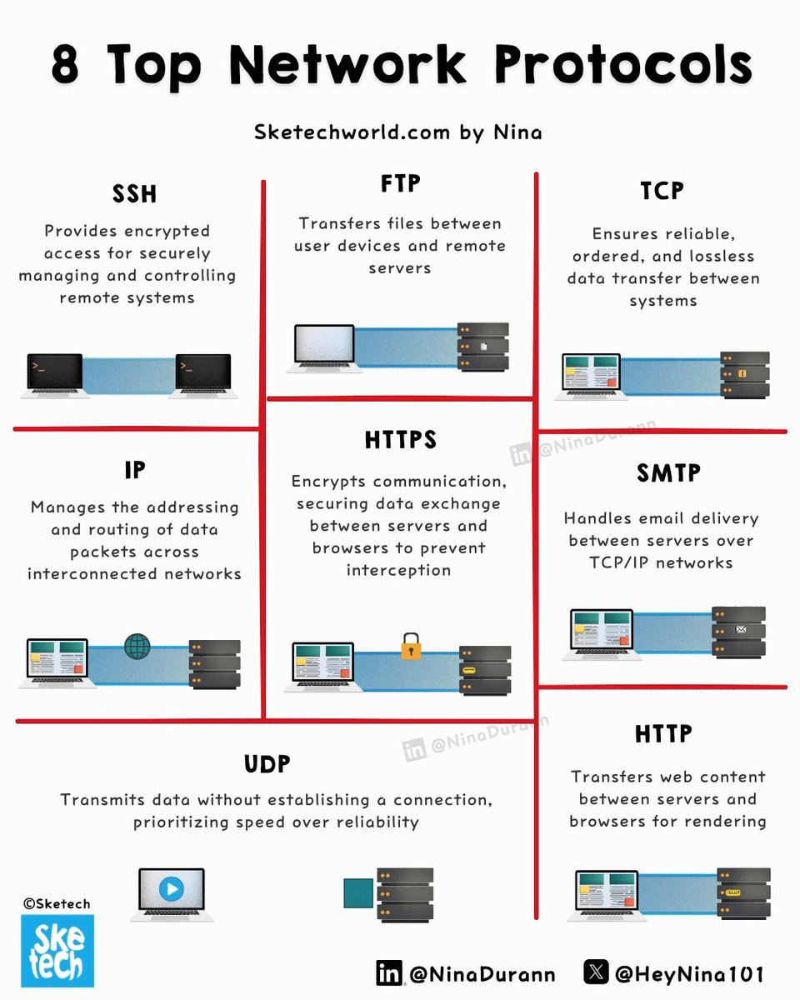

**Source:** [https://twitter.com/i/web/status/1915329364994269216](https://twitter.com/i/web/status/1915329364994269216)
**Original Post Date:** 2025-05-28 02:03:10

# Understanding Core Network Protocols: A Comprehensive Guide

## Introduction
Network protocols are the foundational rules that enable efficient communication across digital networks. Understanding these protocols is crucial for developers designing secure, scalable systems. This guide examines eight essential protocols, exploring their roles in data transfer, security, and application delivery.

From encrypted command-line access to web traffic management, each protocol serves a specific purpose while working together seamlessly within the network stack.

## Secure Communication Protocols

SSH (Secure Shell) provides secure remote system administration via port 22. It creates encrypted tunnels for command-line access and file transfers, preventing eavesdropping and man-in-the-middle attacks.

HTTPS builds on HTTP by adding SSL/TLS encryption. This combination ensures confidentiality and integrity of web traffic between browsers and servers.

While both protocols prioritize security, SSH excels in administrative tasks while HTTPS dominates secure web communications.

- SSH supports key-based authentication for enhanced security
- HTTPS uses certificates to verify server identity
- Both protocols are essential for secure cloud infrastructure

## Data Transfer and Routing Protocols

TCP provides reliable, ordered data delivery through three-way handshakes and acknowledgment mechanisms. It's ideal for applications requiring complete data integrity.

UDP prioritizes speed over reliability by transmitting packets without establishing connections or verifying receipt. This makes it perfect for real-time services like video streaming.

IP handles addressing and routing of packets across networks, working in conjunction with both TCP and UDP.

1. TCP uses sequence numbers and retransmissions to ensure delivery
1. UDP has minimal overhead but no guarantee of packet arrival
1. IP provides logical addressing through IP addresses

## Application Layer Protocols

FTP enables file transfers between clients and servers, commonly using ports 20 (data) and 21 (control). It's simple but lacks inherent security.

SMTP manages email delivery across networks, handling message routing and queueing. Port 25 is traditionally used for SMTP communication.

HTTP forms the foundation of web traffic, defining how browsers request resources from servers.

- FTP should be replaced with SFTP (SSH File Transfer Protocol) for secure file transfers
- SMTP requires proper MX record configuration in DNS
- HTTP/2 and HTTP/3 offer significant performance improvements over original HTTP

> **Note/Tip:** Always prefer modern, secure protocols like HTTPS over plain HTTP or FTP

> **Note/Tip:** Configure firewalls to restrict unnecessary ports to enhance security

> **Note/Tip:** Monitor protocol usage patterns for early detection of anomalies

## Key Takeaways

- Understand the trade-offs between reliable (TCP) and fast (UDP) data delivery protocols
- Implement secure variants like SSH, HTTPS instead of insecure alternatives
- Each protocol serves a specific purpose in the network stack; choose based on requirements
- Monitor and optimize protocol usage for performance and security

## Conclusion
Network protocols form the backbone of modern digital communications. Understanding their roles and interactions enables developers to design secure, efficient systems. By choosing appropriate protocols and implementing best practices, you can ensure robust network communication in your applications.

## External References

- [TCP/IP Fundamentals](https://tools.ietf.org/html/rfc793)
- [HTTPS Security Guide](https://www.owasp.org/index.php/Transport_Layer_Protection_Cheat_Sheet)

## Media

**Image Description:** ### Description of the Image

The image is an infographic titled **"8 Top Network Protocols"**. It is designed to provide an overview of eight commonly used network protocols, each with a brief description and a corresponding visual representation. The infographic is organized into a grid layout with three columns and three rows, plus a footer section. Each protocol is presented in a box with a title, a description, and an illustrative diagram. Below is a detailed breakdown:

---

### **Header**
- **Title**: "8 Top Network Protocols"
- **Source**: "Sketechworld.com by Nina"
- **Visual Design**: The title is bold and prominent, with a clean, minimalist design. The source is mentioned in a smaller font below the title.

---

### **Main Content (Grid Layout)**
The grid is divided into three columns and three rows, with each cell containing a protocol description and an illustration.

#### **Row 1**
1. **Column 1: SSH (Secure Shell)**
   - **Description**: "Provides encrypted access for securely managing and controlling remote systems."
   - **Illustration**: Shows two laptops connected via a secure tunnel (represented by a blue line) to a server, emphasizing secure communication.

2. **Column 2: FTP (File Transfer Protocol)**
   - **Description**: "Transfers files between user devices and remote servers."
   - **Illustration**: Depicts a laptop transferring files (represented by icons) to a server over a network connection.

3. **Column 3: TCP (Transmission Control Protocol)**
   - **Description**: "Ensures reliable, ordered, and lossless data transfer between systems."
   - **Illustration**: Shows a laptop sending data packets (represented by boxes) to a server over a network, with the packets flowing in an orderly manner.

#### **Row 2**
1. **Column 1: IP (Internet Protocol)**
   - **Description**: "Manages the addressing and routing of data packets across interconnected networks."
   - **Illustration**: Displays a globe (representing the internet) connected to multiple servers, emphasizing the routing of data packets.

2. **Column 2: HTTPS (Hypertext Transfer Protocol Secure)**
   - **Description**: "Encrypts communication, securing data exchange between servers and browsers to prevent interception."
   - **Illustration**: Shows a laptop and a server connected via a secure, locked connection (represented by a lock icon), highlighting encryption.

3. **Column 3: SMTP (Simple Mail Transfer Protocol)**
   - **Description**: "Handles email delivery between servers over TCP/IP networks."
   - **Illustration**: Depicts a laptop sending an email to a server, with the email represented as a message icon.

#### **Row 3**
1. **Column 1: UDP (User Datagram Protocol)**
   - **Description**: "Transmits data without establishing a connection, prioritizing speed over reliability."
   - **Illustration**: Shows a laptop sending data packets directly to a server without a secure tunnel, emphasizing speed.

2. **Column 2: HTTP (Hypertext Transfer Protocol)**
   - **Description**: "Transfers web content between servers and browsers for rendering."
   - **Illustration**: Displays a laptop and a server connected via a network, with the server sending web content (represented by a webpage icon) to the browser.

3. **Column 3: Blank (No Protocol Listed)**
   - This cell is empty, likely预留 for future content or design balance.

---

### **Footer**
- **Logos and Social Media Handles**:
  - **Sketech Logo**: A blue logo with the word "Sketech" in a stylized font.
  - **LinkedIn**: "@NinaDurann"
  - **Twitter**: "@HeyNina101"
  - **Visual Design**: The footer includes social media icons and handles, promoting the creator's online presence.

---

### **Design Elements**
- **Color Scheme**: Primarily uses black text on a white background, with blue and gray accents for illustrations and connections.
- **Icons and Diagrams**: Simple, clean diagrams are used to visually represent each protocol's function, such as secure tunnels, data packets, and network connections.
- **Typography**: Uses a mix of bold and regular fonts for emphasis, with protocol names in bold and descriptions in regular text.

---

### **Overall Purpose**
The infographic serves as an educational tool, providing a concise and visually appealing overview of eight essential network protocols. It is designed to be easily understandable for both technical and non-technical audiences, using clear descriptions and intuitive illustrations.

---

### **Summary**
The image is a well-organized infographic titled **"8 Top Network Protocols"**, created by Nina for Sketechworld.com. It covers SSH, FTP, TCP, IP, HTTPS, SMTP, UDP, and HTTP, each with a brief description and a corresponding visual representation. The design is clean, with a focus on clarity and educational value. The footer includes the creator's social media handles and a logo for branding.
