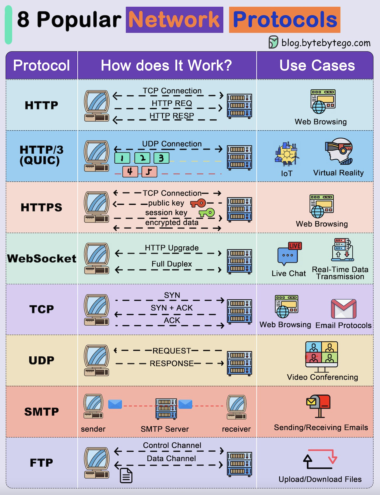

**Source:** [https://twitter.com/i/web/status/1875600551146352755](https://twitter.com/i/web/status/1875600551146352755)
**Original Post Date:** 2025-05-28 05:06:20

# Understanding Network Protocols: HTTP, WebSocket, TCP/UDP, SMTP, FTP, and QUIC

## Introduction
Understanding network protocols is fundamental to software engineering as they form the backbone of modern internet communication. This article provides an in-depth analysis of eight widely-used protocols, examining how they operate at a technical level and their practical applications. From HTTP's stateless nature to WebSocket's full-duplex capabilities, each protocol serves specific use cases that optimize network efficiency and reliability.

## HTTP Protocol

HTTP operates on top of TCP, establishing a reliable client-server connection. The protocol follows a request-response pattern: the client initiates by sending an HTTP request, which is processed by the server and responded to with appropriate status codes and content.

Each interaction closes after response completion, making it stateless but efficient for web browsing.

```HTTP
GET /index.html HTTP/1.1
Host: www.example.com
```

## WebSocket Protocol

WebSocket initiates with an HTTP handshake to upgrade the connection to a bidirectional channel, enabling real-time communication.

This protocol eliminates latency issues present in traditional polling methods by maintaining open connections for continuous data exchange.

```JavaScript
const ws = new WebSocket('ws://example.com');
ws.onmessage = (event) => console.log(event.data);
```

## Transport Layer Protocols

TCP ensures reliable, ordered data delivery through a three-way handshake process: SYN → SYN-ACK → ACK.

UDP prioritizes speed over reliability, making it suitable for time-sensitive applications like real-time video streaming.

- TCP uses sequence numbers and acknowledgments
- UDP doesn't guarantee packet delivery

## Application Layer Protocols

SMTP facilitates email transfer using distinct control and data channels.

FTP employs separate connections for commands (control channel) and file transfers (data channel).

```SMTP
HELO client.example.com
MAIL FROM: sender@example.com
RCPT TO: receiver@example.com
```

## Key Takeaways

- HTTP/3 (QUIC) improves performance over HTTP/2 through UDP-based connections and connection migration.
- WebSocket provides full-duplex communication, ideal for real-time applications like live chat.
- TCP ensures reliability but introduces latency, while UDP offers speed at the cost of reliability.

## Conclusion
Mastering these network protocols is essential for optimizing application performance. Understanding when to use TCP versus UDP, or choosing between HTTP and WebSocket, directly impacts system efficiency and user experience. Each protocol has its strengths and optimal use cases in modern networking.

## External References

- [ByteByteGo Network Protocols Guide](blog.bytebytego.com)


## Media

**Image Description:** The image is an infographic titled **"8 Popular Network Protocols"**, which provides a detailed overview of eight widely used network protocols. Each protocol is explained with a brief description of how it works, accompanied by a visual representation of its operation, and its common use cases. Below is a detailed breakdown of the content:

---

### **Header**
- **Title**: "8 Popular Network Protocols"
- **Color Scheme**: The title uses a combination of purple, orange, and blue text, with a clean and modern design.
- **Website Link**: The bottom right corner includes a link to the source: `blog.bytebytego.com`.

---

### **Main Content**
The infographic is organized into a table with three columns:
1. **Protocol**: Lists the name of each protocol.
2. **How Does It Work?**: Provides a visual explanation of the protocol's operation.
3. **Use Cases**: Highlights the common applications or scenarios where the protocol is used.

---

### **Protocols and Details**

#### **1. HTTP (Hypertext Transfer Protocol)**
- **How Does It Work?**
  - Uses a **TCP connection** for communication.
  - The client sends an **HTTP request** to the server.
  - The server processes the request and sends an **HTTP response** back to the client.
  - The connection is closed after the response is sent.
  - **Visual**: Shows a client-server interaction with labeled arrows for TCP connection, HTTP request, and HTTP response.
- **Use Cases**: Web browsing.

#### **2. HTTP/3 (QUIC)**
- **How Does It Work?**
  - Uses a **UDP connection** for communication.
  - QUIC is designed to improve performance over HTTP/2 by reducing latency and improving reliability.
  - The protocol includes features like **stream multiplexing** and **connection migration**.
  - **Visual**: Shows a client-server interaction with labeled arrows for UDP connection, stream multiplexing, and connection migration.
- **Use Cases**: IoT (Internet of Things), Virtual Reality.

#### **3. HTTPS (Hypertext Transfer Protocol Secure)**
- **How Does It Work?**
  - Similar to HTTP but adds **encryption** using TLS/SSL.
  - The client and server exchange a **public key** to establish a secure connection.
  - A **session key** is used to encrypt and decrypt data during the session.
  - **Visual**: Shows a client-server interaction with labeled arrows for TCP connection, public key exchange, session key establishment, and encrypted data transfer.
- **Use Cases**: Web browsing (secure).

#### **4. WebSocket**
- **How Does It Work?**
  - Starts with an **HTTP handshake** to upgrade the connection to a WebSocket connection.
  - Once established, it provides a **full-duplex communication channel** between the client and server.
  - Data can be sent in both directions simultaneously.
  - **Visual**: Shows a client-server interaction with labeled arrows for HTTP upgrade, full-duplex communication, and data exchange.
- **Use Cases**: Live chat, real-time data transmission.

#### **5. TCP (Transmission Control Protocol)**
- **How Does It Work?**
  - Establishes a **reliable, connection-oriented** protocol.
  - Uses a **three-way handshake**:
    1. Client sends a **SYN** packet.
    2. Server responds with **SYN + ACK**.
    3. Client acknowledges with **ACK**.
  - Data is transmitted in a reliable manner with error checking and retransmission.
  - **Visual**: Shows a client-server interaction with labeled arrows for SYN, SYN + ACK, and ACK packets.
- **Use Cases**: Web browsing, email, general data transmission.

#### **6. UDP (User Datagram Protocol)**
- **How Does It Work?**
  - Provides a **connectionless, unreliable** protocol.
  - The client sends a **request**, and the server responds with a **response**.
  - There is no guarantee of delivery or order of packets.
  - **Visual**: Shows a client-server interaction with labeled arrows for request and response.
- **Use Cases**: Video conferencing, real-time applications.

#### **7. SMTP (Simple Mail Transfer Protocol)**
- **How Does It Work?**
  - Used for sending emails.
  - The **sender** sends an email to the **SMTP server**, which then forwards it to the **receiver**.
  - The protocol uses a **control channel** for commands and a **data channel** for email content.
  - **Visual**: Shows a sender, SMTP server, and receiver with labeled arrows for email transmission.
- **Use Cases**: Sending and receiving emails.

#### **8. FTP (File Transfer Protocol)**
- **How Does It Work?**
  - Used for transferring files between a client and server.
  - Establishes a **control channel** for commands and a **data channel** for file transfer.
  - The client sends commands (e.g., `GET`, `PUT`) to the server, which responds accordingly.
  - **Visual**: Shows a client-server interaction with labeled arrows for control channel and data channel.
- **Use Cases**: Uploading and downloading files.

---

### **Design Elements**
- **Color Coding**: Each protocol has a distinct background color to differentiate it visually.
- **Icons**: Relevant icons are used to represent use cases (e.g., globe for web browsing, chat bubble for live chat, email for SMTP).
- **Arrows and Labels**: Clear arrows and labels are used to illustrate the flow of data and communication between client and server.

---

### **Overall Purpose**
The infographic serves as an educational tool to explain the fundamental concepts of popular network protocols, their operational mechanisms, and their practical applications in real-world scenarios. It is designed to be visually engaging and easy to understand for both technical and non-technical audiences.
