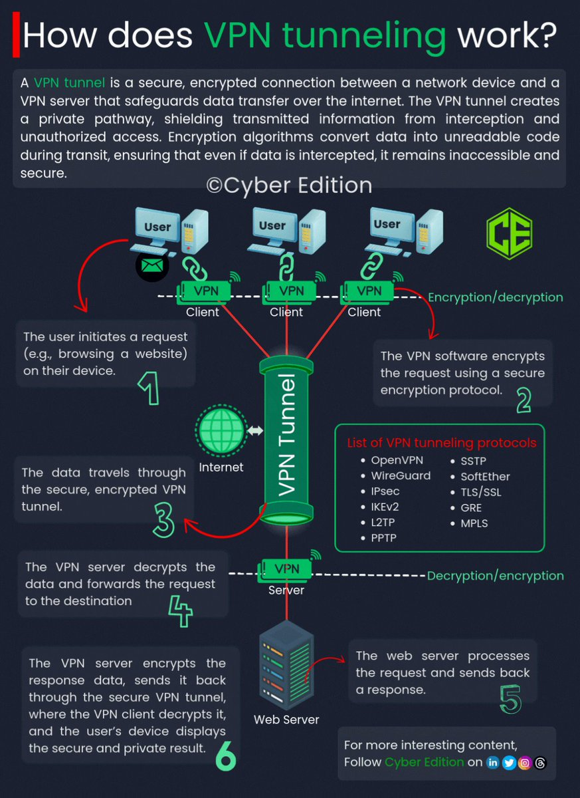

**Source:** [https://twitter.com/i/web/status/1880555755348144617](https://twitter.com/i/web/status/1880555755348144617)
**Original Post Date:** 2025-05-27 18:52:04

# VPN Tunneling Process: End-to-End Secure Data Transmission

## Introduction
Virtual Private Network (VPN) tunneling is a critical technology enabling secure data communication over public networks. This article provides an in-depth examination of the complete tunneling process, focusing on cryptographic mechanisms, protocol implementations, and system architecture considerations. Through detailed analysis of each phase, we'll explore how VPNs maintain confidentiality, integrity, and security during network communications.

## Step-by-Step Tunneling Process

The tunneling process begins with the client initiating a request through their device's VPN client software. This initial phase establishes the cryptographic session parameters essential for secure communication.

Subsequent encryption occurs using industry-standard algorithms such as AES, RSA, or ChaCha20-Poly1305 to protect data integrity during transmission.

The encrypted payload traverses the internet via the established tunnel, bypassing network inspection attempts while maintaining secure connectivity through intermediate nodes.

1. Request Initiation: Client device generates and prepares data for encryption
1. Encryption Process: Data is converted using agreed-upon cryptographic keys
1. Tunnel Establishment: Secure channel created over existing network infrastructure

> **Note/Tip:** Always ensure proper key rotation policies are implemented to maintain long-term security.

> **Note/Tip:** Monitor tunnel performance metrics regularly to identify potential latency issues.

## Protocol Implementations

Modern VPN solutions employ various protocols tailored for specific use cases. Each protocol balances security requirements with performance considerations.

Popular implementations include OpenVPN, WireGuard, and IPSec/IKEv2, each offering distinct advantages in terms of encryption strength, speed, and ease of configuration.

- OpenVPN: Flexible, widely compatible with strong security features
- WireGuard: Modern design focusing on simplicity and performance
- IPSec/IKEv2: Standardized protocol supporting both host-to-host and site-to-site connections

## Security Considerations

Implementing robust VPN tunneling requires careful attention to security best practices. Key considerations include proper key management, regular vulnerability assessments, and comprehensive logging mechanisms.

Additional safeguards such as certificate pinning and perfect forward secrecy should be employed to prevent potential attack vectors.

> **Note/Tip:** Regularly audit tunnel configurations for deprecated protocols or misconfigurations

> **Note/Tip:** Implement strict access controls at both client and server endpoints

## Key Takeaways

- VPN tunneling secures data through cryptographic encapsulation, masking internal network structure from external observers
- Protocol selection should balance security requirements with performance needs based on specific use cases
- Proper implementation requires comprehensive monitoring, regular updates, and adherence to best practices

## Conclusion
Understanding the end-to-end VPN tunneling process is crucial for designing secure communication systems. By implementing appropriate protocols, maintaining robust key management, and following security best practices, organizations can effectively protect their data while ensuring reliable network connectivity.

## External References

- [RFC 7296: Internet Key Exchange Protocol Version 2 (IKEv2)](https://tools.ietf.org/html/rfc7296)
- [WireGuard White Paper](https://www.wireguard.com/papers/wireguard.pdf)

## Media

**Image Description:** ### Description of the Image

The image is an infographic titled **"How does VPN tunneling work?"**. It provides a detailed explanation of the process of Virtual Private Network (VPN) tunneling, focusing on the technical aspects of data encryption, transmission, and decryption. The infographic uses a combination of text, diagrams, and icons to illustrate the steps involved in the VPN tunneling process.

#### **Main Subject: VPN Tunneling Process**
The infographic breaks down the VPN tunneling process into six key steps, each explained with accompanying visuals and technical details. Below is a detailed breakdown:

---

### **1. User Initiates a Request**
- **Description**: The user, represented by a computer icon, initiates a request (e.g., browsing a website) on their device.
- **Visual**: A user icon is shown with a red arrow pointing to the next step.
- **Technical Detail**: The user's device sends a request to the VPN client software installed on the device.

---

### **2. Encryption by the VPN Client**
- **Description**: The VPN client software encrypts the user's request using a secure encryption protocol.
- **Visual**: The user's request is shown traveling through a green tunnel labeled "VPN Tunnel." The encryption process is depicted with a green icon.
- **Technical Detail**: Encryption algorithms (e.g., AES, RSA) are used to convert the data into unreadable code, ensuring that even if intercepted, the data remains secure.

---

### **3. Data Transmission Through the VPN Tunnel**
- **Description**: The encrypted data travels through the secure, encrypted VPN tunnel over the internet.
- **Visual**: The data is shown moving through the green "VPN Tunnel" icon, which is depicted as a cylindrical structure.
- **Technical Detail**: The tunnel ensures that the data remains private and secure during transmission, protecting it from interception.

---

### **4. Decryption by the VPN Server**
- **Description**: The VPN server decrypts the encrypted data and forwards the request to the intended destination (e.g., a website server).
- **Visual**: The data reaches the VPN server, which is represented by a server icon. A decryption icon is shown, indicating the decryption process.
- **Technical Detail**: The server uses the appropriate decryption key to restore the data to its original form before forwarding it to the destination.

---

### **5. Web Server Processes the Request**
- **Description**: The web server processes the request and sends a response back to the VPN server.
- **Visual**: The web server is depicted as a server icon, and the response is shown traveling back through the VPN tunnel.
- **Technical Detail**: The web server handles the request and generates a response, which is then sent back to the VPN server.

---

### **6. Encryption and Transmission Back to the User**
- **Description**: The VPN server encrypts the response data and sends it back through the secure VPN tunnel to the user's device.
- **Visual**: The response travels back through the green "VPN Tunnel" icon, and the encryption process is shown again.
- **Technical Detail**: The response is encrypted to ensure its security during transmission back to the user.

---

### **7. Decryption by the User's Device**
- **Description**: The user's device decrypts the response data and displays the result.
- **Visual**: The data reaches the user's device, where it is decrypted and displayed.
- **Technical Detail**: The user's device uses the decryption key to restore the response to its original form, allowing the user to view the secure and private result.

---

### **Additional Elements in the Infographic**

#### **List of VPN Tunneling Protocols**
- The infographic includes a list of common VPN tunneling protocols used for securing data transmission:
  - **OpenVPN**
  - **SSTP**
  - **WireGuard**
  - **SoftEther**
  - **IPSec**
  - **IKEv2**
  - **L2TP/IPSec**
  - **GRE**
  - **PPTP**
  - **MPLS**
  - **TLS/SSL**

#### **Icons and Visuals**
- **User Icons**: Represent the user's device initiating requests.
- **VPN Tunnel Icon**: Depicts the secure, encrypted tunnel through which data travels.
- **Server Icons**: Represent the VPN server and web server.
- **Encryption/Decryption Icons**: Show the processes of encrypting and decrypting data.
- **Internet Icon**: Indicates the public internet over which the VPN tunnel operates.

#### **Color Coding**
- **Green**: Used to highlight the secure, encrypted tunnel and related processes.
- **Red**: Used for arrows indicating the flow of data and requests.
- **Black/White**: Used for text and background to ensure readability.

---

### **Footer**
- The infographic includes a call-to-action at the bottom, encouraging viewers to follow the content creator, **Cyber Edition**, on social media platforms like LinkedIn, Twitter, and Instagram.

---

### **Overall Layout**
The infographic is structured in a logical flow, guiding the viewer through the steps of the VPN tunneling process. It uses clear visuals and concise text to explain complex technical concepts in an accessible manner. The use of arrows and icons helps to illustrate the data flow and the encryption/decryption processes effectively.

---

### **Conclusion**
The image provides a comprehensive and visually engaging explanation of how VPN tunneling works, focusing on the encryption, transmission, and decryption of data to ensure secure communication over the internet. The inclusion of technical details and a list of protocols adds depth to the explanation, making it informative for both beginners and those with a deeper understanding of networking concepts.
