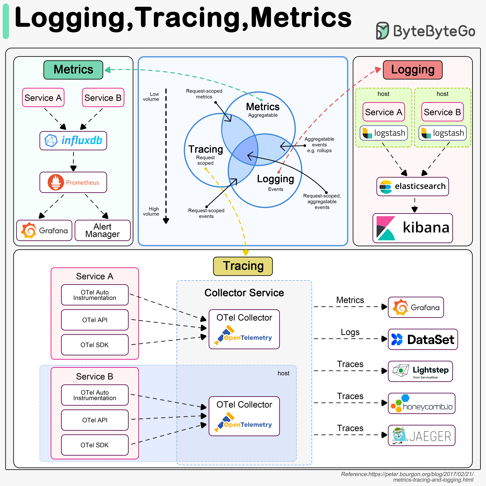

**Source:** [https://twitter.com/i/web/status/1889906611487121477](https://twitter.com/i/web/status/1889906611487121477)
**Original Post Date:** 2025-05-28 04:22:18

# Understanding Observability Foundations: Metrics, Logging, and Tracing

## Introduction
Modern distributed systems require robust observability practices to maintain reliability and performance. This article explores the three pillars of observability - Metrics, Logging, and Tracing - their characteristics, use cases, and how they work together to provide comprehensive system visibility. We'll examine key tools, workflows, and best practices for implementing effective observability solutions.

## Metrics: Performance Monitoring

Metrics are quantitative measurements collected at regular intervals to track system performance and behavior. They provide numerical data points that can be aggregated over time or across different dimensions, making them ideal for identifying trends and setting thresholds.

For example, a service might collect CPU utilization metrics every 15 seconds. These metrics can then be averaged to detect overall resource usage patterns.

- Used for monitoring system health and performance
- Supports automated alerting based on thresholds
- Typically low-volume data collection

## Logging: Event Documentation

Logging captures detailed textual records of events occurring within a system. These logs are often tied to specific requests or operations and provide context about what happened, when it occurred, and any associated errors or warnings.

For instance, an API service might log incoming request details, authentication results, and response status codes for audit purposes.

- Provides detailed event context and debugging information
- Supports post-mortem analysis
- Higher data volume compared to metrics

## Tracing: Request Flow Analysis

Tracing tracks the path of a request as it moves through distributed services, enabling end-to-end visibility into system behavior. Traces show how requests are processed across service boundaries and help identify performance bottlenecks or failure points.

Consider an e-commerce transaction that involves user authentication, inventory checking, payment processing, and order fulfillment - tracing reveals the complete workflow.

- Maps request flow through distributed services
- Identifies performance bottlenecks
- Supports root cause analysis of failures

## Integration and Tooling

Effective observability requires integration between metrics, logging, and tracing systems. OpenTelemetry serves as a unified framework for collecting telemetry data across these domains.

Popular tools include Prometheus and Grafana for metrics visualization, Elasticsearch-Kibana stack for log analysis, and Jaeger or Honeycomb.io for trace exploration.

## Key Takeaways

- Metrics provide quantitative performance insights at regular intervals
- Logs offer detailed event context for debugging and auditing
- Traces map request flows across distributed services
- OpenTelemetry unifies telemetry data collection across all three domains

## Conclusion
A comprehensive observability strategy leverages the unique strengths of metrics, logging, and tracing to provide complete visibility into system behavior. By understanding how these components work together and selecting appropriate tools for each domain, teams can build robust monitoring solutions that support reliable system operation.

## External References

- [OpenTelemetry Documentation](https://opentelemetry.io/docs/)
- [Prometheus Monitoring System](https://prometheus.io/docs/introduction/overview/)
- [Jaeger Tracing Platform](https://www.jaegertracing.io/docs/latest/)

## Media

**Image Description:** The image is a detailed diagram illustrating the concepts of **Logging**, **Tracing**, and **Metrics** in the context of modern software monitoring and observability. It provides an overview of how these three key components work together to provide comprehensive insights into the behavior and performance of distributed systems. Below is a detailed breakdown of the image:

---

### **Main Sections of the Diagram**

#### **1. Metrics**
- **Definition**: Metrics are numerical data points collected at regular intervals to measure the performance and behavior of a system.
- **Characteristics**:
  - **Aggregatable**: Metrics can be aggregated over time or across different dimensions (e.g., averages, sums, etc.).
  - **Low Volume**: Metrics are typically collected at a high frequency but are lightweight and have a low data volume compared to logs or traces.
- **Tools and Workflow**:
  - **Service A and Service B**: These are the services generating metrics.
  - **InfluxDB**: A time-series database used for storing and querying metrics data.
  - **Prometheus**: A popular open-source monitoring and alerting toolkit that collects metrics from services and stores them in a time-series database.
  - **Grafana**: A visualization tool used to create dashboards and graphs to display metrics data.
  - **Alert Manager**: A component that processes alerts based on defined thresholds and conditions in the metrics data.

#### **2. Logging**
- **Definition**: Logging involves capturing detailed textual records of events that occur within a system.
- **Characteristics**:
  - **Request-Specific**: Logs are often tied to specific requests or operations.
  - **High Volume**: Logs can generate a large volume of data, especially in high-traffic systems.
  - **Aggregatable**: Logs can be aggregated and analyzed for patterns or trends.
- **Tools and Workflow**:
  - **Service A and Service B**: These services generate logs.
  - **Logstash**: A tool used for collecting, parsing, and enriching logs.
  - **Elasticsearch**: A distributed search and analytics engine used to store and search logs.
  - **Kibana**: A visualization tool that allows users to explore and analyze logs stored in Elasticsearch.

#### **3. Tracing**
- **Definition**: Tracing involves tracking the flow of a request as it moves through a distributed system, allowing developers to understand the end-to-end behavior of the system.
- **Characteristics**:
  - **Request-Specific**: Traces are tied to specific requests and show the path of the request through different services.
  - **Aggregatable**: Traces can be aggregated to identify common patterns or bottlenecks.
- **Tools and Workflow**:
  - **Service A and Service B**: These services generate traces.
  - **OpenTelemetry (OTel)**: A framework for collecting, processing, and exporting telemetry data (metrics, logs, and traces).
    - **OTel SDK**: Provides the instrumentation for services to generate traces.
    - **OTel API**: The interface used by services to interact with the OpenTelemetry SDK.
    - **OTel Auto Instrumentation**: Automatically instruments services to generate traces without requiring manual coding.
  - **OTel Collector**: A component that collects, processes, and exports telemetry data (metrics, logs, and traces) to various backends.
  - **Tracing Backends**:
    - **Jaeger**: An open-source distributed tracing system.
    - **Lightstep**: A commercial tracing solution.
    - **Honeycomb.io**: A commercial tracing and observability platform.
    - **Lightning Trace**: A tracing solution from ServiceNow.

---

### **Central Venn Diagram**
The central part of the image features a Venn diagram that illustrates the overlap and differences between **Metrics**, **Tracing**, and **Logging**:
- **Metrics**: Focuses on numerical data collected at regular intervals. It is aggregatable and typically has low volume.
- **Tracing**: Focuses on the flow of requests through a system. It is request-specific and can be aggregated to identify patterns.
- **Logging**: Focuses on detailed textual records of events. It is request-specific and has high volume.

The overlaps indicate:
- **Metrics and Tracing**: Both are aggregatable and can provide insights into system performance.
- **Tracing and Logging**: Both are request-specific and can provide detailed information about individual requests.
- **Metrics and Logging**: Both can be aggregated, but they differ in the type of data collected (numerical vs. textual).

---

### **Bottom Section: Tracing Workflow**
The bottom section of the diagram provides a detailed workflow for tracing using OpenTelemetry:
1. **Service A and Service B**:
   - These services are instrumented using OpenTelemetry.
   - **OTel SDK**: Provides the instrumentation for generating traces.
   - **OTel API**: The interface used by services to interact with the OpenTelemetry SDK.
   - **OTel Auto Instrumentation**: Automatically instruments services to generate traces without requiring manual coding.
2. **Collector Service**:
   - The **OTel Collector** collects, processes, and exports telemetry data (metrics, logs, and traces) to various backends.
3. **Tracing Backends**:
   - **Jaeger**: An open-source distributed tracing system.
   - **Lightstep**: A commercial tracing solution.
   - **Honeycomb.io**: A commercial tracing and observability platform.
   - **Lightning Trace**: A tracing solution from ServiceNow.

---

### **Key Observations**
- **Integration**: The diagram emphasizes the integration of Metrics, Tracing, and Logging to provide a comprehensive view of system behavior.
- **OpenTelemetry**: OpenTelemetry is highlighted as a key framework for collecting and exporting telemetry data across all three domains.
- **Tooling**: Popular tools like Prometheus, Grafana, Elasticsearch, Kibana, and Jaeger are showcased as part of the ecosystem for monitoring and observability.

---

### **Conclusion**
The image provides a comprehensive overview of how Metrics, Tracing, and Logging work together in modern software systems. It highlights the tools and workflows used for collecting, processing, and visualizing data from these three domains, emphasizing the importance of observability in distributed systems. The use of OpenTelemetry as a unifying framework for telemetry data collection is a key takeaway.
