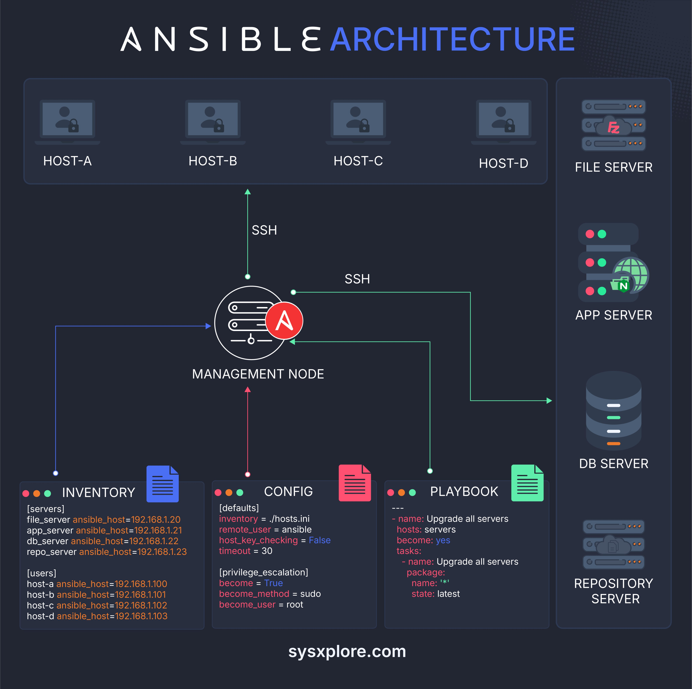

**Source:** [https://twitter.com/i/web/status/1874753711656009963](https://twitter.com/i/web/status/1874753711656009963)
**Original Post Date:** 2025-05-28 02:52:37

# Understanding Ansible Architecture: Core Components and Workflow

## Introduction
Ansible is a powerful open-source tool for automating IT infrastructure management. Understanding its architecture is crucial for implementing efficient workflows. This knowledge base covers the core components: Management Node, Inventory, Configuration, Playbooks, and their interactions through secure SSH connections. Learn how these elements work together to automate complex tasks across multiple systems.

## Management Node Architecture

The Management Node serves as the central control point in Ansible's architecture. It runs the ansible command-line tool and executes playbooks against target hosts using SSH connections.

Key responsibilities include playbook execution, host communication, and automation orchestration.

_Basic playbook execution from the Management Node_

```yaml
- name: Run playbook
  ansible-playbook -i inventory.yml site.yml
```

## Inventory and Host Grouping

The Inventory file organizes hosts into logical groups for targeted automation. It's central to managing complex environments efficiently.

Host grouping enables applying specific configurations to related systems, like all web servers or database nodes.

```ini
[webservers]
web1 ansible_host=192.168.1.10
web2 ansible_host=192.168.1.11

databases
db1 ansible_host=192.168.1.20
```

- Hosts are defined with unique names and IP addresses
- Groups can be created for logical organization
- Variables can be assigned to specific hosts or groups

## Playbook Structure and Execution

Playbooks are YAML files containing sequential tasks that define automation workflows. They're the core of Ansible's configuration management.

Tasks can include package installation, service management, file operations, or complex orchestration.

```yaml
- name: Deploy application
  hosts: webservers
  tasks:
    - name: Install Nginx
      apt:
        name: nginx
        state: present
    - name: Start service
      service:
        name: nginx
        state: started
```

## SSH Communication and Security

Ansible relies on SSH for secure communication between the Management Node and target hosts. No agents are required on managed nodes.

Authentication is typically handled through SSH keys, with optional privilege escalation using sudo.

```ini
[defaults]
remote_user = ansible
host_key_checking = False
```

## Key Takeaways

- Ansible's architecture is agentless, requiring only SSH access to managed hosts
- Inventory files are essential for organizing and targeting automation workflows
- Playbooks provide a declarative way to define infrastructure state and desired configurations
- SSH-based communication ensures secure and efficient task execution across distributed systems

## Conclusion
Understanding Ansible's architectural components enables effective IT infrastructure management. By mastering the Management Node, Inventory, Playbooks, and SSH connections, you can build scalable automation workflows for complex environments.

## External References

- [Official Ansible Documentation](https://docs.ansible.com/)
- [Ansible Architecture Deep Dive](https://www.redhat.com/en/topics/automation/what-is-ansible)


## Media

**Image Description:** The image illustrates the **Ansible Architecture** and its components, showcasing how Ansible is used for automating IT infrastructure management. Below is a detailed description of the image, focusing on the main subject and relevant technical details:

---

### **Main Subject: Ansible Architecture**
The image depicts the architecture of an Ansible setup, highlighting the key components and their interactions. Ansible is an open-source IT automation tool used for configuration management, application deployment, and task automation.

---

### **Key Components and Their Roles**

#### 1. **Management Node**
   - **Description**: The central component of the Ansible architecture is the **Management Node**, which is the server or machine that runs Ansible. It is responsible for executing playbooks and managing the target hosts.
   - **Icon**: Represented by a circular icon with a red "A" in the center, symbolizing Ansible.
   - **Connections**: The Management Node communicates with other components via SSH (Secure Shell).

#### 2. **Inventory**
   - **Description**: The **Inventory** is a file (or multiple files) that defines the list of managed hosts and groups. It specifies the IP addresses or hostnames of the servers and their groupings.
   - **Content**:
     ```
     [servers]
     ansible_host=192.168.1.20
     file_server ansible_host=192.168.1.21
     app_server ansible_host=192.168.1.22
     db_server ansible_host=192.168.1.23
     repo_server ansible_host=192.168.1.23

     [users]
     host-a ansible_host=192.168.1.100
     host-b ansible_host=192.168.1.101
     host-c ansible_host=192.168.1.102
     host-d ansible_host=192.168.1.103
     ```
   - **Purpose**: The Inventory file helps Ansible identify which hosts to manage and how they are grouped.

#### 3. **Config**
   - **Description**: The **Config** file (usually `ansible.cfg`) contains global configuration settings for Ansible.
   - **Content**:
     ```
     [defaults]
     inventory = ./hosts.ini
     remote_user = ansible
     host_key_checking = False
     timeout = 30

     [privilege_escalation]
     become = True
     become_method = sudo
     become_user = root
     ```
   - **Purpose**: This file defines default settings such as the inventory location, remote user, SSH timeout, and privilege escalation options.

#### 4. **Playbook**
   - **Description**: A **Playbook** is a YAML file that defines the tasks to be executed on the managed hosts. It is the core of Ansible automation.
   - **Content**:
     ```
     - name: Upgrade all servers
       hosts: servers
       become: yes
       tasks:
         - name: Upgrade package
           package:
             name: '*'
             state: latest
     ```
   - **Purpose**: The Playbook specifies the tasks to be performed, such as upgrading packages on all servers in the `servers` group.

#### 5. **Managed Hosts**
   - **Description**: These are the target servers that are managed by Ansible. The image shows four hosts labeled as **HOST-A**, **HOST-B**, **HOST-C**, and **HOST-D**.
   - **Connection**: The Management Node communicates with these hosts via SSH.
   - **Purpose**: These hosts are the systems that will be configured, updated, or managed based on the Playbook instructions.

#### 6. **External Servers**
   - The image also shows additional servers that might be part of the infrastructure:
     - **File Server**: Likely used for storing files or configurations.
     - **App Server**: Represents an application server that might be managed or deployed using Ansible.
     - **DB Server**: A database server that could be configured or managed.
     - **Repository Server**: A server hosting software packages or repositories for deployment.

#### 7. **SSH Connections**
   - **Description**: All communication between the **Management Node** and the **Managed Hosts** is done via SSH. The image shows SSH connections as green arrows pointing from the Management Node to the hosts.
   - **Purpose**: SSH ensures secure communication and execution of commands on remote servers.

---

### **Flow of Operations**
1. **Inventory Definition**: The Inventory file specifies the list of managed hosts and their groups.
2. **Configuration Setup**: The `ansible.cfg` file defines global settings, such as the remote user and privilege escalation options.
3. **Playbook Execution**: The Playbook is executed on the Management Node, which then communicates with the managed hosts via SSH.
4. **Task Execution**: The tasks defined in the Playbook are executed on the target hosts, such as upgrading packages.
5. **External Server Interaction**: The Management Node may also interact with external servers (e.g., File Server, Repository Server) to fetch or deploy files.

---

### **Visual Elements**
- **Icons**: Each component is represented by an icon (e.g., a server icon for hosts, a file icon for Inventory, etc.).
- **Arrows**: Green arrows indicate the direction of communication, primarily SSH connections.
- **Color Coding**: Different colors are used to distinguish components (e.g., blue for Inventory, red for Config, green for Playbook).

---

### **Summary**
The image provides a clear visualization of how Ansible works in an IT infrastructure. The **Management Node** uses SSH to communicate with **Managed Hosts**, guided by the **Inventory**, **Config**, and **Playbook** files. The architecture ensures automation of tasks such as configuration management, software deployment, and system updates across multiple servers. The inclusion of external servers highlights the integration of Ansible with other components of the infrastructure. 

This architecture is designed for scalability and efficiency, making it a powerful tool for managing complex IT environments.
