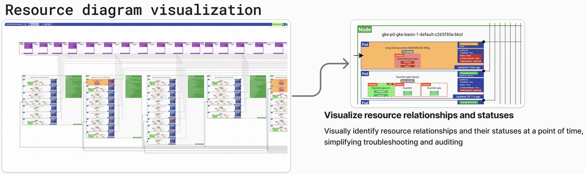

**Source:** [https://twitter.com/i/web/status/1927441189470449817](https://twitter.com/i/web/status/1927441189470449817)
**Original Post Date:** 2025-06-17 10:03:37

# Kubernetes History Inspector: Visual Resource Diagram Analysis

## Introduction
The Kubernetes History Inspector provides a visual representation of cluster resources, enabling engineers to understand complex relationships between nodes, pods, and containers. This tool simplifies monitoring by offering real-time status updates and color-coded visualizations that facilitate quick identification of issues and audit trails.

## Resource Visualization Architecture

The visualization employs a hierarchical structure showing nodes containing pods, which in turn contain containers. Each level provides detailed insights into resource states and relationships.

Status indicators use color coding: green represents healthy/running states while red indicates pending or failed conditions.

- Nodes displayed as rectangular blocks with contained pods
- Pods depicted within nodes, showing container relationships
- Status indicators using color coding for quick identification

## Detailed Resource Components

The left panel provides an overview of the entire resource hierarchy, while the right panel offers detailed views of specific nodes and their contained resources.

Each pod contains multiple containers with distinct states, such as Initiated or Ready conditions.

1. Node details including identification information (e.g., gke-p0-gke-basic-1-default-c265f30a-bkzt)
1. Pod status tracking with timestamps indicating last updates
1. Container-level state monitoring and condition checks

> **Note/Tip:** Monitor pod update frequencies to detect deployment issues

> **Note/Tip:** Use color coding as a quick diagnostic tool for resource states

## Technical Implementation Details

The visualization leverages Kubernetes API endpoints to collect real-time data on resources and their relationships.

Timestamp tracking provides audit trails and temporal context for troubleshooting.

- API endpoint integration for dynamic updates
- Real-time status polling mechanisms
- Temporal data collection for historical analysis

## Practical Applications and Use Cases

This visualization tool serves multiple purposes in Kubernetes management, from quick troubleshooting to detailed auditing.

Engineers can use it to identify resource relationship issues and track state changes over time.

1. Rapid identification of failed pods and containers
1. Visualization of complex resource dependencies
1. Historical analysis of resource states

## Key Takeaways

- Visual representation simplifies understanding of Kubernetes resource relationships
- Color-coded status indicators enable quick problem identification
- Timestamp tracking provides valuable temporal context for troubleshooting
- Hierarchical structure supports both overview and detailed analysis

## Conclusion
The Kubernetes History Inspector offers a comprehensive visualization solution that enhances operational efficiency through clear representation of resource states and relationships. Its real-time updates and color-coding system make it an invaluable tool for cluster management, monitoring, and troubleshooting.

## External References

- [Kubernetes Official Documentation](https://kubernetes.io/docs/concepts/)
- [Container Orchestration Best Practices](https://cloud.google.com/kubernetes-engine/docs/best-practices)

## Media

**Image Description:** The image depicts a **Resource Diagram Visualization** for Kubernetes resources, showcasing a detailed and hierarchical representation of nodes, pods, containers, and their relationships. This visualization is designed to simplify the understanding of complex Kubernetes resource structures and their statuses at a given point in time. Below is a detailed breakdown:

---

### **Main Components of the Image**

#### **1. Title**
- The title at the top reads: **"Resource diagram diagram diagram visualization"**. This emphasizes the focus on visualizing Kubernetes resources and their relationships.

#### **2. Left Panel: Overview of the Resource Hierarchy**
- The left panel provides a **high-level overview** of the Kubernetes cluster's resource hierarchy.
- **Nodes**: Represented as rectangular blocks, each node contains pods, which are further divided into containers.
- **Pods**: Each pod is depicted as a smaller rectangular block within a node. Pods are the smallest deployable units in Kubernetes, and they contain one or more containers.
- **Containers**: Within each pod, containers are shown as smaller blocks. Containers are the actual running processes within a pod.
- **Connections**: Lines connect nodes, pods, and containers, illustrating the relationships between them. These connections help visualize the flow of resources and dependencies.

#### **3. Right Panel: Detailed View of a Node**
- The right panel provides a **detailed view of a specific node** in the Kubernetes cluster.
- **Node Details**:
  - The node is labeled as: **gke-p0-gke-basic-1-default-c265f30a-bkzt**.
  - The node contains multiple pods, each with its own set of containers.
- **Pods**:
  - Two pods are shown in detail:
    1. **Pod 1**: 
       - Name: **long-startup-probe-6bb4485c8-8t8j**
       - Status: **Pending** (indicated by the red box).
       - Containers:
         - **long-startup-probe**: The container is in an **Initiated** state, with the condition **True**.
         - **long-startup-probe**: The container is in a **ContainerReady** state, with the condition **True**.
         - **long-startup-probe**: The container is in a **ContainerReady** state, with the condition **True**.
       - The pod has been **Updated 0.33s ago**.
    2. **Pod 2**:
       - Name: **fluentbit-gke-lgw2**
       - Status: **Running** (indicated by the green box).
       - Containers:
         - **fluentbit-inst**: The container is in a **Ready** state, with the condition **True**.
         - **fluentbit**: The container is in a **Ready** state, with the condition **True**.
       - The pod has been **Updated 39.71s ago**.
- **Status Indicators**:
  - The status of each pod and container is clearly marked with colors:
    - **Green** indicates a healthy or running state.
    - **Red** indicates a pending or failed state.
  - The timestamps (e.g., "Updated 0.33s ago" and "Updated 39.71s ago") provide insights into when the resource statuses were last updated.

#### **4. Text Annotations**
- **Bottom Text**:
  - The text below the right panel explains the purpose of the visualization:
    - **"Visualize resource relationships and statuses"**: This highlights the primary goal of the visualization, which is to make it easier to understand the relationships between resources and their current statuses.
    - **"Visually identify resource relationships and their statuses at a point of time, simplifying troubleshooting and auditing"**: This emphasizes the utility of the visualization in simplifying troubleshooting and auditing processes by providing a clear, visual representation of the cluster's state.

---

### **Key Technical Details**
1. **Kubernetes Components**:
   - **Node**: A physical or virtual machine that runs pods.
   - **Pod**: A group of one or more containers deployed together on a node.
   - **Container**: The smallest unit of execution within a pod, representing a single process or application.

2. **Status Indicators**:
   - **Pending**: Indicates that the pod is waiting to be scheduled or is in the process of being created.
   - **Running**: Indicates that the pod is active and running.
   - **Ready**: Indicates that the container is ready to accept traffic or perform its intended function.

3. **Timestamps**:
   - The timestamps (e.g., "Updated 0.33s ago") provide real-time information about when the resource statuses were last updated, which is crucial for monitoring and troubleshooting.

4. **Color Coding**:
   - **Green**: Represents healthy or running states.
   - **Red**: Represents pending, failed, or unhealthy states.
   - This color-coding helps quickly identify issues or anomalies in the cluster.

---

### **Purpose and Use Case**
- This visualization is particularly useful for:
  - **Troubleshooting**: Quickly identifying failed or pending pods and containers.
  - **Auditing**: Tracking the status and relationships of resources over time.
  - **Monitoring**: Providing a real-time view of the cluster's health and resource allocation.

---

### **Summary**
The image is a detailed visualization of Kubernetes resources, focusing on nodes, pods, and containers. It uses color coding, timestamps, and hierarchical relationships to provide a clear and concise representation of the cluster's state. The visualization simplifies the process of identifying resource relationships and statuses, making it easier to troubleshoot and audit the Kubernetes environment.
