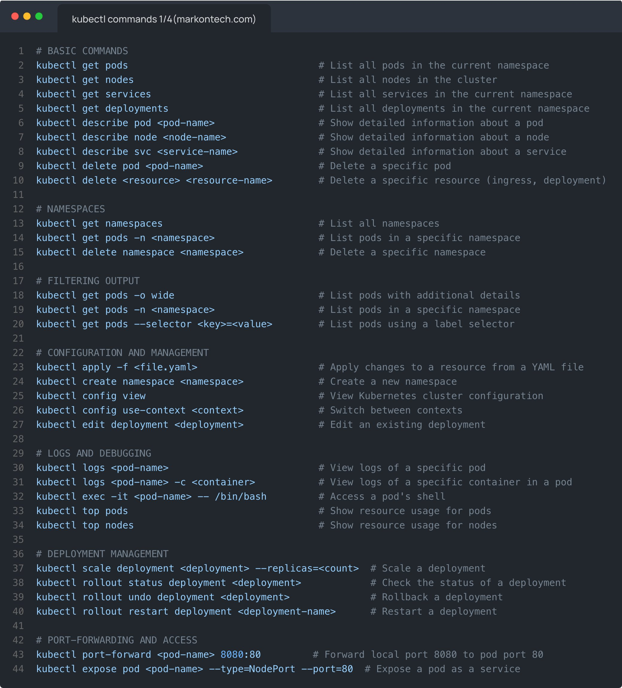

**Source:** [https://twitter.com/i/web/status/1879626370294399157](https://twitter.com/i/web/status/1879626370294399157)
**Original Post Date:** 2025-06-17 11:04:52

# Kubernetes kubectl Command Reference Guide: Essential Cluster Management Commands

## Introduction
This technical guide provides a structured overview of critical kubectl commands for managing Kubernetes clusters. It serves as an authoritative reference for developers and DevOps engineers, organized into logical categories that cover basic operations, namespaces, advanced filtering, configuration management, logging, deployment lifecycle control, and resource access.

## Basic Cluster Operations

Fundamental commands form the foundation of cluster interaction. These provide essential visibility into cluster components and their status.

_These commands provide basic visibility into pod states and detailed resource information_

```bash
# List pods in current namespace
kubectl get pods
# Detailed pod information
kubectl describe pod <pod-name>
```

- Use 'get' verb for listing resources
- Employ 'describe' for detailed resource inspection
- Resource deletion requires specifying resource type

> **Note/Tip:** Always verify target namespace before deletions

> **Note/Tip:** Use wildcards with care when targeting multiple resources

## Namespace Management and Resource Organization

Namespaces provide logical isolation for Kubernetes resources. This section covers creation, deletion, and targeted resource operations within namespaces.

_Namespace management commands for organizational purposes_

```bash
# List all namespaces
kubectl get namespaces
# Create new namespace
kubectl create namespace <namespace-name>
```

## Advanced Resource Management

Configuration and deployment lifecycle management form the core of cluster operations. This section covers resource manipulation, scaling, and monitoring.

_Resource management commands for operational control_

```bash
# Apply configuration from file
kubectl apply -f <file.yaml>
# Scale deployments
kubectl scale deployment <deployment-name> --replicas=3
```

## Debugging and Monitoring Tools

Effective debugging requires access to logs, resource usage metrics, and pod shells. This section provides essential troubleshooting tools.

_Debugging commands for troubleshooting containerized applications_

```bash
# Access pod logs
kubectl logs <pod-name>
# Resource usage monitoring
kubectl top pods
```

## Key Takeaways

- Mastering basic get, describe, and delete operations is foundational
- Namespace management enables logical resource organization
- Resource filtering with -o wide, --selector provides targeted visibility
- Monitoring and debugging commands are essential for operational excellence

## Conclusion
This reference guide provides the essential command structure needed to effectively manage Kubernetes clusters. Understanding these commands is crucial for operational efficiency and troubleshooting.

## External References

- [Official kubectl Documentation](https://kubernetes.io/docs/reference/kubectl/)
- [Kubernetes Best Practices Guide](https://kubernetes.io/docs/concepts/configuration/best-practices-configuration/)


## Media

**Image Description:** ### Image Description

The image is a screenshot of a terminal or code editor displaying a comprehensive list of **Kubernetes (kubect1)** commands. The content is organized into sections, each focusing on a specific category of commands. The text is written in a monospace font, typical of code editors, and uses syntax highlighting to differentiate between comments, commands, and parameters. The background is dark, and the text is primarily white with blue and gray highlights for syntax and comments.

### Main Subject

The main subject of the image is a structured guide to **Kubernetes (kubect1)** commands, categorized into several sections. Each section provides a list of commands along with brief descriptions of their functionality. The commands are written in a clear, instructional format, making it easy for users to understand their purpose and usage.

### Sections and Details

#### 1. **BASIC COMMANDS**
   - **Commands:**
     - `kubectl get pods`: Lists all pods in the current namespace.
     - `kubectl get nodes`: Lists all nodes in the cluster.
     - `kubectl get services`: Lists all services in the current namespace.
     - `kubectl get deployments`: Lists all deployments in the current namespace.
     - `kubectl describe pod <pod-name>`: Shows detailed information about a specific pod.
     - `kubectl describe node <node-name>`: Shows detailed information about a specific node.
     - `kubectl describe svc <service-name>`: Shows detailed information about a specific service.
     - `kubectl delete pod <pod-name>`: Deletes a specific pod.
     - `kubectl delete <resource> <resource-name>`: Deletes a specific resource (e.g., ingress, deployment).

   - **Purpose:** These commands are fundamental for inspecting and managing basic Kubernetes resources.

#### 2. **NAMESPACES**
   - **Commands:**
     - `kubectl get namespaces`: Lists all namespaces.
     - `kubectl get pods -n <namespace>`: Lists pods in a specific namespace.
     - `kubectl delete namespace <namespace>`: Deletes a specific namespace.

   - **Purpose:** These commands help manage and interact with Kubernetes namespaces, which are used to organize resources logically.

#### 3. **FILTERING OUTPUT**
   - **Commands:**
     - `kubectl get pods -o wide`: Lists pods with additional details.
     - `kubectl get pods -n <namespace>`: Lists pods in a specific namespace.
     - `kubectl get pods --selector <key>=<value>`: Lists pods using a label selector.

   - **Purpose:** These commands allow users to filter and customize the output of resource listings based on specific criteria.

#### 4. **CONFIGURATION AND MANAGEMENT**
   - **Commands:**
     - `kubectl apply -f <file.yaml>`: Applies changes to a resource from a YAML file.
     - `kubectl create namespace <namespace>`: Creates a new namespace.
     - `kubectl config view`: Views the Kubernetes cluster configuration.
     - `kubectl config use-context <context>`: Switches between Kubernetes contexts.
     - `kubectl edit deployment <deployment>`: Edits an existing deployment.

   - **Purpose:** These commands are used for configuring and managing Kubernetes resources, including creating new namespaces, applying configurations, and editing existing deployments.

#### 5. **LOGS AND DEBUGGING**
   - **Commands:**
     - `kubectl logs <pod-name>`: Views logs of a specific pod.
     - `kubectl logs <pod-name> -c <container>`: Views logs of a specific container in a pod.
     - `kubectl exec -it <pod-name> -- /bin/bash`: Accesses a pod's shell.
     - `kubectl top pods`: Shows resource usage for pods.
     - `kubectl top nodes`: Shows resource usage for nodes.

   - **Purpose:** These commands are essential for debugging and monitoring the behavior of pods and nodes by accessing logs and resource usage metrics.

#### 6. **DEPLOYMENT MANAGEMENT**
   - **Commands:**
     - `kubectl scale deployment <deployment> --replicas=<count>`: Scales a deployment.
     - `kubectl rollout status deployment <deployment>`: Checks the status of a deployment.
     - `kubectl rollout undo deployment <deployment>`: Rolls back a deployment.
     - `kubectl rollout restart deployment <deployment>`: Restarts a deployment.

   - **Purpose:** These commands are used to manage the lifecycle of deployments, including scaling, checking status, rolling back, and restarting.

#### 7. **PORT FORWARDING AND ACCESS**
   - **Commands:**
     - `kubectl port-forward <pod-name> 8080:80`: Forwards local port 8080 to pod port 80.
     - `kubectl expose pod <pod-name> --type=NodePort --port=80`: Exposes a pod as a service.

   - **Purpose:** These commands facilitate access to services running in pods, either by port forwarding or exposing them as services.

### Technical Details

1. **Syntax Highlighting:**
   - Commands are highlighted in **blue**, making them stand out.
   - Comments (prefixed with `#`) are in **gray**, providing explanations for each command.
   - Parameters (e.g., `<pod-name>`, `<namespace>`) are in **italic**, indicating placeholders for user input.

2. **Command Structure:**
   - Each command follows the standard `kubectl <verb> <resource> <options>` format.
   - Options like `-n`, `--selector`, and `-o` are used to customize command behavior.

3. **Comments:**
   - Each command is accompanied by a comment explaining its purpose, making the guide highly instructional.

4. **Organization:**
   - The commands are grouped into logical sections, making it easy to find relevant commands based on the task at hand.

### Overall Purpose

The image serves as a comprehensive reference guide for Kubernetes users, providing a structured list of commands for managing and interacting with Kubernetes clusters. It is particularly useful for developers, DevOps engineers, and system administrators who work with Kubernetes.

### Summary

The image is a well-organized, syntax-highlighted guide to Kubernetes commands, categorized into sections such as Basic Commands, Namespaces, Filtering Output, Configuration and Management, Logs and Debugging, Deployment Management, and Port Forwarding. Each command is accompanied by a brief description, making it a valuable resource for anyone working with Kubernetes. The use of color coding and clear formatting enhances readability and usability.
