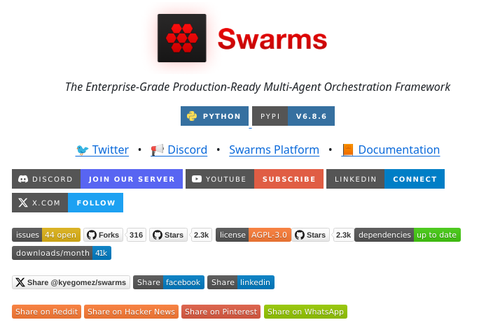

**Source:** [https://twitter.com/i/web/status/1875725211422646557](https://twitter.com/i/web/status/1875725211422646557)
**Original Post Date:** 2025-05-27 22:46:37

# Enterprise-Grade Multi-Agent Orchestration: Understanding Swarms v6.8.6

## Introduction
Swarms represents a significant advancement in multi-agent orchestration systems, offering an enterprise-grade solution built on robust technical foundations. As an open-source framework maintained under the AGPL-3.0 license, Swarms provides developers with powerful tools for orchestrating complex agent-based systems while maintaining production readiness and scalability.

## Technical Architecture Overview

Built on Python v6.8.6 (PyPI version), Swarms integrates seamlessly with the Python ecosystem, leveraging its extensive library support for robust multi-agent coordination. The framework's architecture ensures efficient agent communication and resource management through its production-ready infrastructure.

With dependencies marked as up-to-date and 1k downloads per month, Swarms demonstrates active maintenance and growing adoption in enterprise environments. This stability is crucial for organizations implementing complex orchestration solutions.

1. Python v6.8.6 (PyPI Version)
1. AGPL-3.0 License Compliance Required
1. 1k Downloads Per Month

## Community & Ecosystem Analysis

The project's strong community engagement is evidenced by 2.3k GitHub stars and 316 forks, indicating significant industry adoption. The active development state is further supported by 44 open issues, suggesting ongoing improvement and feature requests.

Multiple communication channels are available through Discord (Join Our Server), Twitter (@SwarmsProject), YouTube tutorials, and comprehensive documentation.

- GitHub: 2.3k Stars, 316 Forks
- Active Discord Community
- Comprehensive Documentation

## Implementation Considerations

Organizations implementing Swarms must consider AGPL-3.0 licensing implications, which require derivative works to be open-sourced under the same license.

Integration best practices include thorough testing in staging environments and careful consideration of agent scaling strategies.

> **Note/Tip:** Consider AGPL licensing impact on proprietary systems

> **Note/Tip:** Leverage community resources for implementation guidance

## Key Takeaways

- Swarms provides enterprise-grade multi-agent orchestration with proven production readiness
- Python ecosystem integration enables rapid development and deployment
- Active community support through multiple channels ensures robust problem-solving capabilities
- AGPL-3.0 licensing requires careful consideration for proprietary implementations

## Conclusion
Swarms stands out as a comprehensive solution for multi-agent orchestration, combining enterprise-grade features with an active community and well-maintained codebase. Its Python foundation, combined with AGPL-3.0 licensing considerations, makes it particularly suitable for organizations prioritizing open-source collaboration while ensuring production reliability.

## External References

- [Swarms GitHub Repository](https://github.com/swarms-project/swarms)
- [Python Package Index (PyPI) Page](https://pypi.org/project/swarms/)
- [Official Documentation](https://swarms-docs.github.io)

## Media

**Image Description:** The image is a screenshot of a webpage for a project called **Swarms**, which appears to be a framework or platform related to multi-agent orchestration. Below is a detailed description of the image, focusing on its main elements and technical details:

### **Main Subject:**
The central focus of the image is the **Swarms** project, which is described as an "Enterprise-Grade Production-Ready Multi-Agent Orchestration Framework." The name "Swarms" is prominently displayed in bold red text, accompanied by a logo featuring a black square with a red pattern resembling a cluster or grid.

### **Header Section:**
- **Logo and Name:** 
  - The logo is a black square with a red pattern, possibly representing a grid or cluster.
  - The word "Swarms" is written in large, bold red text next to the logo.
- **Tagline:** 
  - Below the logo and name, there is a tagline in smaller text: 
    > "The Enterprise-Grade Production-Ready Multi-Agent Orchestration Framework"

### **Technical Details:**
1. **Language and Version:**
   - The project is developed in **Python**, as indicated by the "Python" badge with a plus sign, suggesting it is open-source or community-driven.
   - The version of the project is **v6.8.6**, as shown in the "PyPI" badge, indicating it is available on the Python Package Index.

2. **Social Media and Community Links:**
   - **Twitter:** A link to the project's Twitter account is provided with the Twitter logo.
   - **Discord:** A link to join the project's Discord server is prominently displayed with a "Join Our Server" button.
   - **Swarms Platform:** A direct link to the Swarms Platform is provided.
   - **Documentation:** A link to the project's documentation is available.

3. **Community and Engagement:**
   - **Discord Server:** A button labeled "Join Our Server" encourages users to join the project's Discord community.
   - **YouTube:** A "Subscribe" button for the project's YouTube channel is present.
   - **X (formerly Twitter):** A "Follow" button for the project's X account is included.

4. **GitHub Metrics:**
   - **Issues:** There are **44 open issues** on the project's GitHub repository.
   - **Forks:** The repository has been forked **316** times.
   - **Stars:** The project has **2.3k stars** on GitHub.
   - **License:** The project is licensed under the **AGPL-3.0** (GNU Affero General Public License version 3.0).
   - **Dependencies:** The dependencies are marked as **up to date**.
   - **Downloads:** The project has **1k downloads/month**.

5. **Social Sharing Options:**
   - There are buttons to share the project on various platforms:
     - Twitter
     - Facebook
     - LinkedIn
     - Reddit
     - Hacker News
     - Pinterest
     - WhatsApp

6. **Connectivity Options:**
   - A "Connect" button for LinkedIn is present, suggesting a way to connect with the project's team or community on LinkedIn.

### **Design and Layout:**
- The layout is clean and organized, with a white background and a mix of red, blue, and black colors to highlight key elements.
- Badges and buttons are used effectively to draw attention to important links and metrics.
- The use of icons (e.g., Twitter, Discord, YouTube) makes it easy for users to identify and access the relevant platforms.

### **Overall Impression:**
The image is designed to promote the **Swarms** project, emphasizing its enterprise-grade capabilities, community engagement, and technical details. It provides clear pathways for users to learn more, join the community, and contribute to the project. The inclusion of metrics like stars, forks, and downloads adds credibility and indicates active development and community interest.
