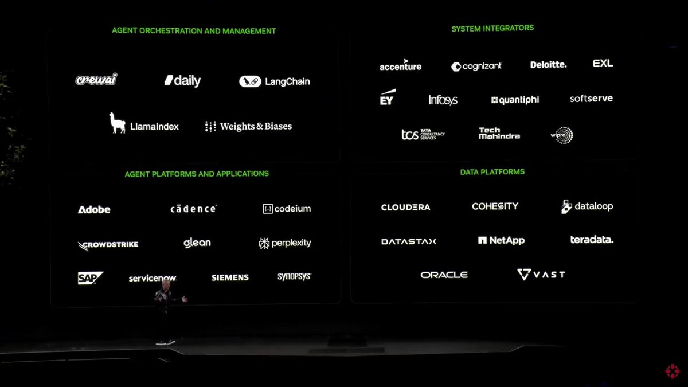

**Source:** [https://twitter.com/i/web/status/1876472202058445225](https://twitter.com/i/web/status/1876472202058445225)
**Original Post Date:** 2025-05-27 18:23:14

# Landscape of AI-Driven Agent Systems: Tools, Platforms, and Data Infrastructure

## Introduction
Agent-driven systems are transforming software development by enabling intelligent automation across various domains. This knowledge base article explores the current landscape of tools, platforms, and infrastructure supporting AI agents, from orchestration frameworks to system integrators and data platforms. Understanding these components is crucial for architects designing modern, automated solutions that leverage artificial intelligence.

## Agent Orchestration and Management

LangChain and LlamaIndex are leading frameworks for orchestrating large language models (LLMs), providing essential tools for prompt management, memory handling, and chain composition. Weights & Biases enables robust tracking of AI model experiments and performance metrics.

crewai specializes in building production-ready AI applications with built-in data versioning and experiment tracking.

```python
from langchain import LLMChain
from langchain.prompts import PromptTemplate

template = """
You are a helpful assistant. {question}
"""
prompt = PromptTemplate(template=template, input_variables=["question"])
chain = LLMChain(prompt=prompt)
```

- Use LangChain for complex prompt workflows and chaining
- Integrate Weights & Biases for ML experiment tracking

## System Integration Landscape

Leading system integrators like Accenture, Cognizant, Deloitte, and Infosys provide comprehensive integration services. Quantiphi specializes in AI-driven solutions while SoftServe offers end-to-end digital transformation.

1. Evaluate vendor expertise in your specific domain (e.g., healthcare, finance)
1. Consider scalability and integration capabilities

> **Note/Tip:** Prioritize integrators with proven AI implementation track records

## Agent Platforms and Applications

Codeium provides AI-driven code assistance, while Perplexity offers advanced search capabilities. SAP and ServiceNow enable enterprise-wide automation and workflow management.

```javascript
// Codeium example
// @ai: complete the function below
class DataProcessor {
    process(data) {
        // AI-generated code here
    }
}
```

## Data Infrastructure Ecosystem

Cloudera and Dataloop provide robust data management solutions. NetApp offers scalable storage while VAST delivers high-performance data processing capabilities.

- Ensure data pipeline scalability for AI workloads
- Implement proper data versioning and lineage tracking

## Key Takeaways

- LangChain and LlamaIndex are essential for managing complex LLM workflows
- System integrators should have proven track records in AI implementation
- Data infrastructure must be designed with AI scalability in mind
- Consider the integration ecosystem when selecting platforms

## Conclusion
Building successful agent-driven systems requires careful selection and integration of tools across multiple domains. By understanding this landscape, architects can make informed decisions to create robust, scalable solutions that effectively leverage artificial intelligence.

## External References

- [LangChain Documentation](https://langchain.com/docs/)
- [Dataloop.ai](https://dataloop.ai)


## Media

**Video Description:** Video Content Analysis - media_seg0_item0.mp4:

The video appears to be a professional presentation or keynote speech, likely focused on technology, artificial intelligence, or data-driven solutions. The content is structured around a series of slides that highlight various companies and platforms, suggesting a discussion about partnerships, integrations, or ecosystem collaborations in the tech industry. Below is a comprehensive description based on the provided frames:

---

### **Overall Context and Structure**
The video features a presenter standing on a stage, delivering a speech in front of a large screen displaying slides. The slides are organized into distinct sections, each highlighting different categories of companies or platforms. The presenter appears to be engaging with the audience, using hand gestures to emphasize points.

---

### **Key Frames and Content Analysis**

#### **Slide 1:**
- **Title:** The slide is divided into four sections, each with a heading in green text:
  1. **Agent Orchestration and Management**
  2. **System Integrators**
  3. **Agent Platforms and Applications**
  4. **Data Platforms**
- **Content:**
  - **Agent Orchestration and Management:** Includes companies like **CrewAI**, **Daily**, **LangChain**, **LlamaIndex**, and **Weights & Biases**. These are likely tools or platforms for managing and orchestrating AI agents.
  - **System Integrators:** Lists major consulting and integration firms such as **Accenture**, **Cognizant**, **Deloitte**, **EXL**, **EY**, **Infosys**, **Quantiphi**, **SoftServe**, **TCS**, **Tech Mahindra**, and **Wipro**. These firms specialize in integrating technology solutions into existing systems.
  - **Agent Platforms and Applications:** Features companies like **Adobe**, **Cadence**, **Codecademy**, **CrowdStrike**, **Glean**, **Perplexity**, **SAP**, **ServiceNow**, **Siemens**, and **Synopsys**. These are platforms or applications that leverage AI or automation.
  - **Data Platforms:** Includes companies like **Vera**, **Snowflake**, **Databricks**, **Google Cloud**, **AWS**, **Microsoft Azure**, and **IBM Cloud**. These are cloud-based data platforms and services.

This slide suggests a focus on the broader ecosystem of AI, data, and technology, highlighting the integration of various tools, platforms, and services.

---

#### **Slide 2:**
- **Background:** The slide shows the word **"SYNOPSYS"** prominently displayed in large, bold letters. This indicates that the presentation may be related to or sponsored by Synopsys, a well-known company in the semiconductor and software verification industry.
- **Presenter:** The individual is dressed in a shiny, textured jacket, suggesting a formal or semi-formal event. The presenter is actively gesturing with their hands, emphasizing key points in their speech.

This frame reinforces the professional nature of the presentation and hints at a focus on technology partnerships or collaborations involving Synopsys.

---

#### **Slide 3:**
- **Background:** Similar to Slide 2, the word **"SYNOPSYS"** is displayed prominently, maintaining the theme of the presentation.
- **Presenter:** The individual continues to engage with the audience, using hand gestures to convey enthusiasm and emphasize key messages. The consistent use of gestures suggests a dynamic and interactive presentation style.

---

### **Key Themes and Technical Concepts**
1. **AI and Automation Ecosystem:**
   - The slide content highlights a range of tools and platforms related to AI, automation, and data management. This suggests a focus on how these technologies are being integrated and utilized across various industries.

2. **Partnerships and Collaborations:**
   - The inclusion of major consulting firms (e.g., Accenture, Deloitte) and technology companies (e.g., Adobe, SAP, Siemens) indicates a discussion around partnerships and ecosystem integrations. The presenter may be explaining how these companies work together to deliver comprehensive solutions.

3. **Data-Driven Solutions:**
   - The emphasis on data platforms (e.g., Snowflake, Databricks, Google Cloud) suggests a focus on leveraging data analytics and cloud services to drive innovation and efficiency.

4. **Synopsys Focus:**
   - The repeated appearance of the Synopsys logo suggests that the presentation is either hosted by Synopsys or highlights its role in the broader technology ecosystem. Synopsys may be showcasing its partnerships or its position as a key player in AI, automation, and data-driven solutions.

---

### **Video Summary**
The video is a professional presentation, likely aimed at an audience interested in technology, AI, and data-driven solutions. The presenter discusses the integration of various tools, platforms, and services within an ecosystem, emphasizing partnerships and collaborations. The slides provide a structured overview of different categories of companies and platforms, including those involved in agent orchestration, system integration, application development, and data management. The consistent presence of the Synopsys logo suggests that the presentation is either hosted by Synopsys or highlights its role in the discussed ecosystem. The presenter’s dynamic delivery style enhances the engagement and impact of the content. 

This video is likely part of a conference, tech summit, or corporate event focused on innovation and technology partnerships.

Key Frames Analysis:
Frame 1: ### Description of Frame 1:

The image shows a presentation slide with a dark background and white/green text. The slide is divided into four sections, each highlighting different categories of companies or platforms. Below is a detailed breakdown of the content:

#### **Top Left Section: Agent Orchestration and Management**
- **Title:** "AGENT ORCHESTRATION AND MANAGEMENT" (in green text)
- **Companies/Platforms:**
  - **Crewai**
  - **Daily**
  - **LangChain**
  - **LlamaIndex**
  - **Weights & Biases**

#### **Top Right Section: System Integrators**
- **Title:** "SYSTEM INTEGRATORS" (in green text)
- **Companies:**
  - **Accenture**
  - **Cognizant**
  - **Deloitte**
  - **EXL**
  - **EY**
  - **Infosys**
  - **Quantiphi**
  - **SoftServe**
  - **TCS**
  - **Tech Mahindra**
  - **Wipro**

#### **Bottom Left Section: Agent Platforms and Applications**
- **Title:** "AGENT PLATFORMS AND APPLICATIONS" (in green text)
- **Companies/Platforms:**
  - **Adobe**
  - **Cadence**
  - **Codecademy**
  - **CrowdStrike**
  - **Glean**
  - **Perplexity**
  - **SAP**
  - **ServiceNow**
  - **Siemens**
  - **Synopsys**

#### **Bottom Right Section: Data Platforms**
- **Title:** "DATA PLATFORMS" (in green text)
- **Companies/Platforms:**
  - **Cloudera**
  - **Cohesity**
  - **Dataloop**
  - **DataStax**
  - **NetApp**
  - **Teradata**
  - **Oracle**
  - **VAST**

### Additional Observations:
- The slide is well-organized into four quadrants, each focusing on a specific category.
- The text is clear and legible, with company names and logos displayed prominently.
- The overall design is minimalistic, using a dark background with white and green text for contrast.
- There is a person standing in front of the slide, likely presenting, but their details are not the focus of the frame.

This slide appears to be part of a presentation discussing various technologies, platforms, and companies in the fields of agent orchestration, system integration, agent platforms, and data management.
Frame 2: In **Frame 2** of the video, the following details are visible:

1. **Speaker**:
   - A person is standing on a stage, wearing a black, shiny, textured jacket. The jacket appears to have a reflective or metallic sheen.
   - The individual has short, light-colored hair and is wearing glasses.
   - Their hands are gesturing outward, suggesting they are in the middle of speaking or explaining something.

2. **Background**:
   - The background is predominantly dark, creating a contrast that highlights the speaker.
   - The word **"SIEMENS"** is prominently displayed in large, bold, white letters on the left side of the frame. This indicates that the event or presentation is likely related to Siemens, a well-known company.

3. **Lighting**:
   - The lighting is focused on the speaker, making them the central point of attention. The rest of the stage remains relatively dark.

4. **Overall Context**:
   - The setting appears to be a formal presentation or conference, given the professional attire of the speaker and the prominent display of the Siemens logo.

This frame captures a moment where the speaker is actively engaging with the audience, likely delivering a speech or presentation. The emphasis on the Siemens logo suggests a corporate or professional context.
Frame 3: In frame 3 of the video, the following details are visible:

1. **Speaker**: 
   - A person is standing on a stage, wearing a black, textured jacket with a shiny, reflective surface. The jacket appears to have a patterned or quilted design.
   - The individual is wearing glasses and has short, light-colored hair.
   - The person is gesturing with their hands, with one hand slightly raised and the other holding what appears to be a small device or remote.

2. **Background**:
   - The background is predominantly dark, creating a contrast that highlights the speaker.
   - There are large, bold, white letters visible on the screen behind the speaker. The visible text includes "ENS" on the left and "SYN" on the right, suggesting part of a larger word or phrase.

3. **Lighting**:
   - The lighting is focused on the speaker, illuminating them clearly against the dark background.
   - The reflective surface of the jacket catches the light, adding a subtle shine.

4. **Stage Setup**:
   - The stage appears minimalistic, with no additional props or decorations visible in the frame.
   - The focus is entirely on the speaker and the text in the background.

This frame suggests a professional or formal presentation, likely at a conference or event, with the speaker actively engaging the audience through gestures and speech. The text in the background may be part of a title, theme, or company name related to the presentation.
Frame 4: In frame 4 of the video, the following details are visible:

1. **Person**: 
   - A man is standing on a stage, facing slightly to the left of the frame.
   - He is wearing a black leather jacket with a shiny, textured appearance.
   - He has short, light-colored hair and is wearing glasses.
   - His hands are gesturing as if he is speaking or explaining something.

2. **Background**:
   - The background is predominantly black, creating a stark contrast with the man and the text.
   - The word "NVIDIA" is prominently displayed in large, bold, white letters behind the man. The text is slightly distorted or stretched, giving it a dynamic or stylized appearance.

3. **Lighting**:
   - The lighting is focused on the man, highlighting his face and upper body.
   - The background remains dark, ensuring the man and the text are the focal points.

4. **Overall Setting**:
   - The setting appears to be a professional or formal event, such as a conference, presentation, or keynote speech.
   - The man seems to be the speaker, given his posture and gestures.

This frame captures a moment where the speaker is actively engaging with the audience, likely discussing a topic related to NVIDIA, given the prominent branding in the background.
Frame 5: In frame 5 of the video, the following details are visible:

1. **Speaker**: A person is standing on a stage, wearing a black, shiny, textured jacket over a black shirt. The individual appears to be gesturing with their hands, suggesting they are actively speaking or presenting.

2. **Background**: The background is predominantly dark, with a large, illuminated logo that reads "SYNOPSYS" in white capital letters. The logo is prominently displayed, indicating that the event or presentation is likely related to the company Synopsys.

3. **Lighting**: The lighting is focused on the speaker, highlighting them against the dark background. The lighting creates a contrast that draws attention to the individual and their gestures.

4. **Expression and Gesture**: The speaker appears to be engaged in delivering a presentation, with one hand slightly raised and the other gesturing, which suggests they are emphasizing a point or explaining something.

5. **Stage Setting**: The stage is minimalistic, with no additional visible elements or distractions, keeping the focus on the speaker and the company logo.

Overall, the frame conveys a professional and focused presentation environment, with the speaker actively engaging the audience.


**Image Description:** The image appears to be a slide from a presentation, likely discussing the landscape of tools, platforms, and services related to **Agent Orchestration and Management**, **System Integrators**, **Agent Platforms and Applications**, and **Data Platforms**. The slide is divided into four main sections, each highlighting different categories of companies and technologies. Below is a detailed description:

### **1. Agent Orchestration and Management**
- **Description**: This section lists tools and platforms that focus on orchestrating and managing agents (likely AI or automation agents).
- **Companies/Tools Listed**:
  - **crewai**: A platform for building and deploying AI-driven applications.
  - **#daily**: Likely a reference to a tool or platform, though the exact details are unclear from the image.
  - **LangChain**: A framework for developing language model applications, often used for orchestrating LLMs (Large Language Models).
  - **LlamaIndex**: A framework for building applications that index and query data using LLMs.
  - **Weights & Biases**: A platform for machine learning experiment tracking and model optimization.

### **2. System Integrators**
- **Description**: This section lists major system integrators, companies that provide services to integrate different systems and technologies.
- **Companies Listed**:
  - **Accenture**: A global professional services company.
  - **Cognizant**: A global IT services and consulting company.
  - **Deloitte**: A multinational professional services network.
  - **EXL**: Likely referring to EXL Services, a global business services company.
  - **EY**: Ernst & Young, a professional services firm.
  - **Infosys**: An Indian multinational technology company.
  - **Quantiphi**: A company specializing in AI and analytics solutions.
  - **SoftServe**: A global IT services company.
  - **TCS**: Tata Consultancy Services, a leading IT services company.
  - **Tech Mahindra**: An Indian multinational IT services company.
  - **Wipro**: An Indian multinational IT services company.

### **3. Agent Platforms and Applications**
- **Description**: This section lists platforms and applications that provide tools for building and deploying agent-based systems.
- **Companies/Tools Listed**:
  - **Adobe**: A multinational computer software and digital media company.
  - **Cadence**: Likely referring to Cadence Design Systems, a company that provides software and hardware tools for electronic design automation.
  - **Codeium**: A platform for AI-driven code completion and assistance.
  - **CrowdStrike**: A cybersecurity company offering endpoint protection and threat intelligence.
  - **Glean**: Likely referring to Glean, a search and knowledge management platform.
  - **Perplexity**: A search engine that uses AI to provide answers to questions.
  - **SAP**: A German multinational software corporation that makes enterprise software.
  - **ServiceNow**: A cloud-based platform for IT service management.
  - **Siemens**: A German multinational technology company.
  - **Synopsys**: A company that develops software for electronic design automation.

### **4. Data Platforms**
- **Description**: This section lists platforms and services that focus on data management, storage, and analytics.
- **Companies/Tools Listed**:
  - **Cloudera**: A company that provides data management and analytics solutions.
  - **Cohesity**: A company that provides data management and protection solutions.
  - **Dataloop**: A platform for managing and labeling data for AI and machine learning projects.
  - **DataStax**: A company that provides Apache Cassandra-based database solutions.
  - **NetApp**: A company that provides data storage and management solutions.
  - **Teradata**: A company that provides data warehousing and analytics solutions.
  - **Oracle**: A multinational computer technology company that specializes in database management systems.
  - **VAST**: Likely referring to VAST Data, a company that provides high-performance storage solutions.

### **Additional Observations**
- **Slide Design**: The slide uses a dark background with green and white text, making the content stand out.
- **Speaker**: There is a person standing in front of the slide, likely presenting the content. The person is partially visible at the bottom of the image.
- **Organization**: The slide is well-organized into four distinct sections, each with a clear heading and a list of companies or tools.
- **Focus**: The slide appears to be part of a larger discussion about the ecosystem of tools and services in the AI, automation, and data management domains.

### **Conclusion**
The image is a comprehensive overview of various companies and tools across different categories related to AI, automation, system integration, and data management. It is likely part of a technical or business presentation aimed at providing insights into the landscape of these technologies and services. The slide effectively categorizes the companies and tools, making it easy to understand the relationships and roles of each entity in the broader ecosystem.
