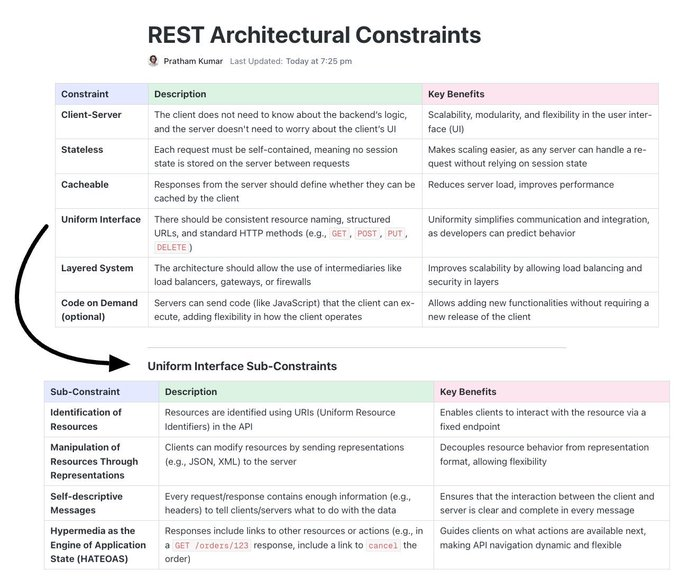

# tech_insight_20250114_18694038

**Tweet URL:** [https://x.com/Prathkum/status/1869403892007710750](https://x.com/Prathkum/status/1869403892007710750)

**Tweet Text:** 6 REST API architectural constraints.

**Image 1 Description:** The image presents a comprehensive overview of REST architectural constraints, highlighting their significance in ensuring scalability, flexibility, and maintainability of web applications.

*   **Constraint**
    *   The client does not need to know about the backend's logic.
    *   The server is unaware of the client's UI requirements.
*   **Key Benefits**
    *   Scalability
    *   Modularity
    *   Flexibility
*   **Client-Server Architecture**
    *   Separates concerns between clients and servers.
    *   Improves scalability by allowing multiple clients to interact with a single server.
    *   Enhances flexibility through modularity, enabling easy addition or removal of components without affecting the entire system.
*   **Stateless**
    *   Each request is independent and does not rely on previous requests for state information.
    *   Allows for load balancing and caching.
    *   Facilitates scalability by eliminating the need to store session data on the server.
*   **Cacheable**
    *   Responses from the server can be cached by intermediate proxies or clients.
    *   Improves performance by reducing latency.
    *   Reduces the number of requests made to the server.

In summary, REST architectural constraints provide a foundation for building scalable, flexible, and maintainable web applications. By separating concerns between clients and servers, eliminating state information, and enabling caching, these constraints enable developers to create robust and efficient systems that can adapt to changing requirements over time.

