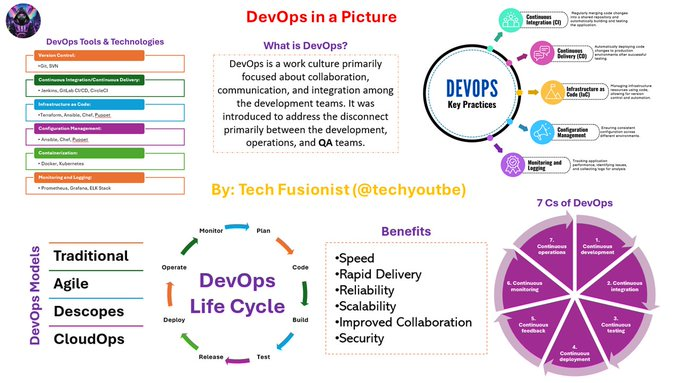

# tech_insight_20250114_18682589

**Tweet URL:** [https://x.com/techyoutbe/status/1868258946919592207](https://x.com/techyoutbe/status/1868258946919592207)

**Tweet Text:** DevOps (Simplified)

**Image 1 Description:** The infographic, titled "DevOps in a Picture," provides an overview of DevOps principles and practices, presented by Tech Fusionist (@techyoutbe). The visual content is organized into sections, each addressing different aspects of DevOps.

**What is DevOps?**

*   Definition: A work culture focused on collaboration, communication, and integration among development teams.
*   Key Practices:
    *   Continuous Integration
    *   Continuous Deployment
    *   Continuous Monitoring

**DevOps Tools & Technologies**

*   **Continuous Integration**
    *   Jenkins
    *   GitLab CI/CD
    *   Travis CI
*   **Continuous Testing**
    *   Selenium
    *   Appium
    *   Cypress
*   **Containerization**
    *   Docker
    *   Kubernetes

**DevOps Life Cycle**

*   **Plan**
    *   Identify business requirements and define project scope.
    *   Create a project plan, including timelines and milestones.
*   **Code**
    *   Write clean, modular code using version control systems like Git.
    *   Implement automated testing and continuous integration.
*   **Build**
    *   Compile and package code into deployable artifacts.
    *   Use tools like Maven or Gradle for build automation.
*   **Release**
    *   Deploy applications to production environments.
    *   Monitor performance and handle issues.
*   **Monitor**
    *   Track application performance and user feedback.
    *   Identify areas for improvement.

**Benefits of DevOps**

*   **Speed**: Faster time-to-market with automated testing and deployment.
*   **Reliability**: Improved quality through continuous monitoring and feedback.
*   **Scalability**: Easier scaling due to containerization and orchestration.
*   **Improved Collaboration**: Enhanced communication between teams with tools like Jira and Slack.

**DevOps Models**

*   **Traditional**
    *   Waterfall
    *   Agile
*   **Agile**
    *   Scrum
    *   Kanban
*   **Scrum**
    *   Sprint planning
    *   Daily stand-ups
*   **Kanban**
    *   Visual boards
    *   WIP limits

**DevOps Tools**

*   **CI/CD Tools**: Jenkins, GitLab CI/CD, Travis CI
*   **Version Control Systems**: Git, SVN
*   **Agile Project Management Tools**: Jira, Trello

In summary, the infographic provides a comprehensive overview of DevOps principles, tools, and practices. It highlights the importance of collaboration, communication, and integration among development teams to achieve faster time-to-market, improved quality, and better scalability. The visual content is organized into sections that address different aspects of DevOps, making it easy to understand and navigate.

