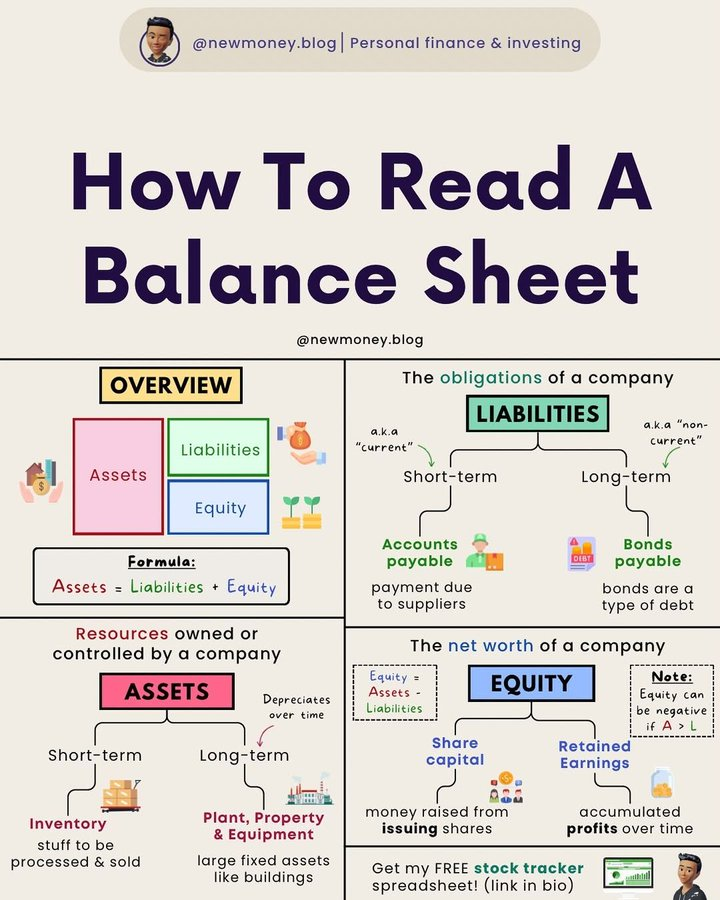

# tech_insight_20250114_18762329

**Tweet URL:** [https://x.com/CompoundingW/status/1876232999081255133](https://x.com/CompoundingW/status/1876232999081255133)

**Tweet Text:** How to read a balance sheet

**Image 1 Description:** The image presents a comprehensive guide to understanding balance sheets, titled "How To Read A Balance Sheet." The title is prominently displayed in large purple text at the top of the page.

**Overview:**
This infographic provides an overview of how to interpret a company's financial health through its balance sheet. It covers essential concepts such as assets, liabilities, equity, and their relationships with each other.

* **Assets:** 
	+ Definition: Assets are resources owned or controlled by a company.
	+ Examples:
		- Short-term assets (cash, accounts receivable)
		- Long-term assets (property, equipment, investments)
	+ Formula: Assets = Liabilities + Equity
* **Liabilities:**
	+ Definition: Liabilities are debts or obligations owed to external parties.
	+ Types:
		- Current liabilities (accounts payable, loans)
		- Non-current liabilities (bonds, mortgages)
	+ Formula: Liabilities = Assets - Equity
* **Equity:** 
	+ Definition: Equity represents the ownership stake in a company.
	+ Components:
		- Common stock
		- Retained earnings
	+ Formula: Equity = Assets - Liabilities

**Summary:**
In summary, this infographic effectively explains the key components of a balance sheet and how they interact with each other. By understanding these concepts, individuals can gain valuable insights into a company's financial performance and make informed decisions.

