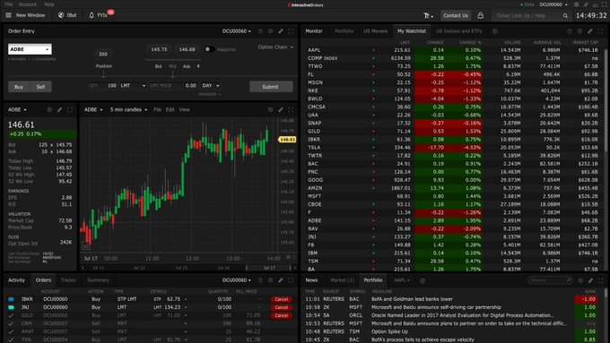

# trading_optimization

**Tweet URL:** [https://x.com/quantscience_/status/1878851674132865404](https://x.com/quantscience_/status/1878851674132865404)

**Tweet Text:** The biggest mistake I made when I started trading.

Not learning Python.

This is what helped:

**Image 1 Description:** The image shows a stock trading platform, with various charts and graphs displaying market data.

* A graph
	+ Located in the center of the screen
	+ Displays a line chart with green and red lines
	+ Has a title that reads "AORE"
	+ Shows a range of values on the y-axis from 0 to 150
	+ Has a date axis on the x-axis
* A table
	+ Located below the graph
	+ Lists various stock symbols, including "AAPL", "TSLA", and "GOOG"
	+ Displays columns for "Price", "Change", and "Volume"
	+ Shows values in dollars and percentages
* A list of stocks
	+ Located on the right side of the screen
	+ Displays a list of stock symbols, including "AAPL", "TSLA", and "GOOG"
	+ Has a column for "Price" and another for "Change"

Overall, the image appears to be a screenshot of a stock trading platform, showing real-time market data and allowing users to track the performance of various stocks. The presence of green and red lines on the graph suggests that the platform is displaying price movements over time, with green indicating an increase in value and red indicating a decrease.

