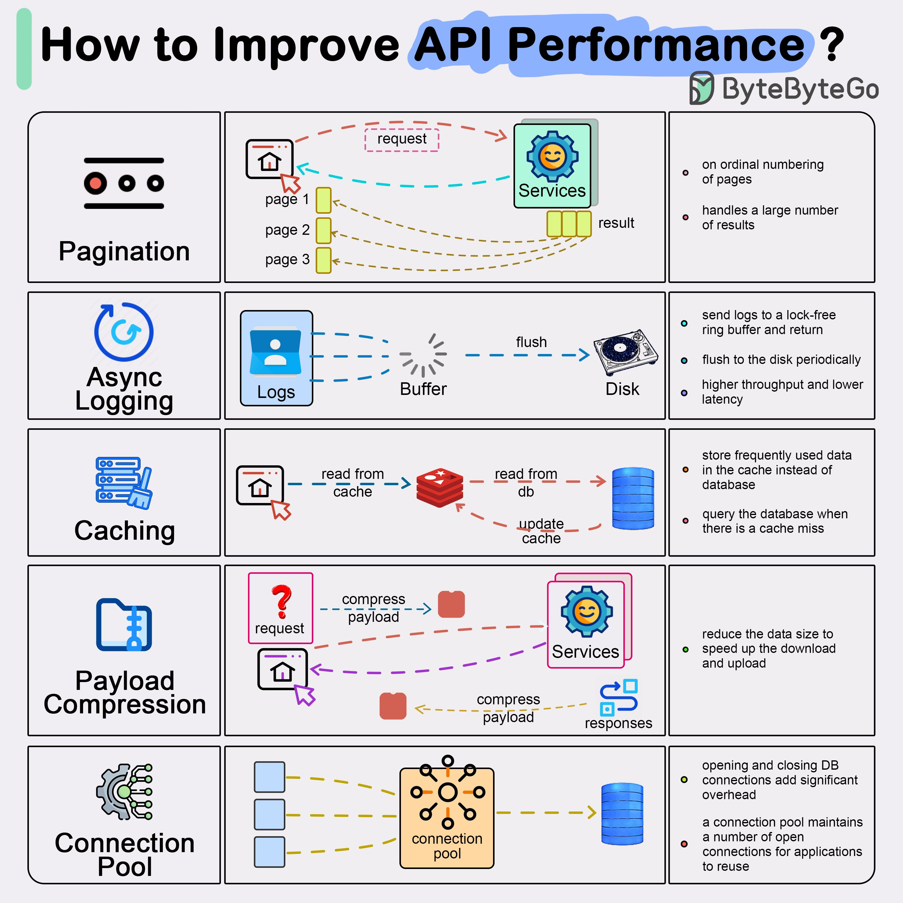

**Source:** [https://twitter.com/i/web/status/1917791347865706696](https://twitter.com/i/web/status/1917791347865706696)
**Original Post Date:** 2025-05-28 00:54:45

# API Performance Optimization: Five Essential Techniques

## Introduction
In modern distributed systems, API performance directly impacts user experience and system scalability. This guide explores five critical optimization techniques that address common bottlenecks in API design. By implementing these strategies—pagination, async logging, caching, payload compression, and connection pooling—you can significantly improve response times, reduce server load, and enhance overall system efficiency.

## Pagination

Pagination optimizes large dataset handling by dividing results into manageable chunks. This technique reduces server load and network bandwidth usage while improving response times for initial requests.

Implementing pagination requires careful consideration of page sizes, total result counts, and proper error handling to maintain data consistency across pages.

```python
def get_paginated_data(page=1, size=20):
    skip = (page - 1) * size
    return {
        'data': database.find().skip(skip).limit(size),
        'total_pages': ceil(total_records / size)
    }
```

- Use query parameters like page=1&size=20 for flexibility
- Implement total count headers for accurate pagination metadata
- Consider implementing last-page optimization techniques

> **Note/Tip:** Choose optimal page sizes based on average response time and memory constraints

> **Note/Tip:** Avoid returning empty pages; handle edge cases gracefully

## Async Logging

Asynchronous logging prevents performance degradation by decoupling log writing from the main application flow. This approach significantly reduces latency in high-throughput scenarios.

Implementing a buffered logging system with periodic flushes ensures reliable log capture while maintaining minimal impact on API response times.

```javascript
const logger = {
    buffer: [],
    writeLog(log) {
        this.buffer.push(log);
        if (this.buffer.length > 1000) {
            this.flush();
        }
    },
    flush() {
        return new Promise((resolve) => {
            setTimeout(() => {
                fs.writeFile('logs.txt', JSON.stringify(this.buffer), () => {
                    this.buffer = [];
                    resolve();
                });
            }, 100);
        });
    }
};
```

## Caching

Caching frequently accessed data reduces database load and improves response times. This technique is particularly effective for read-heavy APIs with stable data requirements.

Implementing caching requires careful consideration of cache invalidation strategies, expiration policies, and appropriate cache layer selection (e.g., Redis, Memcached).

1. Use HTTP Cache-Control headers for CDN-level caching
1. Implement request fingerprinting to avoid cache collisions
1. Consider multi-layer caching strategies for optimal performance

## Payload Compression

Compressing API responses reduces network bandwidth usage and improves transmission speed. This technique is especially beneficial for APIs handling large payloads.

Modern web servers support various compression algorithms, with gzip being widely adopted due to its balance of compression ratio and processing overhead.

```nginx
gzip on;
gzip_types application/json text/plain;
gzip_min_length 1024;
```

## Connection Pooling

Connection pooling optimizes database interactions by maintaining a pool of reusable connections. This reduces the overhead of establishing new connections for each request.

Proper configuration of connection pools requires careful consideration of maximum pool size, idle timeouts, and validation queries to maintain healthy connections.

- Monitor active connections to prevent exhaustion
- Implement graceful shutdown for maintaining data integrity
- Use connection validation before each request

## Key Takeaways

- Pagination is essential for handling large datasets efficiently while reducing initial load times.
- Async logging significantly improves response times by decoupling log writing from the main execution flow.
- Effective caching strategies reduce database load and improve read performance without compromising data consistency.
- Payload compression reduces network overhead, especially beneficial for mobile clients and high-latency networks.
- Connection pooling optimizes database interactions by maintaining a pool of reusable connections.

## Conclusion
Implementing these five techniques—pagination, async logging, caching, payload compression, and connection pooling—creates a robust foundation for highly performant APIs. Each technique addresses specific bottlenecks in the request-response cycle, contributing to improved user experience and system scalability.

## External References

- [NGINX Gzip Configuration](https://nginx.org/en/docs/http/ngx_http_gzip_module.html)
- [Redis Documentation](https://redis.io/documentation)


## Media

**Image Description:** The image is an infographic titled **"How to Improve API Performance?"** and is designed to provide insights into various techniques and strategies for enhancing the performance of APIs. The infographic is divided into six main sections, each focusing on a specific technique: **Pagination**, **Async Logging**, **Caching**, **Payload Compression**, and **Connection Pooling**. Below is a detailed description of each section:

---

### **1. Pagination**
- **Icon**: A stack of dots (`••••`) representing pagination.
- **Diagram**:
  - A client sends a **request** to the **Services**.
  - The services return results in **pages** (e.g., Page 1, Page 2, Page 3).
  - Each page contains a subset of the total results.
- **Description**:
  - Pagination is used to handle large datasets by breaking them into smaller, manageable chunks.
  - It helps in reducing the load on the server and improves response times by sending only a portion of the data at a time.
  - The client can request subsequent pages as needed.

---

### **2. Async Logging**
- **Icon**: A circular arrow (`↻`) representing asynchronous operations.
- **Diagram**:
  - A **Logs** component sends logs to a **Buffer**.
  - The **Buffer** periodically **flushes** the logs to the **Disk**.
- **Description**:
  - Asynchronous logging ensures that log writes do not block the main application flow.
  - Logs are buffered in memory and flushed to disk periodically, reducing latency and improving throughput.
  - This approach avoids the overhead of writing logs synchronously, which can slow down API responses.

---

### **3. Caching**
- **Icon**: A database icon (`db`) with a cache icon (`cache`).
- **Diagram**:
  - A client sends a **request**.
  - The system first checks the **Cache**.
  - If the data is in the cache, it is returned directly.
  - If not, the system queries the **Database (DB)**, updates the cache, and returns the result.
- **Description**:
  - Caching stores frequently accessed data in a faster, temporary storage (e.g., memory).
  - This reduces the load on the database by serving data from the cache when possible.
  - It improves response times for repeated requests and reduces database queries.

---

### **4. Payload Compression**
- **Icon**: A folder icon (`📁`) with a compression symbol.
- **Diagram**:
  - A client sends a **request**.
  - The server compresses the **payload** before sending the **response**.
  - The client decompresses the payload upon receipt.
- **Description**:
  - Payload compression reduces the size of data being transmitted over the network.
  - This speeds up download and upload times, especially for large payloads.
  - Common compression algorithms include gzip and deflate.

---

### **5. Connection Pooling**
- **Icon**: A gear with multiple connections (`conn`).
- **Diagram**:
  - A **Connection Pool** manages a set of reusable connections.
  - When a client sends a **request**, the pool provides an available connection.
  - After the request is processed, the connection is returned to the pool.
- **Description**:
  - Connection pooling avoids the overhead of repeatedly opening and closing database connections.
  - It maintains a pool of pre-established connections, which can be reused for subsequent requests.
  - This reduces latency and improves the overall performance of database interactions.

---

### **Overall Layout and Design**
- The infographic uses a clean, grid-based layout with six sections, each containing:
  - An **icon** representing the technique.
  - A **diagram** illustrating the flow or process.
  - A **description** explaining the concept and its benefits.
- The use of arrows, dashed lines, and colored boxes helps visualize the flow of data and interactions between components.
- The text is concise and technical, aimed at developers or technical audiences.

---

### **Key Takeaways**
The infographic effectively communicates how these techniques can be applied to improve API performance:
1. **Pagination** manages large datasets efficiently.
2. **Async Logging** reduces latency by buffering logs.
3. **Caching** minimizes database queries for frequently accessed data.
4. **Payload Compression** reduces network overhead.
5. **Connection Pooling** optimizes database interactions.

This visual guide is a practical resource for developers looking to optimize API performance.
