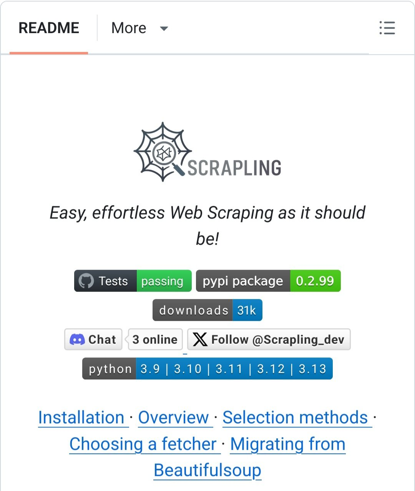

**Source:** [https://twitter.com/i/web/status/1920357544083460377](https://twitter.com/i/web/status/1920357544083460377)
**Original Post Date:** 2025-05-28 00:24:47

# Optimizing Web Scraping Performance with Scraprapling

## Introduction
Web scraping is a critical data extraction task that often faces challenges of speed and complexity. Scraprapling emerges as a next-generation Python library designed to simplify web scraping while maintaining high performance standards. This knowledge base explores its key features, optimization techniques, and best practices for achieving maximum efficiency in your scraping operations.

## Installation and Project Overview

Scraprapling offers a straightforward installation process through PyPI:

The package supports Python versions 3.9 to 3.13, ensuring compatibility across modern environments.

```python
pip install scraprapling==0.2.99
```

- Passing GitHub Actions tests for reliability
- 31k downloads indicating community adoption
- Active Discord support with 3 online users

> **Note/Tip:** Always check Python version compatibility before installation.

## Selection Methods and Element Fetching

Scraprapling introduces advanced element selection capabilities that outperform traditional approaches.

The library's selector methods are optimized for performance while maintaining simplicity.

```python
// Select elements
select('.class-name')
// Efficient filtering
filter('contains-text', 'specific content')
```

> **Note/Tip:** Use CSS selectors for complex element targeting.

> **Note/Tip:** Leverage built-in filters to reduce post-processing overhead.

## Performance Optimization Techniques

Maximize scraping speed through efficient fetcher selection and parallel processing.

Implement caching strategies to avoid redundant requests.

```python
// Async fetching
async with Fetcher() as f:
    results = await f.fetch_all(urls)
// Caching implementation
cache.set(key, data, ttl=3600)
```

1. Choose appropriate fetchers based on target servers
1. Implement rate limiting to prevent blocking
1. Use parallel processing for multiple URLs

## Migration from Beautiful Soup

Transitioning from Beautiful Soup is straightforward with Scraprapling's similar API.

Key advantages include improved performance and modern features.

```python
// Old BS4 approach
soup.find('div', class_='content')
// New Scraprapling syntax
select('div.content')
```

> **Note/Tip:** Leverage Scraprapling's built-in optimizations over manual implementations.

## Key Takeaways

- Scraprapling simplifies web scraping while maintaining high performance standards
- Optimize fetchers and implement caching for maximum speed improvement
- Active community support ensures troubleshooting help is readily available

## Conclusion
By leveraging Scraprapling's optimized features, developers can achieve significant improvements in web scraping performance. The combination of ease-of-use, robust testing, and active community support makes it an excellent choice for modern data extraction needs.

## External References

- [Scraprapling GitHub Repository](https://github.com/scraprapling)
- [PyPI Package Page](https://pypi.org/project/scraprapling/)


## Media

**Image Description:** The image appears to be a screenshot of a GitHub repository's README page for a Python package named **"Scraprapling"**. Below is a detailed description of the image, focusing on the main subject and relevant technical details:

### **Header and Navigation**
- At the top of the image, there is a navigation bar with the following elements:
  - **"README"**: This is the active tab, indicating that the content displayed is the README file of the repository.
  - **"More"**: A dropdown menu is visible, suggesting additional options or sections related to the repository.
  - **Menu Icon**: On the far right, there is a hamburger menu icon (three horizontal lines), which typically provides access to more options or settings.

### **Logo and Title**
- **Logo**: The logo is a stylized design resembling a shield or emblem with a cross-like structure and a circular element in the center. It is black and white, giving it a professional and clean appearance.
- **Title**: Below the logo, the text **"SCRAPRAPLING"** is displayed in uppercase letters. The font is bold and prominent, indicating the name of the project.

### **Tagline**
- The tagline reads: **"Easy, effortless Web Scraping as it should be!"**. This emphasizes the project's purpose, which is to simplify web scraping tasks.

### **Key Information and Badges**
- **GitHub Actions Tests**: A badge shows that the tests are **"passing"**. This indicates that the project's automated tests have been successfully executed, ensuring the code's reliability.
- **PyPI Package**: Another badge indicates that the package is available on PyPI (Python Package Index) with the version number **0.2.99**. This suggests that the package can be installed via `pip`.
- **Downloads**: A badge shows that the package has been downloaded **31k** times, indicating its popularity and usage.
- **Chat and Follow**: There are badges for communication and social media:
  - **Discord Chat**: Indicates that there are **3 online** users in the Discord server, suggesting community support.
  - **X (Twitter) Follow**: Encourages users to follow the project on X (formerly Twitter) at **@Scraprapling_dev_dev**.

### **Python Version Compatibility**
- A badge specifies the compatible Python versions:
  - **3.9**, **3.10**, **3.11**, **3.12**, and **3.13**. This ensures that the package works across a range of Python versions, making it versatile for different environments.

### **Installation and Documentation Links**
- Below the badges, there are links to different sections of the README:
  - **Installation**: Guides users on how to install the package.
  - **Overview**: Provides a general overview of the project's features and capabilities.
  - **Selection Methods**: Describes the methods available for selecting web elements during scraping.
  - **Choosing a Fetcher**: Explains how to choose the appropriate fetcher (e.g., HTTP client) for scraping tasks.
  - **Migrating from Beautifulsoup**: Offers guidance on transitioning from the popular Beautiful Soup library to this package.

### **Styling and Layout**
- The layout is clean and organized, with clear sections and visual cues (badges) to highlight important information.
- The use of color coding (e.g., green for passing tests, blue for links) enhances readability and draws attention to key details.

### **Relevant Technical Details**
1. **Web Scraping Focus**: The project is centered around web scraping, a common task in data extraction and automation.
2. **Open Source**: The presence of a GitHub repository suggests that the project is open-source, allowing users to contribute, report issues, or fork the project.
3. **Community Engagement**: The inclusion of Discord and X (Twitter) links indicates active community support and engagement.
4. **Versioning**: The PyPI version (0.2.99) and Python compatibility list provide technical details about the package's maturity and compatibility.

### **Summary**
The image showcases a well-structured README for a Python package named **"Scraprapling"**, designed to simplify web scraping tasks. Key features include:
- A clean and professional logo and title.
- Badges indicating passing tests, PyPI availability, download statistics, and community engagement.
- Clear links to installation, documentation, and migration guides.
- Compatibility with multiple Python versions, ensuring broad usability.

This README effectively communicates the project's purpose, features, and technical details to potential users and contributors.
