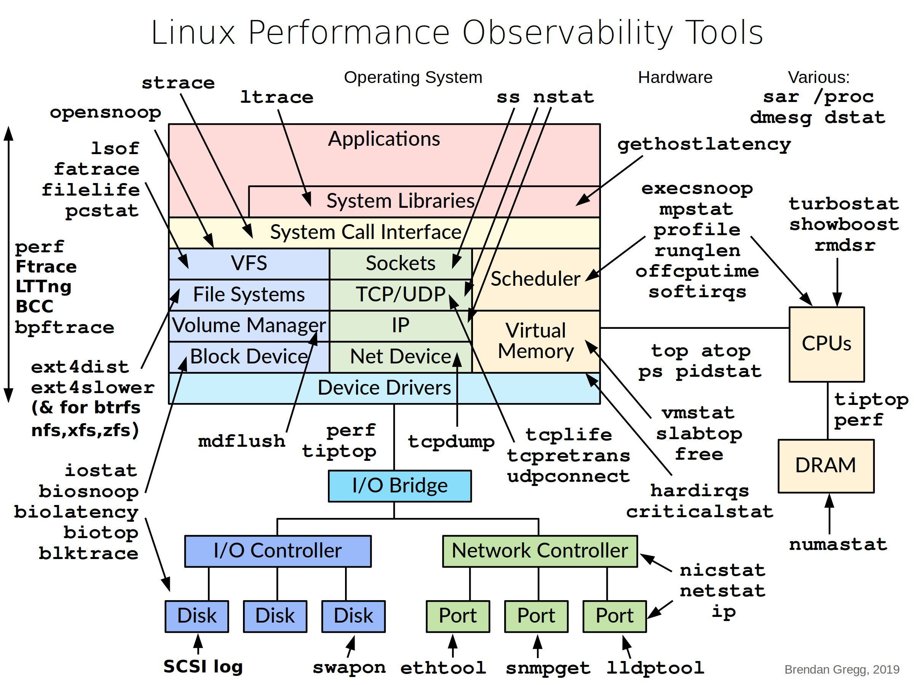

**Source:** [https://twitter.com/i/web/status/1868616720794955835](https://twitter.com/i/web/status/1868616720794955835)
**Original Post Date:** 2025-05-28 07:30:55

# Brendan Gregg's Linux Performance Observability Tools: A Layered Approach to System Monitoring

## Introduction
Linux performance optimization requires deep understanding of system components and their interactions. Brendan Gregg's 'Linux Performance Observability Tools' diagram provides a structured approach by categorizing monitoring tools across distinct system layers. This knowledge base item explores each layer's characteristics and the specialized tools that monitor them, enabling systematic performance analysis from hardware to applications.

## Hardware Layer Analysis

The hardware layer encompasses core components like CPUs and memory, each requiring specific monitoring approaches. CPU-focused tools provide real-time utilization metrics, while memory monitoring tools track allocation patterns and NUMA behavior.

_Sample commands to measure CPU performance counters and per-CPU statistics_

```bash
perf stat -e cycles,instructions,L1-dcache-loads,L1-dcache-misses sleep 1
mpstat -P ALL 1
```

- Use turbostat for power management analysis on modern CPUs
- vmstat provides virtual memory statistics including page faults
- numastat tracks NUMA node interactions and memory distribution

> **Note/Tip:** Always consider CPU architecture when selecting monitoring tools

## Device Drivers Layer Monitoring

This layer interfaces with physical devices, requiring specialized tools for I/O tracking. Disk and network drivers each have unique characteristics that influence tool selection.

1. Use iostat for disk throughput monitoring
1. tcpdump captures detailed packet-level network traffic

## System Call Interface Optimization

The system call interface is critical for performance as it bridges user space and kernel. Tools like strace provide visibility into these interactions.

```bash
strace -p <PID> -e trace=file
fatrace -f /bin/ls
```

## Application Layer Analysis

Monitoring application behavior requires understanding system call patterns and resource utilization. Specialized tools offer insights into file operations, network connections, and process scheduling.

- opensnoop tracks open/close system calls
- strace traces all system calls for a given PID

## Key Takeaways

- Layered approach to monitoring enables targeted performance analysis
- Tool selection should align with specific component being monitored
- Understanding tool interactions across layers provides complete visibility

## Conclusion
Effective Linux performance optimization requires systematic monitoring using appropriate tools for each system layer. By following this layered approach, engineers can identify bottlenecks and optimize resource utilization efficiently.

## External References

- [Linux Performance Tools Diagram](https://brendangregg.com/Performance/linux_perf_tools.pdf)
- [Brendan Gregg's Linux Performance Analysis Tools](https://www.brendangregg.com/perf.html)


## Media

**Image Description:** ### Description of the Image

The image is a detailed diagram titled **"Linux Performance Observability Tools"** by Brendan Gregg, dated 2019. It provides an overview of various Linux performance monitoring and observability tools, organized in a hierarchical structure that maps these tools to different layers of the Linux system stack. The diagram is visually rich, with multiple layers and tools interconnected, highlighting their relationships and the system components they monitor.

#### **Main Subject**
The main subject of the image is the **Linux Performance Observability Tools** and their mapping to different layers of the Linux system stack. The diagram is structured to show how these tools interact with various components of the system, from hardware (CPUs, DRAM) to applications.

#### **Structure of the Diagram**
The diagram is organized into several vertical layers, each representing a different abstraction level of the Linux system. These layers are interconnected with tools that monitor or interact with them. The tools are listed on the left and right sides of the diagram, with arrows pointing to the layers they affect.

#### **Layers of the Linux System Stack**
1. **Hardware Layer**
   - **CPUs**: Tools like `top`, `mpstat`, `pidstat`, `perf`, and `turbostat` are used to monitor CPU performance, utilization, and power management.
   - **DRAM (Memory)**: Tools like `vmstat`, `slabtop`, and `numastat` are used to monitor memory usage, slab allocations, and NUMA (Non-Uniform Memory Access) statistics.

2. **Device Drivers Layer**
   - **Device Drivers**: This layer includes drivers for various hardware components such as disks, network interfaces, and I/O bridges.
   - **Disk Drivers**: Tools like `iostat`, `iotop`, `blktrace`, and `ext4dist` are used to monitor disk I/O performance.
   - **Network Drivers**: Tools like `tcpdump`, `ss`, `nstat`, and `netstat` are used to monitor network traffic and performance.
   - **I/O Bridge**: Tools like `perf` and `tiptop` are used to monitor I/O operations across different devices.

3. **System Call Interface Layer**
   - **System Call Interface**: This layer handles the interface between user-space applications and the kernel.
   - **VFS (Virtual File System)**: Tools like `fatrace`, `strace`, and `perf` are used to monitor file system operations.
   - **Sockets**: Tools like `ss`, `nstat`, and `netstat` are used to monitor socket connections and network statistics.
   - **Scheduler**: Tools like `pidstat`, `top`, and `mpstat` are used to monitor process scheduling and CPU utilization.

4. **System Libraries Layer**
   - **System Libraries**: This layer includes libraries that provide system-level functionality.
   - Tools like `ltrace` and `strace` are used to trace library calls and system calls.

5. **Applications Layer**
   - **Applications**: This layer represents user-space applications.
   - Tools like `strace`, `ltrace`, `opensnoop`, and `fatrace` are used to monitor application behavior and system interactions.

#### **Tools and Their Functions**
The tools are categorized based on their primary functions and the layers they interact with. Here is a breakdown of some key tools:

- **CPU Monitoring Tools**:
  - `top`: Monitors CPU and memory usage.
  - `mpstat`: Reports CPU statistics, including idle and busy times.
  - `pidstat`: Reports statistics for Linux tasks.
  - `perf`: A powerful tool for performance analysis, profiling, and tracing.
  - `turbostat`: Monitors CPU power management and performance states.

- **Memory Monitoring Tools**:
  - `vmstat`: Reports virtual memory statistics.
  - `slabtop`: Displays kernel slab memory usage.
  - `numastat`: Reports NUMA memory statistics.

- **Disk I/O Monitoring Tools**:
  - `iostat`: Reports I/O statistics for disks.
  - `iotop`: Displays real-time I/O usage by processes.
  - `blktrace`: Captures detailed I/O traces for block devices.
  - `ext4dist`: Analyzes ext4 file system performance.

- **Network Monitoring Tools**:
  - `tcpdump`: Captures and analyzes network traffic.
  - `ss`: Reports socket statistics.
  - `nstat`: Reports network statistics.
  - `netstat`: Displays network connections and routing tables.

- **System Call and Library Monitoring Tools**:
  - `strace`: Traces system calls and signals.
  - `ltrace`: Traces library calls.
  - `fatrace`: Monitors file system activity.
  - `opensnoop`: Monitors open system calls.

- **Scheduler Monitoring Tools**:
  - `pidstat`: Reports statistics for Linux tasks.
  - `top`: Monitors CPU and memory usage.
  - `mpstat`: Reports CPU statistics.

#### **Additional Observations**
- The diagram uses color coding to differentiate between layers, making it easier to visualize the relationships between tools and system components.
- Arrows indicate the direction of monitoring or interaction between tools and the layers they affect.
- The tools are listed on the left and right sides of the diagram, with their corresponding layers in the middle.

#### **Purpose of the Diagram**
The primary purpose of this diagram is to provide a comprehensive overview of Linux performance monitoring tools and their relationships with different layers of the Linux system stack. It serves as a reference for system administrators, developers, and performance engineers to understand which tools are best suited for monitoring specific system components.

### **Summary**
This diagram is a detailed and structured representation of Linux performance observability tools, organized by the layers of the Linux system stack. It highlights the tools used for monitoring CPUs, memory, disk I/O, network, system calls, and applications, providing a clear visual guide for understanding how these tools interact with the system. The use of arrows and color coding enhances the clarity and usability of the diagram.
