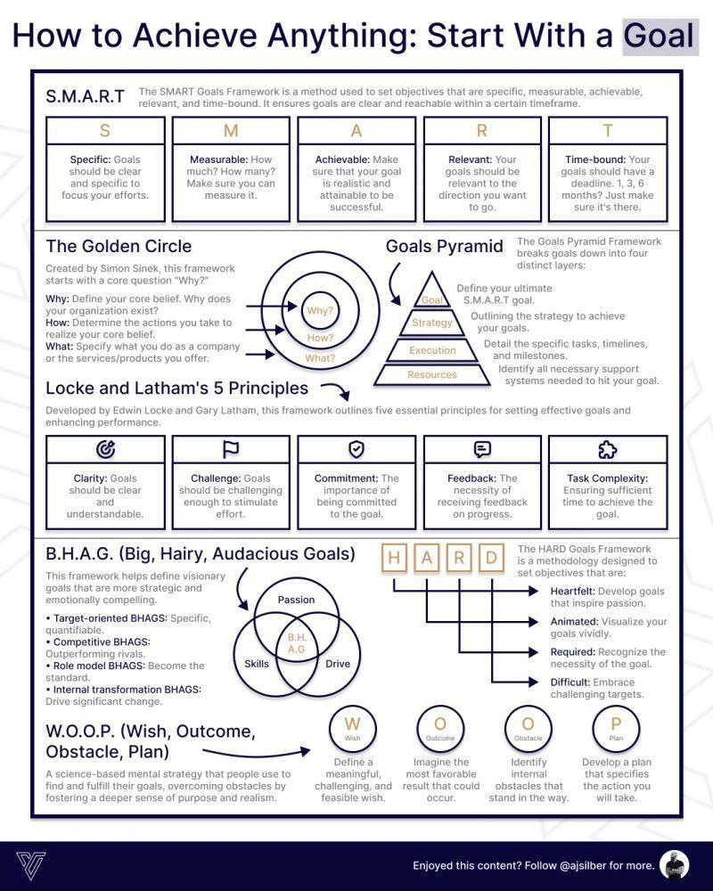

**Source:** [https://twitter.com/i/web/status/1870675126754099657](https://twitter.com/i/web/status/1870675126754099657)
**Original Post Date:** 2025-05-27 23:20:31

# Advanced Goal Setting Frameworks: A Technical Deep Dive into Achievement Architecture

## Introduction
Goal setting is the architectural foundation of personal and professional development. This technical deep dive explores advanced frameworks that transform abstract aspirations into concrete achievements. We'll analyze proven methodologies from Locke & Latham to Simon Sinek, providing a systematic approach to goal implementation and achievement measurement.

## SMART Goals Framework: The Foundation of Achievement Engineering

The SMART framework establishes a rigorous methodology for defining achievable objectives. Each component serves as a validation layer in the goal-setting pipeline:

Specificity ensures focused execution paths, Measurability enables progress tracking, Achievability maintains feasibility boundaries, Relevance aligns with strategic objectives, and Time-bound constraints optimize resource allocation.

- S - Define clear, unambiguous targets using precise language
- M - Implement quantifiable metrics (e.g., 10% improvement in X)
- A - Validate against resource constraints and capacity limits
- R - Ensure alignment with long-term strategic objectives
- T - Establish specific deadlines (30/90/180 days)

> **Note/Tip:** Use SMART as a validation pipeline for each goal before implementation

## Golden Circle Architecture: Purpose-Driven Goal Engineering

The Golden Circle represents a hierarchical framework where purpose drives action. This architecture follows Simon Sinek's principle of working from the core outward, ensuring alignment at each layer.

1. Define the Why (core purpose) as your foundational element
1. Design How (actionable steps and strategies)
1. Implement What (specific deliverables and outcomes)

## BHAG Framework: Strategic Vision Engineering

Big Hairy Audacious Goals serve as north stars for organizational development. This framework defines four types of visionary objectives that drive exponential growth:

- Target-oriented BHAGs: Quantifiable strategic milestones
- Competitive BHAGs: Market leadership benchmarks
- Role Model BHAGs: Industry standard-setting goals
- Internal Transformation BHAGs: Organizational change initiatives

## WOOP Methodology: Obstacle-Driven Goal Execution

The WOOP framework provides a systematic approach to goal achievement through obstacle identification and mitigation planning.

- Wish: Define your objective with precision
- Outcome: Visualize the desired state
- Obstacle: Identify internal barriers
- Plan: Develop contingency strategies

## Key Takeaways

- Implement SMART validation as a prerequisite for all goal setting
- Structure goals using Golden Circle principles to ensure purpose alignment
- Use BHAGs as strategic north stars while maintaining S.M.A.R.T. sub-goals
- Apply WOOP methodology to systematically address potential obstacles

## Conclusion
Goal achievement requires systematic architecture and execution engineering. By integrating these frameworks, you create a robust system for transforming aspirations into measurable outcomes. Remember that the most effective approach often combines multiple methodologies based on specific context and requirements.

## External References

- [Locke & Latham's Goal Setting Theory](https://www.edwinlocke.org/goal-setting-theory/)
- [Simon Sinek's Golden Circle](https://www.startwithwhy.com/golden-circle/)

## Media

**Image Description:** ### Image Description

The image is a detailed infographic titled **"How to Achieve Anything: Start With a Goal"**. It provides a comprehensive overview of various frameworks and principles for setting and achieving goals effectively. The content is organized into several sections, each highlighting a different methodology or framework. Below is a detailed breakdown of the image:

---

### **1. Title and Introduction**
- **Title**: "How to Achieve Anything: Start With a Goal"
- The title emphasizes the importance of goal-setting as the foundation for achieving success.

---

### **2. SMART Goals Framework**
- **Section Title**: "S.M.A.R.T"
- **Description**: The SMART Goals Framework is a method for setting objectives that are Specific, Measurable, Achievable, Relevant, and Time-bound. This ensures that goals are clear and reachable within a specific timeframe.
- **Key Components**:
  - **S (Specific)**: Goals should be clear and specific to focus efforts.
  - **M (Measurable)**: Goals should be quantifiable (e.g., "How much? How many?").
  - **A (Achievable)**: Goals should be realistic and attainable.
  - **R (Relevant)**: Goals should align with the direction you want to go.
  - **T (Time-bound)**: Goals should have a deadline (e.g., 1, 3, or 6 months).

---

### **3. The Golden Circle**
- **Section Title**: "The Golden Circle"
- **Description**: Created by Simon Sinek, this framework emphasizes starting with the core question "Why?" to define a core belief or purpose.
- **Key Components**:
  - **Why**: Define the core belief or reason for existence.
  - **How**: Determine the actions taken to realize the core belief.
  - **What**: Specify the products or services offered.
- **Visual**: A circular diagram with concentric circles labeled "Why?", "How?", and "What?".

---

### **4. Goals Pyramid Framework**
- **Section Title**: "Goals Pyramid"
- **Description**: This framework breaks goals down into four distinct layers, providing a structured approach to achieving them.
- **Key Components**:
  - **Goal**: Define the ultimate S.M.A.R.T goal.
  - **Strategy**: Outline the strategy to achieve the goal.
  - **Execution**: Detail specific tasks, timelines, and milestones.
  - **Resources**: Identify all necessary support systems and resources.

---

### **5. Locke and Latham's 5 Principles**
- **Section Title**: "Locke and Latham's 5 Principles"
- **Description**: Developed by Edwin Locke and Gary Latham, this framework outlines five essential principles for setting effective goals and enhancing performance.
- **Key Components**:
  - **Clarity**: Goals should be clear and understandable.
  - **Challenge**: Goals should be challenging enough to stimulate effort.
  - **Commitment**: The importance of being committed to the goal.
  - **Feedback**: The necessity of receiving feedback on progress.
  - **Task Complexity**: Ensuring sufficient time to achieve the goal.

---

### **6. BHAG (Big, Hairy, Audacious Goals)**
- **Section Title**: "B.H.A.G. (Big, Hairy, Audacious Goals)"
- **Description**: This framework helps define visionary goals that are more strategic and emotionally compelling.
- **Key Components**:
  - **Target-Oriented BHAGs**: Specific, quantifiable, and measurable.
  - **Competitive BHAGs**: Outperforming rivals.
  - **Role Model BHAGs**: Becoming the standard.
  - **Internal Transformation BHAGs**: Driving significant change.
- **Visual**: A Venn diagram showing the intersection of **Passion**, **Skills**, and **Drive**.

---

### **7. HARD Goals Framework**
- **Section Title**: "H.A.R.D. Goals"
- **Description**: A methodology for setting objectives that are Heartfelt, Animated, Required, and Difficult.
- **Key Components**:
  - **Heartfelt**: Develop goals that are meaningful and emotionally resonant.
  - **Animated**: Visualize goals vividly.
  - **Required**: Recognize the necessity of the goal.
  - **Difficult**: Embrace challenging targets.

---

### **8. WOOP (Wish, Outcome, Obstacle, Plan)**
- **Section Title**: "W.O.O.P. (Wish, Outcome, Obstacle, Plan)"
- **Description**: A science-based mental strategy for finding and fulfilling goals by overcoming obstacles.
- **Key Components**:
  - **Wish**: Define a meaningful, feasible wish.
  - **Outcome**: Imagine the most favorable result.
  - **Obstacle**: Identify internal obstacles.
  - **Plan**: Develop a plan to overcome obstacles and achieve the goal.

---

### **9. Footer**
- **Social Media Call-to-Action**: "Enjoyed this content? Follow @ajsiber for more."
- **Attribution**: "ajsiber for more."

---

### **Visual Design**
- The infographic uses a clean, structured layout with:
  - **Bold Headings** for each section.
  - **Color-Coded Boxes** for clarity.
  - **Icons and Diagrams** (e.g., Golden Circle, Pyramid, Venn Diagram) to illustrate concepts.
  - **Arrows and Flowcharts** to show relationships between components.

---

### **Overall Purpose**
The image serves as an educational resource, providing a comprehensive guide to goal-setting and achievement using multiple frameworks. It is designed to be visually engaging and easy to understand, making it useful for individuals or teams looking to improve their goal-setting strategies.
