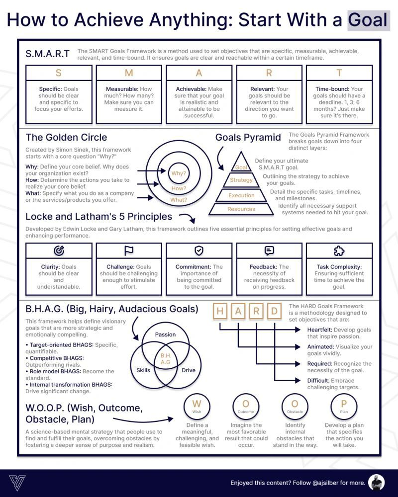

Achieving goals requires a structured approach that involves setting clear objectives, developing effective strategies, and overcoming obstacles. This guide provides a comprehensive framework for goal achievement, incorporating established methodologies such as S.M.A.R.T. goals, the Golden Circle, Locke and Latham's 5 Principles, B.H.A.G., and W.O.O.P.

#### Technical Content
The process of achieving goals can be broken down into several key components, each playing a crucial role in ensuring success. 

##### S.M.A.R.T. Goals
S.M.A.R.T. is an acronym that stands for Specific, Measurable, Achievable, Relevant, and Time-bound. It provides a framework for setting goals that are clear, actionable, and achievable.
* **Specific**: Goals should be clear and concise, leaving no room for misinterpretation. For example, instead of "I want to be healthier," a specific goal would be "I will lose 10 pounds in the next 3 months."
* **Measurable**: Progress towards the goal should be trackable and measurable. Using the weight loss example, progress could be measured by weekly weigh-ins.
* **Achievable**: Goals must be realistic and attainable based on current resources and constraints. Setting a goal to lose 50 pounds in a month is not only unrealistic but also unhealthy.
* **Relevant**: The goal should align with overall objectives and values. If the ultimate goal is to improve overall health, then the weight loss goal should contribute to this objective.
* **Time-bound**: Deadlines are essential for creating a sense of urgency and focus. In the example given, the deadline is 3 months.

##### The Golden Circle
The Golden Circle, introduced by Simon Sinek, consists of three concentric circles that help in understanding the why, how, and what of goal setting.
* **Why?**: This defines your core belief or purpose. Understanding why you want to achieve a certain goal helps in staying motivated. For instance, "I want to lose weight because I believe being healthy will allow me to spend more quality time with my family."
* **How?**: Determine the actions required to achieve your goal. Following the previous example, "I will achieve my weight loss goal by exercising for 30 minutes every day and eating a balanced diet."
* **What?**: Specify what you want to accomplish. This is the actual goal statement, such as "Lose 10 pounds in 3 months."

##### Locke and Latham's 5 Principles
These principles, outlined by Edwin Locke and Gary Latham, provide a framework for effective goal setting.
* **Clarity**: Goals should be clear and well-defined to avoid confusion. A clear goal is "I will read one book per week for the next year" rather than "I want to read more."
* **Challenge**: Goals should be challenging yet achievable. Setting goals that are too easy or too hard can lead to lack of motivation or discouragement, respectively.
* **Commitment**: Commit to your goals and take action. Writing down your goals and sharing them with a friend can increase commitment.
* **Feedback**: Regularly review progress and adjust as needed. For example, if the goal is to write a novel in 6 months, regular feedback could involve monthly word count checks.
* **Task Complexity**: Ensure tasks are manageable and feasible. Breaking down large goals into smaller, more manageable tasks can help maintain momentum.

##### B.H.A.G. (Big, Hairy, Audacious Goals)
The B.H.A.G. methodology involves setting ambitious goals that drive significant change or achievement.
* **Target-oriented BHAGs**: Set specific, measurable goals that drive change. For instance, "Increase sales by 20% within the next year" is a target-oriented goal.
* **Competitive BHAGs**: Outperform rivals by setting ambitious targets. An example could be "Become the market leader in our industry within the next 3 years."
* **Role model BHAGs**: Become a role model by achieving exceptional results. This could involve setting a goal to win an industry award or to be recognized as a thought leader.

##### W.O.O.P. (Wish, Outcome, Obstacle, Plan)
The W.O.O.P. framework is used for overcoming obstacles in the path to achieving goals.
* **Wish**: Define your desire or goal. This is the starting point of your goal-setting process, such as "I wish to start my own business."
* **Outcome**: Identify the desired outcome of achieving your goal. Using the previous example, "The outcome will be financial independence and the ability to pursue my passion."
* **Obstacle**: Recognize potential obstacles that may hinder progress. For someone wishing to start a business, an obstacle could be lack of funding.
* **Plan**: Develop a plan to overcome these obstacles and achieve success. This might involve seeking out investors, bootstrapping, or developing a side hustle to save funds.

#### Key Takeaways and Best Practices
- Set S.M.A.R.T. goals that are specific, measurable, achievable, relevant, and time-bound.
- Understand your why, how, and what through the Golden Circle framework.
- Apply Locke and Latham's 5 Principles for effective goal setting: clarity, challenge, commitment, feedback, and task complexity.
- Use B.H.A.G. to set ambitious goals that drive change or achievement.
- Employ the W.O.O.P. framework to identify and plan around obstacles.

#### References
The methodologies mentioned in this guide are based on established principles of goal setting and achievement. For further reading and implementation:
- S.M.A.R.T. Goals: A widely recognized acronym for setting effective objectives.
- The Golden Circle by Simon Sinek: Provides insight into the importance of understanding why, how, and what in achieving success.
- Locke and Latham's 5 Principles: Offers a framework for goal setting based on psychological research.
- B.H.A.G. (Big, Hairy, Audacious Goals): A concept popularized by business strategy literature.
- W.O.O.P. (Wish, Outcome, Obstacle, Plan): A practical tool for overcoming obstacles in goal achievement.

By incorporating these frameworks and principles into your goal-setting process, you can create a structured approach to achieving success, whether personal or professional.
## Source

- Original Tweet: [https://twitter.com/i/web/status/1870675126754099657](https://twitter.com/i/web/status/1870675126754099657)
- Date: 2025-02-20 21:19:46

## Media

### Media 1

**Description:** The infographic "How to Achieve Anything: Start with a Goal" presents a comprehensive framework for goal setting, featuring a pyramid structure that breaks down into four distinct layers. The top layer is labeled as S.M.A.R.T., which stands for Specific, Measurable, Achievable, Relevant, and Time-bound.

**S.M.A.R.T.**

*   **Specific**: Goals should be clear and concise.
*   **Measurable**: Progress can be tracked and measured.
*   **Achievable**: Goals must be realistic and attainable.
*   **Relevant**: Goals align with overall objectives.
*   **Time-bound**: Deadlines are set to create a sense of urgency.

The infographic also incorporates the Golden Circle, which consists of three concentric circles:

**The Golden Circle**

*   **Why?**: Define your core belief or purpose.
*   **How?**: Determine the actions required to achieve your goal.
*   **What?**: Specify what you want to accomplish.

Additionally, the infographic highlights Locke and Latham's 5 Principles for effective goal setting:

**Locke and Latham's 5 Principles**

*   **Clarity**: Goals should be clear and well-defined.
*   **Challenge**: Goals should be challenging yet achievable.
*   **Commitment**: Commit to your goals and take action.
*   **Feedback**: Regularly review progress and adjust as needed.
*   **Task Complexity**: Ensure tasks are manageable and feasible.

Furthermore, the infographic outlines the B.H.A.G. (Big, Hairy, Audacious Goals) methodology:

**B.H.A.G.**

*   **Target-oriented BHAGs**: Set specific, measurable goals that drive change.
*   **Competitive BHAGs**: Outperform rivals by setting ambitious targets.
*   **Role model BHAGs**: Become a role model by achieving exceptional results.

Finally, the infographic introduces the W.O.O.P. (Wish, Outcome, Obstacle, Plan) framework for overcoming obstacles:

**W.O.O.P.**

*   **Wish**: Define your desire or goal.
*   **Outcome**: Identify the desired outcome of achieving your goal.
*   **Obstacle**: Recognize potential obstacles that may hinder progress.
*   **Plan**: Develop a plan to overcome these obstacles and achieve success.

By following this structured approach, individuals can create effective goals and develop strategies for overcoming challenges.

*Last updated: 2025-02-20 21:19:46*