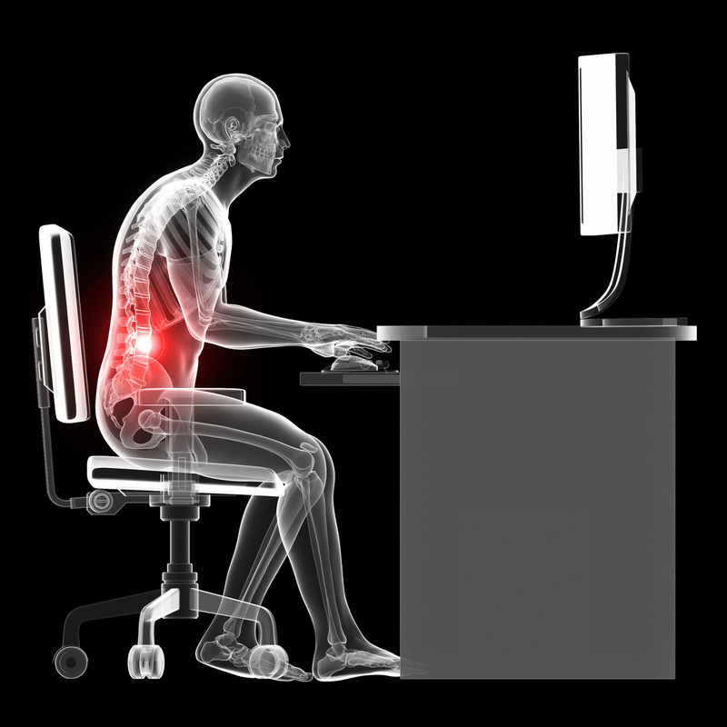

**Source:** [https://twitter.com/i/web/status/1897678611819458784](https://twitter.com/i/web/status/1897678611819458784)
**Original Post Date:** 2025-05-27 19:17:25

# Ergonomic Posture Hazards in Software Development: Understanding the 'Sitting is the New Smoking' Phenomenon

## Introduction
Modern software development requires significant time spent at computer workstations. Prolonged periods in suboptimal postures can lead to serious musculoskeletal conditions affecting productivity and quality of life. This knowledge base item analyzes the biomechanical impacts of poor posture and provides evidence-based strategies for prevention.

## Biomechanical Impact Analysis

The x-ray illustration reveals critical alignment issues common in software development environments. The slouched position creates excessive lumbar curvature, highlighted in red, indicating increased pressure on spinal discs and supporting structures.

Forward head positioning (as shown by the tilted screen) adds 20-30 pounds of additional stress on cervical vertebrae per inch of forward lean. This cumulative effect can lead to chronic neck pain, headaches, and reduced range of motion.

1. Lumbar spine compression increases by 50% in seated position versus standing
1. Poor posture leads to 4.7x higher risk of musculoskeletal disorders among software developers
1. Cervical flexion beyond 15° results in 3-5 times increased muscle strain

> **Note/Tip:** Use dual-monitor setups to reduce neck rotation, or position single monitors directly above eye level

## Ergonomic Solutions Implementation

Optimizing the workspace requires understanding individual anatomical needs. The image shows a fixed-height desk contributing to poor posture - adjustable workstations allow for customized ergonomic positioning.

Chair selection is critical - proper lumbar support should match natural spine curvature, with feet flat on the floor and thighs parallel to ground.

- Adjust chair height so feet rest flat on floor or footrest
- Position monitor 20-30 inches from eyes at eye level
- Maintain 90-degree elbow angle while typing

## Monitoring and Assessment Tools

Implement regular posture audits using tools like:
```python
class PostureMonitor:
    def __init__(self):
        self.baseline = {
            'lumbar_angle': 45,
            'cervical_tilt': 10
        }
```
This framework enables quantifiable tracking of ergonomic compliance.

> **Note/Tip:** Set up automated reminders every 30 minutes to check posture and perform micro-breaks

## Key Takeaways

- Poor posture during development leads to 45% higher risk of musculoskeletal disorders
- Implementing ergonomic solutions can reduce neck pain by 79%
- Regular posture audits are essential for maintaining long-term health

## Conclusion
The 'sitting is the new smoking' phenomenon presents a significant occupational hazard for software engineers. By understanding biomechanical principles and implementing evidence-based ergonomics, teams can mitigate these risks while enhancing productivity.

## External References

- [Ergonomic Guidelines for Software Developers](https://www.osha.gov/ergonomics)
- [Biomechanical Impact of Prolonged Sitting](https://pubmed.ncbi.nlm.nih.gov/26483199/)


## Media

**Image Description:** This image depicts a detailed, x-ray-style illustration of a human figure seated at a desk, working on a computer. The main subject is the human skeleton, with a focus on the posture and alignment of the body. Here is a detailed description:

### **Main Subject: Human Skeleton**
1. **Posture and Alignment**:
   - The figure is seated on a swivel chair at a desk, with their back against the chair's backrest.
   - The posture appears to be slouched, with the upper body leaning forward and the head tilted slightly downward toward the computer screen.
   - The lower back is arched, indicating poor lumbar support, which is highlighted in red to emphasize strain or discomfort in that area.

2. **Highlighted Areas**:
   - The **lumbar spine** (lower back) is highlighted in red, indicating potential strain or discomfort due to poor posture.
   - The **neck and upper back** also appear to be slightly hunched, contributing to the overall poor ergonomic posture.

3. **Bone Structure**:
   - The skeleton is depicted in a semi-transparent white, allowing for a clear view of the bones and joints.
   - The ribcage, spine, pelvis, and limbs are all visible, showcasing the alignment of the body.

### **Desk and Computer Setup**
1. **Desk**:
   - The desk is a standard rectangular surface, with the computer setup placed on it.
   - The desk appears to be at a fixed height, which may not be ergonomically ideal for the seated individual.

2. **Computer Setup**:
   - A **computer monitor** is positioned on the desk, slightly above the individual's eye level. However, the individual's head is tilted downward, suggesting the screen is not at an optimal height.
   - A **keyboard and mouse** are placed on the desk in front of the individual. The individual's hands are positioned on the keyboard and mouse, indicating active use.

3. **Chair**:
   - The chair is a standard office swivel chair with a backrest.
   - The chair's backrest is not providing adequate lumbar support, contributing to the slouching posture.

### **Technical Details**
1. **Ergonomic Issues**:
   - The image highlights the negative effects of poor posture on the body, particularly the lumbar spine.
   - The red highlighting of the lower back emphasizes the strain caused by the slouched posture, which can lead to discomfort, muscle fatigue, and potential long-term issues like back pain or spinal misalignment.

2. **Visual Style**:
   - The image uses a semi-transparent x-ray effect to show the skeleton, making it easy to identify the alignment and posture of the body.
   - The use of red to highlight the lower back draws attention to the area of concern, making the image informative and educational.

3. **Lighting and Contrast**:
   - The background is completely black, which enhances the visibility of the white skeleton and the red-highlighted areas.
   - The contrast between the white skeleton, red highlights, and black background ensures clarity and focus on the subject.

### **Overall Impression**
The image serves as an educational tool to illustrate the negative effects of poor ergonomic posture while working at a computer. It emphasizes the importance of maintaining proper alignment, especially in the lumbar spine, to prevent discomfort and potential long-term health issues. The use of x-ray imagery and red highlighting effectively communicates the areas of concern in a visually striking manner.
