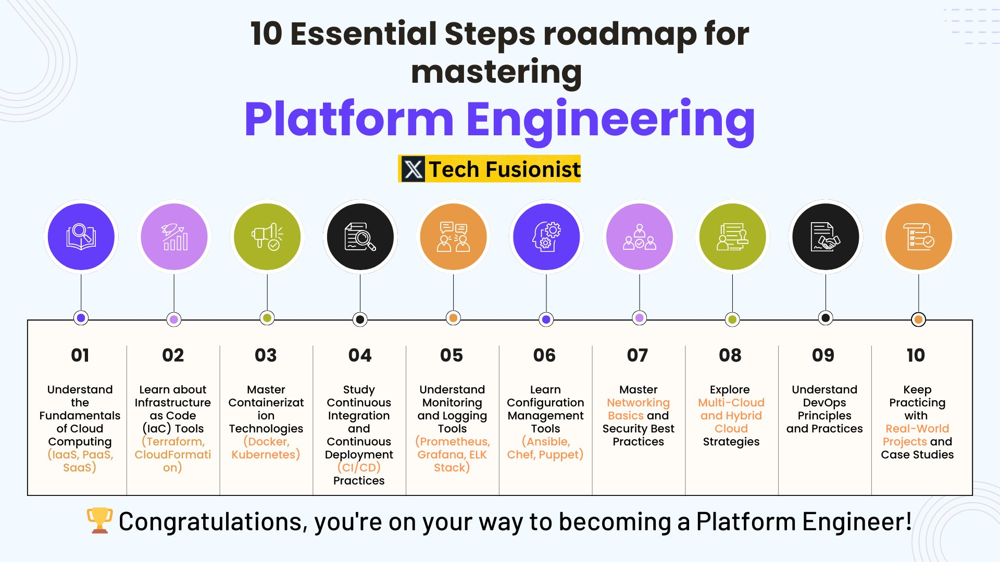

**Source:** [https://twitter.com/i/web/status/1912161388882952652](https://twitter.com/i/web/status/1912161388882952652)
**Original Post Date:** 2025-05-27 18:56:11

# Mastering Platform Engineering: A Comprehensive 10-Step Guide

## Introduction
Platform Engineering has emerged as a critical discipline bridging infrastructure management with software delivery. This guide presents a structured 10-step pathway to becoming proficient in platform engineering, focusing on essential technical domains from cloud fundamentals to modern DevOps practices. Each step builds upon the previous, creating a comprehensive foundation for effective platform architecture and implementation.

## Step 01: Cloud Computing Fundamentals

Master Infrastructure as a Service (IaaS), Platform as a Service (PaaS), and Software as a Service (SaaS) concepts. Understand cloud provider models, resource provisioning, scaling strategies, and cost optimization techniques.

1. Analyze IaaS offerings from AWS EC2 to Azure VMs
1. Explore PaaS platforms like Heroku and Google App Engine
1. Implement SaaS solutions using cloud-based services

## Step 02: Infrastructure as Code (IaC)

Master declarative infrastructure provisioning using Terraform, AWS CloudFormation, and Azure Bicep. Learn state management, version control integration, and multi-environment deployments.

```HCL
provider "aws" {
  region = "us-west-2"
}

resource "aws_instance" "example" {
  ami           = "ami-1234567890"
  instance_type = "t2.micro"
}
```

## Step 03: Containerization and Orchestration

Gain expertise in container-based architecture using Docker for application packaging and Kubernetes for orchestration. Understand deployment strategies, scaling policies, and service mesh implementation.

- Create multi-container applications with Docker Compose
- Implement Kubernetes deployments and services
- Configure resource limits and autoscaling

## Step 04: CI/CD Pipeline Implementation

Design automated build, test, and deployment pipelines using Jenkins, GitLab CI, or GitHub Actions. Integrate security scanning, environment management, and roll-back mechanisms.

```yaml
jobs:
  build:
    runs-on: ubuntu-latest
    steps:
      - uses: actions/checkout@v2
      - name: Build Docker image
        run: docker build .
      - name: Deploy to Kubernetes
        run: kubectl apply -f k8s-deployment.yaml
```

## Step 05: Observability and Monitoring

Implement comprehensive monitoring using Prometheus, Grafana, and the ELK Stack. Establish alerting thresholds, perform log analysis, and create meaningful dashboards for system health tracking.

> **Note/Tip:** Start with metrics like CPU/Memory usage before adding application-specific monitoring

## Key Takeaways

- Cloud fundamentals are the foundation; master them before moving to advanced topics
- Infrastructure as Code is essential for repeatable and version-controlled deployments
- Container orchestration requires understanding of both containerization and service mesh concepts
- CI/CD pipelines must integrate security checks at every stage
- Observability is critical for maintaining complex distributed systems

## Conclusion
This 10-step journey provides a structured path to platform engineering mastery. Start with fundamentals, progressively build expertise in core tools, and continuously practice through real-world projects. Remember that platform engineering evolves rapidly - stay updated with emerging technologies and best practices.

## External References

- [Kubernetes Documentation](https://kubernetes.io/docs/home/)
- [Docker Official Guide](https://docs.docker.com/get-started/)


## Media

**Image Description:** ### Description of the Image

The image is an infographic titled **"10 Essential Steps for Mastering Platform Engineering"**. It provides a structured roadmap for individuals looking to become proficient in platform engineering. The design is clean, colorful, and visually organized, with a focus on clarity and ease of understanding. Below is a detailed breakdown of the image:

---

#### **Header Section**
- **Title**: The main title is prominently displayed at the top in bold, large font: **"10 Essential Steps for Mastering Platform Engineering"**.
- **Subtitle**: Below the title, there is a smaller subtitle that reads: **"Congratulations, you're on your way to becoming a Platform Engineer!"**.
- **Logo/Brand**: In the center, there is a logo or brand name: **"Tech Fusion Fusionist"**, enclosed in a yellow box with a black "X" symbol.

---

#### **Main Content: 10 Essential Steps**
The infographic lists 10 steps in a horizontal timeline format. Each step is represented by:
1. A **numbered circle** (e.g., 01, 02, etc.).
2. A **color-coded icon** that visually represents the step.
3. A **brief description** of the step in text.

Here is a detailed breakdown of each step:

---

### **Step 01: Understand the Fundamentals of Cloud Computing**
- **Icon**: A purple circle with an icon resembling a cloud or server.
- **Description**: 
  - **Text**: "Understand the Fundamentals of Cloud Computing (IaaS, PaaS, SaaS)."
  - **Focus**: This step emphasizes learning the foundational concepts of cloud computing, including Infrastructure as a Service (IaaS), Platform as a Service (PaaS), and Software as a Service (SaaS).

---

### **Step 02: Learn about Infrastructure as Code (IaC) Tools**
- **Icon**: A purple circle with an icon resembling a graph or chart.
- **Description**: 
  - **Text**: "Learn about Infrastructure as Code (IaC) Tools (Terraform, CloudFormation)."
  - **Focus**: This step highlights the importance of mastering Infrastructure as Code (IaC) tools like Terraform and AWS CloudFormation for automating infrastructure provisioning.

---

### **Step 03: Master Containerization Technologies**
- **Icon**: A green circle with an icon resembling a container or Docker logo.
- **Description**: 
  - **Text**: "Master Containerization Technologies (Docker, Kubernetes)."
  - **Focus**: This step focuses on gaining expertise in containerization technologies, specifically Docker and Kubernetes, which are essential for modern platform engineering.

---

### **Step 04: Study Continuous Integration and Continuous Deployment (CI/CD) Practices**
- **Icon**: A black circle with an icon resembling a magnifying glass.
- **Description**: 
  - **Text**: "Study Continuous Integration and Continuous Deployment (CI/CD) Practices."
  - **Focus**: This step involves learning about CI/CD pipelines, which are critical for automating software development, testing, and deployment processes.

---

### **Step 05: Understand Monitoring and Logging Tools**
- **Icon**: An orange circle with an icon resembling a chat or monitoring symbol.
- **Description**: 
  - **Text**: "Understand Monitoring and Logging Tools (Prometheus, Grafana, ELK Stack)."
  - **Focus**: This step emphasizes the importance of monitoring and logging tools like Prometheus, Grafana, and the ELK Stack (Elasticsearch, Logstash, Kibana) for system observability.

---

### **Step 06: Learn Configuration Management Tools**
- **Icon**: A purple circle with an icon resembling a gear.
- **Description**: 
  - **Text**: "Learn Configuration Management Tools (Ansible, Chef, Puppet)."
  - **Focus**: This step focuses on mastering configuration management tools like Ansible, Chef, and Puppet, which are used to manage and automate infrastructure configurations.

---

### **Step 07: Master Networking Basics and Security Best Practices**
- **Icon**: A purple circle with an icon resembling a network or people.
- **Description**: 
  - **Text**: "Master Networking Basics and Security Best Practices."
  - **Focus**: This step highlights the importance of understanding networking fundamentals and implementing security best practices to ensure robust and secure systems.

---

### **Step 08: Explore Multi-Cloud and Hybrid Cloud Strategies**
- **Icon**: A green circle with an icon resembling a network or people.
- **Description**: 
  - **Text**: "Explore Multi-Cloud and Hybrid Cloud Strategies."
  - **Focus**: This step involves learning about strategies for managing and integrating multiple cloud providers (multi-cloud) and combining on-premises and cloud environments (hybrid cloud).

---

### **Step 09: Understand DevOps Principles and Practices**
- **Icon**: A black circle with an icon resembling a document or checklist.
- **Description**: 
  - **Text**: "Understand DevOps Principles and Practices."
  - **Focus**: This step emphasizes the importance of DevOps, which combines development and operations to improve software delivery processes.

---

### **Step 10: Keep Practicing with Real-World Projects and Case Studies**
- **Icon**: An orange circle with an icon resembling a document or checklist.
- **Description**: 
  - **Text**: "Keep Practicing with Real-World Projects and Case Studies."
  - **Focus**: This step encourages continuous learning and application of skills through hands-on experience with real-world projects and case studies.

---

#### **Design Elements**
- **Color Scheme**: The infographic uses a vibrant color palette, with each step represented by a distinct color (purple, green, black, orange) to make the content visually engaging and easy to differentiate.
- **Icons**: Each step is accompanied by an icon that visually represents the topic, enhancing comprehension.
- **Typography**: The text is clear and concise, with a mix of bold and regular fonts to highlight key points.
- **Layout**: The steps are arranged in a horizontal timeline format, making the progression logical and easy to follow.

---

#### **Footer**
- **Congratulatory Message**: At the bottom, there is a congratulatory message: **"Congratulations, you're on your way to becoming a Platform Engineer!"**, accompanied by a gold trophy icon, adding a motivational touch.

---

### **Overall Impression**
The infographic is well-structured, visually appealing, and provides a comprehensive roadmap for mastering platform engineering. It effectively combines text, icons, and colors to convey information in a clear and engaging manner, making it a valuable resource for anyone looking to enter or advance in the field of platform engineering.
