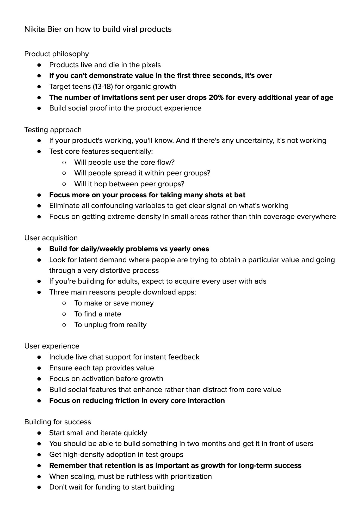

**Source:** [https://twitter.com/i/web/status/1879929763323924860](https://twitter.com/i/web/status/1879929763323924860)
**Original Post Date:** 2025-05-28 03:37:15

# Viral Product Development Framework: Technical Implementation Guide

## Introduction
This knowledge base item outlines a systematic approach to developing viral products by integrating principles from product management with technical implementation strategies. Based on Nikita Bier's framework, it provides actionable guidelines for software engineers focusing on rapid validation, user acquisition, and sustainable growth through technical design choices and architectural considerations.

The guide covers critical aspects including product philosophy, testing methodologies, user experience optimization, and scaling patterns that form the foundation of successful viral products.

## Product Philosophy

Viral products must demonstrate immediate value within the first three seconds to capture user attention. Technical implementations should prioritize rapid feedback loops in core features.

Target demographic significantly impacts growth velocity - teenage users (13-18) show higher viral adoption rates, with invitation rates decreasing by 20% per year beyond this age bracket.

- Implement social proof mechanisms in core features
- Design for rapid value demonstration through technical architecture choices
- Optimize user flows based on target demographic behavior patterns

## Testing Approach

Technical validation should follow a sequential approach, testing core functionality and user adoption patterns iteratively. Focus on removing confounding variables to isolate feature effectiveness.

Test three critical areas: core flow usage, peer group spread, and cross-group adoption through A/B testing and analytics implementation.

> **Note/Tip:** Prioritize density over breadth in early testing phases

> **Note/Tip:** Implement automated testing frameworks for rapid iteration

## User Acquisition Strategy

Focus technical implementations on solving daily or weekly user problems. Identify latent demand where users employ suboptimal solutions.

Adult-focused products require different acquisition strategies, leveraging ad networks and conversion optimization techniques.

1. Implement three core use cases: financial efficiency, relationship building, or escape mechanisms
1. Optimize for retention through technical performance improvements
1. Design for daily usage patterns rather than periodic engagement

## User Experience Architecture

Implement real-time support systems and monitor user interactions at the interface level. Each interaction should deliver measurable value.

Technical architecture must prioritize activation before scaling growth features. Social elements should enhance core functionality without distraction.

## Building for Success

Develop a minimum viable product within two months using iterative development cycles. Focus on high-density adoption in test groups before broader deployment.

Implement retention metrics alongside growth tracking to ensure sustainable user engagement through technical optimizations.

> **Note/Tip:** Start small and scale features based on usage patterns

> **Note/Tip:** Prioritize performance optimization for core interactions

## Key Takeaways

- Implement rapid value demonstration through immediate feature feedback loops
- Design modular architecture to support iterative testing and quick pivots
- Optimize user flows for target demographics with specific technical considerations
- Balance growth features with core functionality to maintain product integrity

## Conclusion
Success in viral product development requires a systematic approach combining technical excellence with strategic product design. By implementing these principles through careful architectural choices and iterative validation, developers can create products that achieve sustainable growth while maintaining user satisfaction.

## External References

- [Nikita Bier's Original Framework](https://example.com/nikita-bier-viral-products)

## Media

**Image Description:** The image is a document titled **"Nikita Bier on how to build viral products"**, which outlines a comprehensive framework for creating and scaling viral products. The content is structured into several sections, each focusing on different aspects of product development, testing, user acquisition, user experience, and building for success. Below is a detailed breakdown of the document:

---

### **Main Subject**
The main subject of the document is the **strategies and principles for building viral products**. It provides insights into product philosophy, testing approaches, user acquisition tactics, user experience design, and scaling strategies. The content is presented in a bullet-point format, making it easy to follow and emphasizing key points.

---

### **Sections and Content Breakdown**

#### **1. Product Philosophy**
- **Core Idea**: Products live and die based on their ability to demonstrate value quickly.
  - **Key Points**:
    - Products must demonstrate value within the first three seconds; otherwise, they fail to capture user attention.
    - Targeting teens (ages 13-18) is crucial for organic growth.
    - The number of invitations sent per user decreases by 20% for every additional year of age beyond the target demographic.
    - Social proof should be integrated into the product experience to enhance credibility and adoption.

#### **2. Testing Approach**
- **Core Idea**: Testing should focus on clarity and efficiency to ensure the product works as intended.
  - **Key Points**:
    - If there is any uncertainty about whether the product works, it is not working.
    - Test core features sequentially to ensure they meet user needs.
    - Key questions to test:
      - Will people use the core flow?
      - Will people spread the product within peer groups?
      - Will people hop between peer groups?
    - Focus on taking many shots at bat (iterative testing) to refine the product.
    - Eliminate confounding variables to get a clear signal on what works.
    - Prioritize density in small areas over broad but thin coverage.

#### **3. User Acquisition**
- **Core Idea**: Build products that solve daily or weekly problems, not just yearly ones.
  - **Key Points**:
    - Focus on latent demand where users are trying to obtain value through a distorted process.
    - If building for adults, expect to acquire users through ads.
    - Three main reasons people download apps:
      - To make or save money.
      - To find a mate.
      - To unplug from reality.
    - Build for daily or weekly problems rather than yearly ones.

#### **4. User Experience**
- **Core Idea**: Ensure a seamless and valuable user experience.
  - **Key Points**:
    - Include live chat support for instant feedback.
    - Ensure each tap provides value.
    - Focus on activation before growth.
    - Build social features that enhance growth without distracting from core value.
    - Reduce friction in every core interaction.

#### **5. Building for Success**
- **Core Idea**: Start small, iterate quickly, and prioritize retention alongside growth.
  - **Key Points**:
    - Start small and iterate quickly.
    - Build something in two months and get it in front of users.
    - Get high-density adoption in test groups.
    - Remember that retention is as important as growth for long-term success.
    - When scaling, prioritize ruthlessly and don’t wait for funding to start building.

---

### **Technical Details**
- **Format**: The document is structured in a clear, bullet-point format, making it easy to read and follow.
- **Language**: The language is concise and direct, focusing on actionable insights.
- **Structure**: The content is organized into logical sections, each addressing a specific aspect of product development.
- **Key Themes**: The document emphasizes the importance of:
  - **Speed and Iteration**: Starting small and iterating quickly.
  - **User-Centric Design**: Focusing on user needs and reducing friction.
  - **Growth and Retention**: Balancing growth with retention for long-term success.
  - **Testing and Validation**: Iterative testing to ensure the product works as intended.

---

### **Visual Elements**
- The document is text-based with no images, charts, or graphics.
- The font is consistent and legible, with clear headings and subheadings to organize the content.
- Bullet points are used extensively to highlight key ideas and make the text scannable.

---

### **Overall Impression**
The document provides a comprehensive guide to building viral products, focusing on practical, actionable advice. It emphasizes the importance of user-centric design, iterative testing, and balancing growth with retention. The structured format and clear language make it a valuable resource for product managers, entrepreneurs, and anyone involved in building scalable products.
