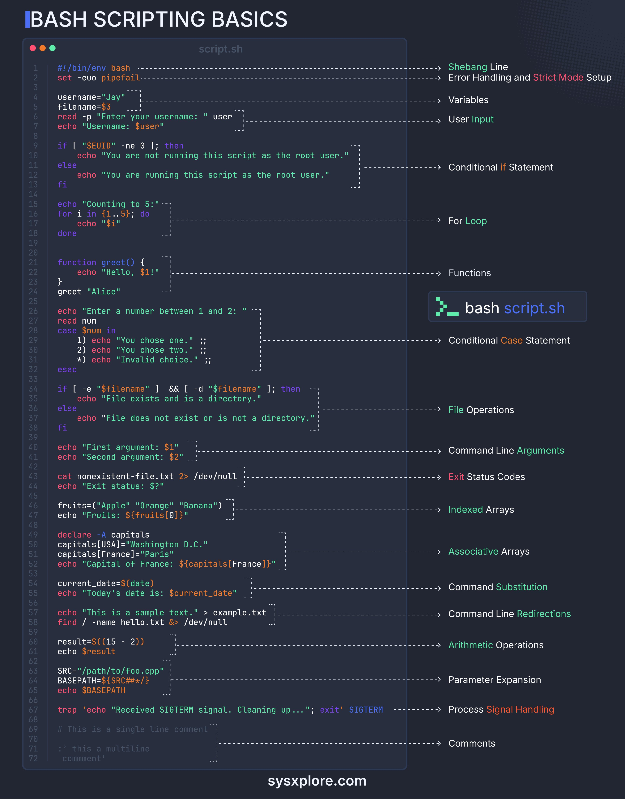

**Source:** [https://twitter.com/i/web/status/1874845414874325469](https://twitter.com/i/web/status/1874845414874325469)
**Original Post Date:** 2025-05-28 07:16:46

# Essential Bash Scripting Fundamentals: From Basics to Best Practices

## Introduction
Bash scripting is a fundamental skill for system administration and automation tasks in Linux/Unix environments. This comprehensive guide covers essential concepts from basic syntax to advanced techniques, focusing on best practices that enhance script reliability and maintainability.

The content explores critical areas including error handling through strict mode, robust control structures, command-line argument processing, and practical examples demonstrating real-world applications.

## Script Execution Fundamentals

Every Bash script begins with the shebang line to specify the interpreter. Strict mode setup is crucial for error detection during runtime.

_Shebang specifies Bash as the interpreter, while strict mode (-e, -u, -o pipefail) ensures early error detection_

```bash
#!/bin/env bash
set -euo pipefail
```

## Variable Management and User Interaction

Variables store data for later use. Proper handling of command-line arguments is essential for script flexibility.

```bash
username="Jay"
filename=$3
read -p "Enter your username: " user
```

> **Note/Tip:** Always quote variable references to prevent word splitting

> **Note/Tip:** Use meaningful names for variables

## Control Structures

Conditional logic and loops are essential for script flow control. Bash offers multiple constructs including if-else, case statements, and for loops.

```bash
if [ "$EUID" -ne 0 ]; then
echo "Not root"
fi
for i in {1..5}; do
echo "$i"
done
```

## Advanced Features

Arrays, command substitution, and signal handling demonstrate Bash's capability for complex automation tasks.

```bash
declare -A capitals
capitals[USA]="Washington D.C."
trap 'echo "Cleanup"' SIGTERM
```

1. Indexed arrays for ordered data
1. Associative arrays for key-value pairs

## Key Takeaways

- Always enable strict mode (-euo pipefail) to catch errors early
- Use proper quoting and parameter expansion techniques for robust scripts
- Implement signal handling for graceful script termination

## Conclusion
Mastering Bash scripting fundamentals enables efficient automation of system tasks. By following best practices in error handling, variable management, and control structures, developers can create reliable and maintainable scripts.

## External References

- [Official GNU Bash Manual](https://www.gnu.org/software/bash/manual/)
- [Bash Guide for Beginners](https://tldp.org/LDP/Bash-Beginners-Guide/html/)


## Media

**Image Description:** ### Description of the Image

The image is a comprehensive tutorial or reference guide for **Bash Scripting Basics**. It is presented in a visually structured format, with code snippets on the left and corresponding explanations on the right. The background is dark, and the text is highlighted with syntax coloring to enhance readability. The content is organized to cover various fundamental concepts of Bash scripting, making it an educational resource for beginners and intermediate users.

---

### **Main Subject: Bash Scripting Basics**

The main subject of the image is a detailed breakdown of a Bash script, `script.sh`, which demonstrates various essential features and constructs of Bash scripting. The script is annotated with comments and explanations to highlight each concept.

---

### **Key Sections and Technical Details**

#### 1. **Shebang Line**
   - **Code**: `#!/bin/env bash`
   - **Explanation**: The shebang line specifies the interpreter to be used for executing the script. In this case, it points to the `bash` shell.

#### 2. **Strict Mode Setup**
   - **Code**: `set -euo pipefail`
   - **Explanation**: This command enables strict mode, which helps in catching errors early:
     - `-e`: Exits the script if any command exits with a non-zero status.
     - `-u`: Treats unset variables as an error.
     - `-o pipefail`: Causes a pipeline to return the exit status of the last command in the pipe that returned a non-zero exit status.

#### 3. **Variables Handling**
   - **Code**:
     ```bash
     username="Jay"
     filename=$3
     ```
   - **Explanation**: Demonstrates variable declaration and assignment. The variable `username` is explicitly set, while `filename` is assigned the value of the third command-line argument (`$3`).

#### 4. **User Input**
   - **Code**:
     ```bash
     read -p "Enter your username: " user
     echo "Username: $user"
     ```
   - **Explanation**: Uses the `read` command to prompt the user for input and store it in the variable `user`. The `-p` flag allows a custom prompt.

#### 5. **Conditional Statements**
   - **Code**:
     ```bash
     if [ "$EUID" -ne 0 ]; then
         echo "You are not running this script as the root user."
     else
         echo "You are running this script as the root user."
     fi
     ```
   - **Explanation**: Uses an `if-else` statement to check if the script is being run as the root user (`$EUID` is the effective user ID). The condition `[ "$EUID" -ne 0 ]` checks if the user ID is not equal to 0 (root).

#### 6. **For Loop**
   - **Code**:
     ```bash
     for i in {1..5}; do
         echo "$i"
     done
     ```
   - **Explanation**: Demonstrates a `for` loop that iterates over a range of numbers (`1` to `5`) and prints each number.

#### 7. **Functions**
   - **Code**:
     ```bash
     function greet() {
         echo "Hello, $1!"
     }
     greet "Alice"
     ```
   - **Explanation**: Defines a function `greet` that takes one argument (`$1`) and prints a greeting. The function is then called with the argument `"Alice"`.

#### 8. **Case Statement**
   - **Code**:
     ```bash
     read num
     case $num in
         1) echo "You chose one." ;;
         2) echo "You chose two." ;;
         *) echo "Invalid choice." ;;
     esac
     ```
   - **Explanation**: Uses a `case` statement to handle user input (`$num`). It matches the input against predefined cases (`1`, `2`) and provides corresponding outputs. The `*` acts as a default case for invalid inputs.

#### 9. **File Operations**
   - **Code**:
     ```bash
     if [ -e "$filename" ] && [ -d "$filename" ]; then
         echo "File exists and is a directory."
     else
         echo "File exists but is not a directory."
     fi
     ```
   - **Explanation**: Checks if a file exists (`-e`) and whether it is a directory (`-d`). The `&&` operator ensures both conditions are true.

#### 10. **Command Line Arguments**
   - **Code**:
     ```bash
     echo "First argument: $1"
     echo "Second argument: $2"
     ```
   - **Explanation**: Demonstrates accessing command-line arguments passed to the script. `$1` and `$2` represent the first and second arguments, respectively.

#### 11. **Exit Status Codes**
   - **Code**:
     ```bash
     cat nonexistent-file.txt 2> /dev/null
     echo "Exit status: $?"
     ```
   - **Explanation**: Attempts to read a nonexistent file and redirects any errors to `/dev/null`. The exit status (`$?`) is then printed, which indicates whether the command succeeded or failed.

#### 12. **Indexed Arrays**
   - **Code**:
     ```bash
     fruits=("Apple" "Orange" "Banana")
     echo "Fruits: ${fruits[0]}"
     ```
   - **Explanation**: Declares an indexed array `fruits` and accesses its elements using zero-based indexing (`${fruits[0]}`).

#### 13. **Associative Arrays**
   - **Code**:
     ```bash
     declare -A capitals
     capitals[USA]="Washington D.C."
     capitals[France]="Paris"
     echo "Capital of France: ${capitals[France]}"
     ```
   - **Explanation**: Declares an associative array `capitals` and assigns key-value pairs. The array is accessed using keys (`${capitals[France]}`).

#### 14. **Command Substitution**
   - **Code**:
     ```bash
     current_date=$(date)
     echo "Today's date is: $current_date"
     ```
   - **Explanation**: Uses command substitution (`$(date)`) to capture the output of the `date` command and store it in the variable `current_date`.

#### 15. **Command Line Redirections**
   - **Code**:
     ```bash
     echo "This is a sample text." > example.txt
     ```
   - **Explanation**: Redirects the output of the `echo` command to a file named `example.txt`.

#### 16. **Arithmetic Operations**
   - **Code**:
     ```bash
     result=$((15 + 2))
     echo "$result"
     ```
   - **Explanation**: Performs arithmetic operations using the `$(())` syntax and stores the result in the variable `result`.

#### 17. **Parameter Expansion**
   - **Code**:
     ```bash
     SRC=/path/to/foo.cpp
     BASEPATH=${SRC%/*}
     echo "$BASEPATH"
     ```
   - **Explanation**: Uses parameter expansion (`${SRC%/*}`) to remove the last component of the path, leaving only the base directory.

#### 18. **Signal Handling**
   - **Code**:
     ```bash
     trap 'echo "Received SIGTERM signal. Cleaning up..."; exit' SIGTERM
     ```
   - **Explanation**: Sets up a signal handler using the `trap` command to catch the `SIGTERM` signal. When the signal is received, it prints a message and exits the script.

#### 19. **Comments**
   - **Code**:
     ```bash
     # This is a single line comment
     : '
     This is a
     multiline
     comment
     '
     ```
   - **Explanation**: Demonstrates both single-line and multi-line comments in Bash scripts.

---

### **Visual Layout**
- The left side of the image contains the actual Bash script (`script.sh`), with syntax highlighting for better readability.
- The right side provides annotations and explanations for each section of the script, pointing to the corresponding lines of code.
- The explanations are concise and focus on the purpose and functionality of each construct.

---

### **Footer**
- The bottom of the image includes the URL `sysxplore.com`, indicating the source of the tutorial or reference guide.

---

### **Overall Purpose**
The image serves as an educational resource, providing a comprehensive overview of Bash scripting fundamentals. It is structured to help learners understand and apply various scripting constructs effectively. The use of syntax highlighting, annotations, and clear explanations makes it an accessible and informative guide.
