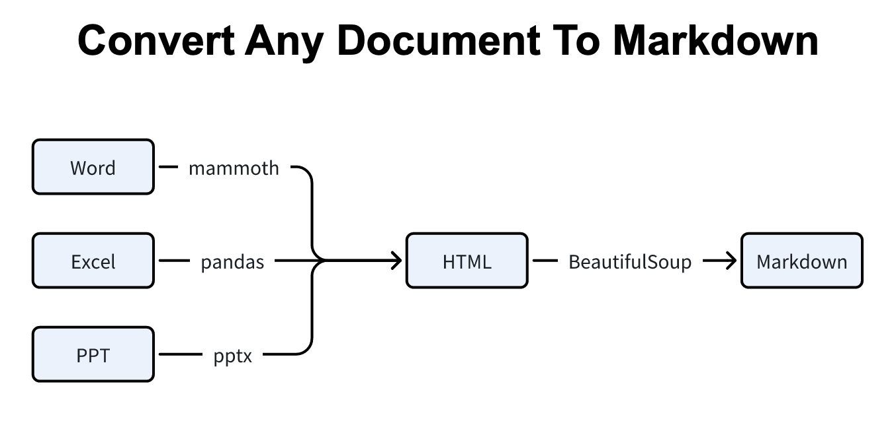

**Source:** [https://twitter.com/i/web/status/1908545566218273086](https://twitter.com/i/web/status/1908545566218273086)
**Original Post Date:** 2025-05-28 04:14:56

# Converting Word, Excel, and PPT Documents to Markdown Using Python Libraries

## Introduction
Document conversion workflows are critical for maintaining consistent documentation standards. This knowledge base article explores a systematic approach to converting Microsoft Office formats (Word, Excel, PPT) into Markdown using specialized Python libraries. The process leverages an HTML intermediate step for optimal content preservation and structure retention.

## Workflow Architecture

The conversion pipeline follows a three-step approach: input document processing, HTML intermediation, and final Markdown generation. This structure ensures compatibility across different document types while maintaining structural integrity throughout the conversion process.

1. Input documents are first converted to standardized HTML format
1. HTML content is processed using BeautifulSoup for structure preservation
1. Final Markdown output maintains formatting and semantic meaning

## Tools Overview

Each document type requires specific processing capabilities:

Word documents utilize the mammoth library for accurate HTML conversion

Excel files are processed using pandas for tabular data handling

PPT conversions rely on pandoc's multi-format support

_Demonstrates basic Word document conversion using mammoth library_

```python
# Word to Markdown example
import mammoth
with open('document.docx', 'rb') as doc:
    result = mammoth.convert_to_html(doc)
    html_content = result.value
```

_Shows simple conversion of Excel data to Markdown table format_

```python
# Excel to Markdown example
import pandas as pd
df = pd.read_excel('data.xlsx')
markdown_table = df.to_markdown()
```

## Implementation Considerations

Careful handling of metadata, styling, and embedded elements is crucial for preserving document integrity.

Error handling should be implemented to manage missing dependencies or unsupported features.

> **Note/Tip:** Always validate input files before processing

> **Note/Tip:** Maintain a fallback strategy for complex document structures

## Key Takeaways

- Use HTML as an intermediate format for consistent conversion results
- Implement specific libraries (mammoth, pandas, pandoc) based on input format
- Consider content structure and metadata preservation during conversion

## Conclusion
This workflow provides a robust foundation for automated document conversion to Markdown. By leveraging specialized Python libraries and maintaining an HTML intermediate step, developers can create reliable, scalable solutions for handling various document formats.

## External References

- [Mammoth Documentation](https://python-mammoth.readthedocs.io/)
- [Pandas Markdown Conversion Guide](https://pandas.pydata.org/docs/reference/api/pandas.DataFrame.to_markdown.html)


## Media

**Image Description:** ### Description of the Image

The image is a flowchart that illustrates the process of converting various document formats into Markdown. The main subject of the image is the conversion workflow, which is depicted using a series of connected boxes and arrows. Below is a detailed breakdown of the image:

---

#### **Title**
- The title at the top of the image reads:
  **"Convert Any Any Document Document Document Document To To To Markdown"**
  - The repetition of "Document" and "To" suggests a typographical error or stylistic choice, but the overall intent is clear: converting documents to Markdown.

---

#### **Main Components**
1. **Input Formats (Sources):**
   - There are three input document formats listed on the left side of the flowchart:
     - **Word**: Represented by a box labeled "Word."
     - **Excel**: Represented by a box labeled "Excel."
     - **PPT**: Represented by a box labeled "PPT."
   - Each of these input formats is connected to a central processing step.

2. **Processing Steps:**
   - **Conversion to HTML:**
     - All three input formats ("Word," "Excel," and "PPT") are connected to a central box labeled **"HTML"**.
     - This indicates that the first step in the conversion process is to convert the input documents into HTML format.
     - Each connection is labeled with a term:
       - "Word" → "mammoth"
       - "Excel" → "pandas"
       - "PPT" → "pandoc"
     - These labels suggest the tools or libraries used for the conversion:
       - **mammoth**: A library for converting Word documents to HTML.
       - **pandas**: A library commonly used for data manipulation, which might be used for converting Excel files.
       - **pandoc**: A universal document converter that can handle various formats, including PPT.

3. **Conversion to Markdown:**
   - The **HTML** box is connected to a final box labeled **"Markdown"**.
   - The connection between "HTML" and "Markdown" is labeled **"BeautifulSoup"**.
     - **BeautifulSoup**: A Python library used for parsing HTML and XML documents. It is likely used here to extract the necessary content from the HTML and convert it into Markdown format.

---

#### **Flow of the Process**
1. **Input Documents**:
   - The user starts with documents in Word, Excel, or PPT formats.
2. **Conversion to HTML**:
   - Each document type is converted into HTML using the respective tools:
     - Word → mammoth
     - Excel → pandas
     - PPT → pandoc
3. **Conversion to Markdown**:
   - The resulting HTML is then processed using **BeautifulSoup** to extract the content and convert it into Markdown format.

---

#### **Visual Layout**
- The flowchart uses a simple, linear structure with arrows pointing from one box to the next, indicating the sequence of operations.
- The boxes are rectangular and labeled clearly with the names of the document formats and tools.
- The labels on the arrows provide additional context about the tools or libraries used at each step.

---

#### **Key Technical Details**
1. **Input Formats**:
   - Word, Excel, and PPT are common document formats that need to be converted.
2. **Intermediate Format**:
   - HTML serves as an intermediate format, which is a common practice when converting between complex document formats.
3. **Tools Used**:
   - **mammoth**: For converting Word documents to HTML.
   - **pandas**: For handling Excel files, likely extracting tabular data.
   - **pandoc**: A versatile tool for converting PPT files to HTML.
   - **BeautifulSoup**: For parsing the HTML and converting it to Markdown.

---

### Summary
The image is a flowchart that outlines a process for converting documents from Word, Excel, and PPT formats into Markdown. The process involves first converting the documents to HTML using tools like mammoth, pandas, and pandoc, and then using BeautifulSoup to parse the HTML and generate the final Markdown output. The flowchart is clear and structured, providing a step-by-step visualization of the conversion workflow.
