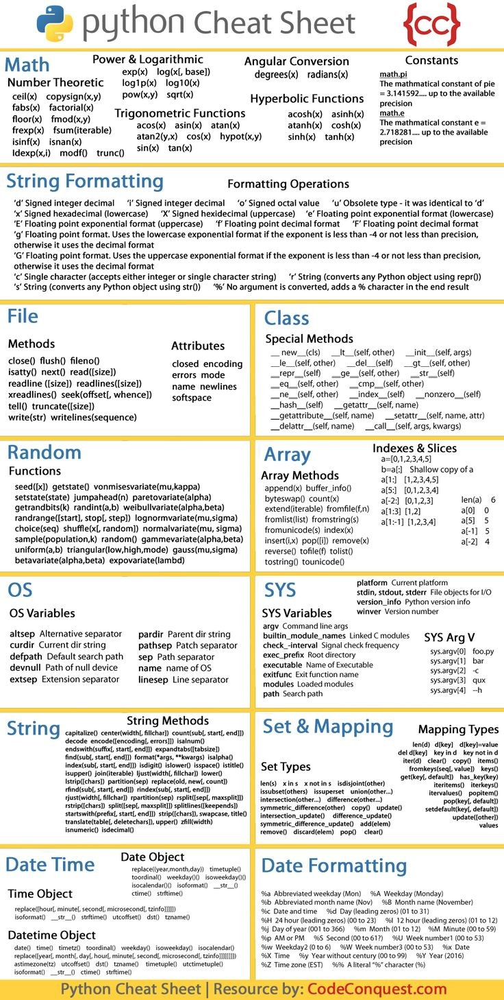

**Source:** [https://twitter.com/i/web/status/1868631059388313850](https://twitter.com/i/web/status/1868631059388313850)
**Original Post Date:** 2025-07-12 21:32:29

# Python Learning Cheat Sheet: Core Concepts and Syntax Quick Reference

## Introduction
Python is a versatile programming language known for its readability and extensive libraries. This cheat sheet provides a concise yet comprehensive overview of Python's core concepts and syntax, making it an essential resource for both beginners and experienced developers. It covers fundamental topics such as data types, control structures, functions, and object-oriented programming, along with practical examples to reinforce understanding.

## Data Types

Python supports several built-in data types including integers, floats, strings, lists, tuples, dictionaries, and sets. Each type has specific properties and methods that can be used for various operations.

- Integers: Whole numbers (e.g., 5, -3).
- Floats: Decimal numbers (e.g., 3.14, -0.001).
- Strings: Sequences of characters (e.g., 'Hello', 'World').
- Lists: Ordered, mutable collections (e.g., [1, 2, 3]).
- Tuples: Ordered, immutable collections (e.g., (1, 2, 3)).
- Dictionaries: Key-value pairs (e.g., {'key': 'value'}).
- Sets: Unordered collections of unique elements (e.g., {1, 2, 3}).

> **Note/Tip:** Use type() to check the data type of a variable.

> **Note/Tip:** Convert between types using functions like int(), float(), str().

## Control Structures

Python uses control structures to manage the flow of execution. These include conditional statements and loops.

_This code snippet demonstrates a simple conditional statement in Python._

```python
if x > 0:
    print('Positive')
elif x < 0:
    print('Negative')
else:
    print('Zero')
```

_This loop prints numbers from 0 to 4._

```python
for i in range(5):
    print(i)
```

- Conditional Statements: if, elif, else.
- Loops: for, while.

## Functions

Functions are reusable blocks of code that perform specific tasks. They can take arguments and return values.

Define functions using the def keyword, followed by the function name and parameters in parentheses.

_This function takes a name as input and returns a greeting message._

```python
def greet(name):
    return f'Hello, {name}!'
```

## Object-Oriented Programming

Python supports object-oriented programming (OOP) with classes and objects. Classes are blueprints for creating objects.

Define classes using the class keyword, followed by the class name. Methods within a class define the behavior of the objects created from the class.

_This class defines a Dog object with attributes and methods._

```python
class Dog:
    def __init__(self, name):
        self.name = name
    
def bark(self):
        print('Woof!')
```

## Key Takeaways

- Understand Python's core data types and their properties.
- Use control structures to manage the flow of execution.
- Define and use functions for reusable code blocks.
- Leverage classes and objects for object-oriented programming.

## Conclusion
This cheat sheet provides a quick reference for Python's core concepts and syntax. It is designed to be a handy resource for developers at all levels, from beginners learning the basics to experienced programmers needing a refresher on specific topics.

## External References

- [Python Official Documentation](https://docs.python.org/3/)
- [W3Schools Python Tutorial](https://www.w3schools.com/python/)


## Media

**Image Description:** Failed to process image: media_seg0_item0.jpg
