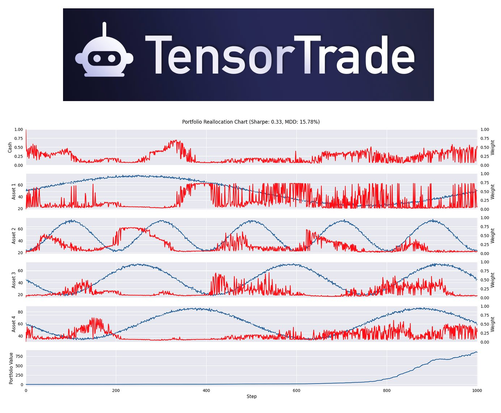

**Source:** [https://twitter.com/i/web/status/1916884210444271870](https://twitter.com/i/web/status/1916884210444271870)
**Original Post Date:** 2025-05-27 21:31:48

# TensorTrade Portfolio Reallocation Visualization: Understanding Metrics and Components

## Introduction
TensorTrade is a powerful Python library for developing reinforcement learning-based trading algorithms. This guide examines its portfolio reallocation visualization system, which provides comprehensive insights into trading strategy performance. We'll analyze the chart components including key metrics like Sharpe ratio and Maximum Drawdown (MDD), asset allocation patterns, and cash management strategies to understand how TensorTrade visualizes complex trading dynamics.

## Understanding Portfolio Visualization Components

The visualization comprises five main panels tracking portfolio performance over discrete time steps. The top panel shows cash balance fluctuations, indicating trading activity and liquidity management. Four middle panels represent individual assets with their values (blue) and allocation weights (red), demonstrating dynamic rebalancing strategies.

Each asset's weight adjusts according to market conditions while maintaining a normalized sum of 1 across all assets at any given time step. The bottom panel displays the total portfolio value, reflecting cumulative performance after trading activities.

- Top Panel: Cash balance visualization over time steps
- Middle Panels: Asset values and weights (4 assets)
- Bottom Panel: Total portfolio value trend

## Key Performance Metrics Analysis

The Sharpe ratio of 0.33 indicates moderate risk-adjusted returns, showing that the strategy generates excess returns relative to its volatility but could be improved.

Maximum Drawdown (15.78%) represents peak-to-trough portfolio value decline, a critical metric for assessing downside risk.

_Basic implementation of Sharpe ratio calculation_

```python
# Calculate Sharpe Ratio
sharpe_ratio = (portfolio_return - risk_free_rate) / portfolio_volatility
```

## Dynamic Portfolio Management Insights

The visualization demonstrates frequent weight adjustments across assets, indicating active rebalancing. The relatively stable cash balance suggests efficient use of liquidity for trading.

Portfolio value shows an upward trend with controlled volatility, suggesting effective risk management strategies.

> **Note/Tip:** Monitor asset weights closely during high-volatility periods

> **Note/Tip:** Consider adjusting Sharpe ratio targets based on market conditions

## Key Takeaways

- Portfolio visualizations effectively communicate complex trading dynamics through multiple time series panels
- Dynamic rebalancing is evident in weight adjustments across assets while maintaining normalized allocation
- Performance metrics like Sharpe ratio and MDD provide crucial insights for strategy optimization

## Conclusion
TensorTrade's visualization system offers a comprehensive view of portfolio performance, combining technical metrics with intuitive visual representations. Understanding these components enables developers to effectively analyze trading strategies, optimize portfolio management, and implement robust risk control measures.

## External References

- [TensorTrade Documentation](https://tensortrade.org/docs)
- [Understanding Risk-Adjusted Performance Metrics](https://papers.ssrn.com/sol3/papers.cfm?abstract_id=2957136)


## Media

**Image Description:** The image is a detailed visualization of a portfolio reallocation chart, likely generated by a trading or portfolio management system. Below is a comprehensive description of the image, focusing on its main elements and technical details:

### **Header**
- **Logo and Branding**: 
  - The top section features a logo with a stylized robot icon and the text "TensorTrade." This suggests that the chart is generated by or associated with the TensorTrade platform, which is a Python library for reinforcement learning in trading and portfolio management.
  
### **Title**
- **Chart Title**: 
  - The title reads: "Portfolio Reallocation Chart (Sharpe: 0.33, MDD: 15.78%)". This indicates that the chart is tracking the performance of a portfolio over time, with key performance metrics provided:
    - **Sharpe Ratio (0.33)**: A measure of risk-adjusted return, indicating the excess return per unit of deviation in the portfolio.
    - **Maximum Drawdown (MDD: 15.78%)**: The peak-to-trough decline in the portfolio value, representing the risk of loss from a peak to a trough of a portfolio.

### **Main Chart**
- The chart is a multi-panel visualization, with each panel representing different components of the portfolio over time. The x-axis represents the "Step," which likely corresponds to discrete time intervals (e.g., days, weeks, or trading periods). The y-axis varies across panels, representing different metrics.

#### **Panels**
1. **Top Panel: Cash**
   - **Description**: This panel shows the cash component of the portfolio over time.
   - **Key Features**:
     - The red line represents the cash balance.
     - The cash balance fluctuates over time, indicating periodic inflows and outflows as assets are bought or sold.
     - The cash level appears to remain relatively stable but shows some volatility.

2. **Middle Panels: Asset 1, Asset 2, Asset 3, Asset 4**
   - **Description**: These panels represent the value and weight of four different assets in the portfolio.
   - **Key Features**:
     - Each asset is represented by two lines:
       - **Blue Line**: The value of the asset over time.
       - **Red Line**: The weight of the asset in the portfolio (normalized to a scale of 0 to 1).
     - **Asset 1**:
       - The blue line shows the asset value, which fluctuates over time.
       - The red line shows the weight, which also fluctuates, indicating dynamic reallocation.
     - **Asset 2, Asset 3, Asset 4**: Similar patterns are observed for these assets, with varying levels of volatility and weight adjustments.
     - The weights of the assets (red lines) sum up to 1 at any given time, reflecting the portfolio's allocation constraints.

3. **Bottom Panel: Portfolio Value**
   - **Description**: This panel shows the total value of the portfolio over time.
   - **Key Features**:
     - The blue line represents the portfolio value, which increases over time, indicating overall growth.
     - The portfolio value shows a general upward trend with some volatility, reflecting market fluctuations and trading activities.

### **Axes and Labels**
- **X-Axis**: Labeled as "Step," representing discrete time intervals.
- **Y-Axis**:
  - For the Cash and Asset panels, the y-axis is labeled as "Value" or "Weight," depending on the metric being displayed.
  - For the Portfolio Value panel, the y-axis is labeled as "Portfolio Value," showing the total portfolio value over time.

### **Color Coding**
- **Red Line**: Represents the weight of assets or cash in the portfolio.
- **Blue Line**: Represents the value of assets or the total portfolio value.
- This consistent color coding helps differentiate between value and weight metrics across the panels.

### **Overall Observations**
- **Dynamic Rebalancing**: The chart shows frequent adjustments in the portfolio weights (red lines), indicating active rebalancing based on market conditions or trading strategies.
- **Growth and Volatility**: The portfolio value (bottom panel) shows a general upward trend, but with some volatility, reflecting market fluctuations.
- **Cash Management**: The cash component (top panel) fluctuates, suggesting periodic trading activities where cash is used to buy or sell assets.

### **Technical Details**
- **Sharpe Ratio (0.33)**: Indicates a moderate risk-adjusted return, suggesting that the portfolio generates returns that are somewhat higher than the risk-free rate relative to its volatility.
- **Maximum Drawdown (15.78%)**: Indicates the peak-to-trough decline in portfolio value, reflecting the risk of loss. A lower MDD is generally preferred for more stable portfolios.

### **Conclusion**
The image is a comprehensive visualization of a portfolio's performance over time, highlighting the dynamic allocation of assets, cash management, and overall portfolio value growth. The inclusion of key performance metrics like Sharpe Ratio and Maximum Drawdown provides insights into the risk and return characteristics of the portfolio. The multi-panel design effectively communicates the interplay between asset values, weights, and the total portfolio value, making it a valuable tool for analyzing portfolio management strategies.
