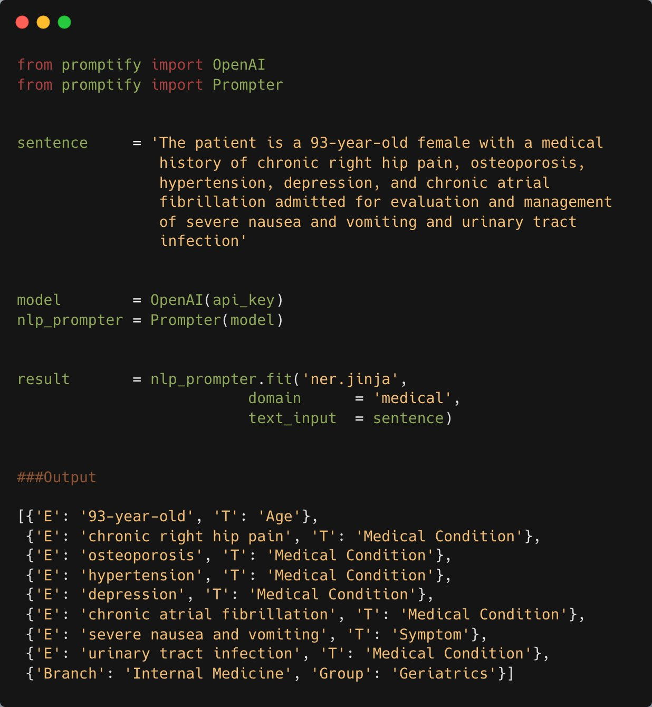

**Source:** [https://twitter.com/i/web/status/1912891173829493173](https://twitter.com/i/web/status/1912891173829493173)
**Original Post Date:** 2025-05-28 00:05:51

# Using Promptify Library for Medical Named Entity Recognition with LLMs

## Introduction
Natural Language Processing (NLP) plays a crucial role in modern healthcare systems by automating the extraction of meaningful information from unstructured medical text. This article demonstrates how to leverage the Promptify library combined with OpenAI's LLMs to perform domain-specific Named Entity Recognition (NER) tasks, particularly focusing on medical entity extraction from patient records.

We'll explore the practical implementation of this technology through a detailed code example that processes real-world medical text and extracts structured information about age, conditions, symptoms, and other relevant details.

## Library Setup and Initialization

The Promptify library provides essential components for interacting with LLM-based NLP models. The OpenAI model wrapper handles API interactions while the Prompter class manages prompt creation and execution.

```python
from promptify import import OpenAI
from promptify import import Prompter
```

## Processing Medical Text Input

Medical text requires careful handling due to its domain-specific terminology and complex structure. The input sentence contains multiple medical entities that need precise extraction.

```python
sentence = 'The patient is a 93-year-old female with a medical history of chronic right hip pain, osteoporosis, hypertension, depression, and chronic atrial fibrillation admitted for evaluation and management of severe nausea and vomiting and urinary tract infection.'
```

## Model Configuration and Execution

The OpenAI model is initialized with an API key, while the Prompter combines this model with a domain-specific NER template to process medical entities.

```python
model = OpenAI(api_key)
nlp_prompter = Prompter(model=model)
```

## Executing the NER Task

The fit method executes the NER task using a medical domain template, returning structured entity information.

```python
result = nlp_prompter.fit('ner.jinja',
                            domain='medical',
                            text_input=sentence)
```

## Processing NER Results

The output provides a structured list of medical entities with their types, enabling downstream processing for clinical decision support or patient record management.

```python
[{'E': '93-year-old', 'T': 'Age'},
 {'E': 'chronic right hip pain', 'T': 'Medical Condition'},
 {'E': 'osteoporosis', 'T': 'Medical Condition'},
 ...]
```

## Key Takeaways

- Promptify provides a streamlined interface for LLM-based NLP tasks in Python
- Domain-specific templates (like medical.jinja) significantly improve entity recognition accuracy
- The structured output format enables easy integration with healthcare systems
- Combining OpenAI models with Promptify offers high-accuracy, flexible NER capabilities

## Conclusion
This implementation demonstrates the power of combining modern LLMs with domain-specific NLP templates to extract meaningful medical information. The approach is particularly valuable for automating clinical documentation review and supporting healthcare decision-making processes.

## External References

- [Promptify Documentation](https://promptify.readthedocs.io/)
- [OpenAI API Reference](https://platform.openai.com/docs/api-reference)


## Media

**Image Description:** The image shows a Python code snippet that demonstrates the use of a Natural Language Processing (NLP) library, specifically leveraging a Named Entity Recognition (NER) model to extract medical entities from a given sentence. Below is a detailed breakdown of the image:

### **Main Subject**
The main subject of the image is a Python script that performs Named Entity Recognition (NER) on a medical sentence using a library called `promptify` and an OpenAI model. The script processes a sentence containing medical information and extracts entities such as age, medical conditions, symptoms, and other relevant details.

### **Technical Details**

#### **1. Imports**
- The script begins with imports from the `promptify` library:
  ```python
  from promptify import import OpenAI
  from promptify import import Prompter
  ```
  - `OpenAI`: This is likely a wrapper or interface for interacting with OpenAI's API, which provides access to their language models.
  - `Prompter`: This is a class from the `promptify` library used to create and manage prompts for the NLP tasks.

#### **2. Sentence Definition**
- A sentence is defined as a string containing medical information about a patient:
  ```python
  sentence = 'The patient is a 93-year-old female with a medical history of chronic right hip pain, osteoporosis, hypertension, depression, and chronic atrial fibrillation admitted for evaluation and management of severe nausea and vomiting and urinary tract infection.'
  ```
  - The sentence describes a 93-year-old female patient with various medical conditions and symptoms, including chronic pain, osteoporosis, hypertension, depression, atrial fibrillation, nausea, vomiting, and a urinary tract infection.

#### **3. Model Initialization**
- An instance of the `OpenAI` model is created using an API key:
  ```python
  model = OpenAI(api_key)
  ```
  - `api_key`: This is a placeholder for the actual API key required to interact with the OpenAI API.

#### **4. Prompter Initialization**
- A `Prompter` object is created using the initialized `model`:
  ```python
  nlp_prompter = Prompter(model=model)
  ```
  - This object will be used to execute NLP tasks, such as NER, using the specified model.

#### **5. NER Task Execution**
- The `fit` method of the `Prompter` object is used to perform NER:
  ```python
  result = nlp_prompter.fit('ner.jinja',
                            domain='medical',
                            text_input=sentence)
  ```
  - **Parameters:**
    - `'ner.jinja'`: This specifies the template or configuration for the NER task, likely stored in a file named `ner.jinja`.
    - `'medical'`: The domain is set to `'medical'`, indicating that the NER task is focused on extracting medical entities.
    - `sentence`: The input text for which NER is performed.

#### **6. Output**
- The output of the NER task is displayed as a list of dictionaries, where each dictionary represents an extracted entity:
  ```python
  [{'E': '93-year-old', 'T': 'Age'},
   {'E': 'chronic right hip pain', 'T': 'Medical Condition'},
   {'E': 'osteoporosis', 'T': 'Medical Condition'},
   {'E': 'hypertension', 'T': 'Medical Condition'},
   {'E': 'depression', 'T': 'Medical Condition'},
   {'E': 'chronic atrial fibrillation', 'T': 'Medical Condition'},
   {'E': 'severe nausea and vomiting', 'T': 'Symptom'},
   {'E': 'urinary tract infection', 'T': 'Medical Condition'},
   {'Branch': 'Medicine', 'Internal Medicine Group': 'Geriatrics'}]
  ```
  - **Explanation of the Output:**
    - Each dictionary contains:
      - `'E'`: The extracted entity (e.g., `'93-year-old'`, `'chronic right hip pain'`).
      - `'T'`: The type of the entity (e.g., `'Age'`, `'Medical Condition'`, `'Symptom'`).
    - The last entry indicates the medical branch and group, suggesting that the patient's case falls under geriatrics.

### **Key Observations**
1. **NER Task**: The script uses a pre-trained model to identify and categorize medical entities in the input sentence.
2. **Domain-Specific**: The domain is explicitly set to `'medical'`, ensuring that the NER model is tuned for medical terminology.
3. **Output Structure**: The output is well-organized, providing both the extracted entities and their types, which is useful for further analysis or integration into medical systems.
4. **Integration with OpenAI**: The use of the `OpenAI` model suggests leveraging state-of-the-art language models for NER tasks.

### **Conclusion**
The image demonstrates a practical application of NLP for medical text analysis, specifically using Named Entity Recognition to extract and categorize medical entities from a patient's description. The code is structured to be modular and reusable, with clear separation between model initialization, task execution, and output interpretation. This approach is valuable for applications in healthcare, such as patient record analysis, medical research, and clinical decision support systems.
