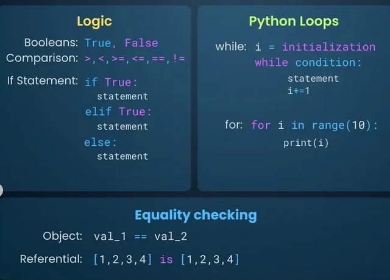
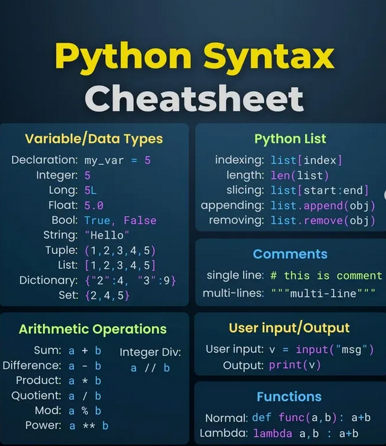

**Source:** [https://twitter.com/i/web/status/1878628030614290897](https://twitter.com/i/web/status/1878628030614290897)
**Original Post Date:** 2025-05-28 02:38:43

# Python Syntax Cheatsheet: Core Concepts and Best Practices

## Introduction
Understanding core Python syntax is essential for effective programming. This cheatsheet provides a structured overview of key concepts including boolean logic, control structures, data types, and common operations. Each section includes practical examples to reinforce learning and help developers quickly reference critical syntax patterns.

## Logic Operations

Python uses two boolean values: True and False. These are fundamental for conditional logic in your code.

```python
# Comparison operators
>  # Greater than
<  # Less than
>=  # Greater than or equal to
<=  # Less than or equal to
==  # Equal to
!=  # Not equal to
```

_Shows how Python handles conditional logic with indentation for block definition_

```python
# If-elif-else structure
if condition:
    statement1
elif another_condition:
    statement2
else:
    statement3
```

> **Note/Tip:** Always use == for equality comparison, not single = which is assignment

> **Note/Tip:** Python evaluates conditions from top to bottom in if-elif chains

## Python Loops

Loops allow repeated execution of code blocks based on defined conditions.

While loops execute as long as a condition remains true.

```python
# While loop
i = 0
while i < 5:
    print(i)
    i += 1
```

```python
# For loop with range
for i in range(10):
    print(f'Value: {i}')
```

> **Note/Tip:** Remember to increment counters in while loops to avoid infinite loops

> **Note/Tip:** range() generates a sequence of numbers for iteration

## Equality Checking

Python provides two distinct ways to check equality: value comparison and identity checking.

```python
# Value equality
val_1 == val_2
```

```python
# Identity (memory location)
[1, 2] is [1, 2]
```

- == compares values for equality
- is checks if objects are the same in memory

## Additional Core Syntax

Python supports various data types and operations essential for daily programming tasks.

```python
# Data type examples
integer = 5
float_num = 5.0
string_var = "Hello"
list_example = [1, 2, 3]
dict_sample = {"key": "value"}
```

```python
# Basic operations
sum_result = a + b
diff = a - b
product = a * b
quotient = a / b
```

## Key Takeaways

- Master Python's boolean logic and comparison operators for effective conditionals
- Understand the difference between while and for loops for appropriate use cases
- Know when to use == (value equality) vs is (identity check)
- Be familiar with core data types and basic arithmetic operations

## Conclusion
This cheatsheet provides a quick reference for essential Python syntax patterns. For complex applications, always consult the official Python documentation and consider using type hints for better code maintainability.

## External References

- [Official Python Documentation](https://docs.python.org/3/)


## Media

**Image Description:** The image is a slide or presentation slide that focuses on programming concepts, specifically logic, Python loops, and equality checking. The slide is divided into three main sections, each highlighting different aspects of programming. Below is a detailed description of each section:

---

### **1. Logic**
- **Title**: "Logic"
- **Content**:
  - **Booleans**: 
    - Lists the two boolean values: `True` and `False`.
  - **Comparison Operators**:
    - Lists the comparison operators used in programming: `>`, `<`, `>=`, `<=`, `==`, `!=`.
  - **If Statement**:
    - Demonstrates the structure of an `if` statement in Python:
      ```python
      if True:
          statement
      elif True:
          statement
      else:
          statement
      ```
    - This structure shows how conditional logic is implemented, with `if`, `elif`, and `else` clauses.

---

### **2. Python Loops**
- **Title**: "Python Loops"
- **Content**:
  - **While Loop**:
    - Explains the structure of a `while` loop:
      ```python
      i = initialization
      while condition:
          statement
          i += 1
      ```
    - This demonstrates how a `while` loop works, where the loop continues as long as the condition is `True`, and the variable `i` is incremented (`i += 1`) in each iteration.
  - **For Loop**:
    - Explains the structure of a `for` loop:
      ```python
      for i in range(10):
          print(i)
      ```
    - This demonstrates how a `for` loop iterates over a sequence (in this case, the range from 0 to 9), executing the `print(i)` statement for each value of `i`.

---

### **3. Equality Checking**
- **Title**: "Equality checking"
- **Content**:
  - **Object Equality**:
    - Shows how to compare two objects for equality using the `==` operator:
      ```python
      val_1 == val_2
      ```
    - This checks if the values of `val_1` and `val_2` are the same.
  - **Referential Equality**:
    - Demonstrates how to check if two objects are the same (i.e., they refer to the same memory location) using the `is` operator:
      ```python
      [1, 2, 3, 4] is [1, 2, 3, 4]
      ```
    - This checks if the two lists are identical in memory, not just in value. Note that in this case, the two lists are different objects, so the `is` operator would return `False`.

---

### **Visual Layout**
- The slide uses a dark background with text in bright colors (e.g., blue, purple, and white) for readability.
- The sections are clearly separated by horizontal lines, making the content easy to distinguish.
- The code snippets are formatted in a way that mimics Python syntax, with proper indentation to emphasize structure.

---

### **Key Technical Details**
1. **Logic Section**:
   - Focuses on boolean values and conditional statements, which are fundamental to programming logic.
   - Highlights the use of comparison operators for decision-making.

2. **Python Loops Section**:
   - Explains both `while` and `for` loops, which are essential for iteration in Python.
   - Demonstrates how to increment variables and iterate over ranges.

3. **Equality Checking Section**:
   - Differentiates between value equality (`==`) and referential equality (`is`), which is a crucial concept in Python due to its object-oriented nature.

---

### **Overall Purpose**
The slide serves as an educational resource, likely part of a programming tutorial or course, aimed at teaching fundamental programming concepts such as logic, loops, and equality checking in Python. The use of clear examples and syntax makes it accessible for learners.


**Image Description:** The image is a **Python Syntax Cheat Sheet** designed to provide a concise overview of key Python programming concepts and syntax. The background is dark blue, with text in various colors (white, yellow, blue, and purple) to highlight different sections and categories. Below is a detailed breakdown of the content:

### **Main Sections**
1. **Title**
   - The title at the top reads **"Python Syntax Cheatsheet"** in bold, with "Python Syntax" in yellow and "Cheatsheet" in white.

2. **Variable/Data Types**
   - This section explains how to declare and use different data types in Python.
   - **Declaration**: `my_var = 5`
   - **Data Types**:
     - **Integer**: `5`
     - **Long**: `5L` (Note: In Python 3, there is no distinction between `int` and `long`; both are treated as `int`.)
     - **Float**: `5.0`
     - **Bool**: `True`, `False`
     - **String**: `"Hello"`
     - **Tuple**: `(1, 2, 3, 4, 5)`
     - **List**: `[1, 2, 3, 4, 5]`
     - **Dictionary**: `{"2": 4, "3": 9}`
     - **Set**: `{2, 4, 5}`

3. **Python List**
   - This section details operations that can be performed on Python lists.
   - **Indexing**: `list[index]`
   - **Length**: `len(list)`
   - **Slicing**: `list[start:end]`
   - **Appending**: `list.append(obj)`
   - **Removing**: `list.remove(obj)`

4. **Comments**
   - This section explains how to write comments in Python.
   - **Single-line Comment**: `# this is a comment`
   - **Multi-line Comment**: `"""multi-line comment"""`
     - Note: Python does not have a dedicated multi-line comment syntax, but triple quotes (`"""` or `'''`) are commonly used for documentation strings or multi-line comments.

5. **Arithmetic Operations**
   - This section lists basic arithmetic operations in Python.
   - **Sum**: `a + b`
   - **Difference**: `a - b`
   - **Product**: `a * b`
   - **Quotient**: `a / b`
   - **Integer Division**: `a // b`
   - **Modulus**: `a % b`
   - **Power**: `a ** b`

6. **User Input/Output**
   - This section explains how to handle user input and output in Python.
   - **User Input**: `v = input("msg")`
   - **Output**: `print(v)`

7. **Functions**
   - This section covers the syntax for defining and using functions in Python.
   - **Normal Function**: 
     ```python
     def func(a, b):
         return a + b
     ```
   - **Lambda Function**: 
     ```python
     lambda a, b: a + b
     ```

### **Design and Layout**
- The content is organized into distinct sections, each with a heading in bold.
- Different categories (e.g., Variables, Lists, Comments) are separated by color-coded boxes for clarity.
- Syntax examples are provided in a clear, readable format, using Python's standard syntax.

### **Key Technical Details**
1. **Data Types**:
   - Python supports various data types, including integers, floats, booleans, strings, tuples, lists, dictionaries, and sets.
   - The distinction between `int` and `long` is noted, but it is mentioned that in Python 3, there is no such distinction.

2. **Lists**:
   - Lists are mutable, ordered collections of items. Operations like indexing, slicing, appending, and removing elements are demonstrated.

3. **Comments**:
   - Single-line comments start with `#`, and multi-line comments are typically written using triple quotes (`"""` or `'''`).

4. **Arithmetic Operations**:
   - Python supports standard arithmetic operations, including addition, subtraction, multiplication, division, integer division, modulus, and exponentiation.

5. **User Input/Output**:
   - The `input()` function is used to take user input, and the `print()` function is used to display output.

6. **Functions**:
   - Functions can be defined using the `def` keyword, and lambda functions provide a concise way to define small anonymous functions.

### **Overall Purpose**
The image serves as a quick reference guide for Python syntax, covering fundamental concepts such as data types, list operations, comments, arithmetic operations, user input/output, and functions. It is designed to be a handy resource for beginners and intermediate Python programmers.
