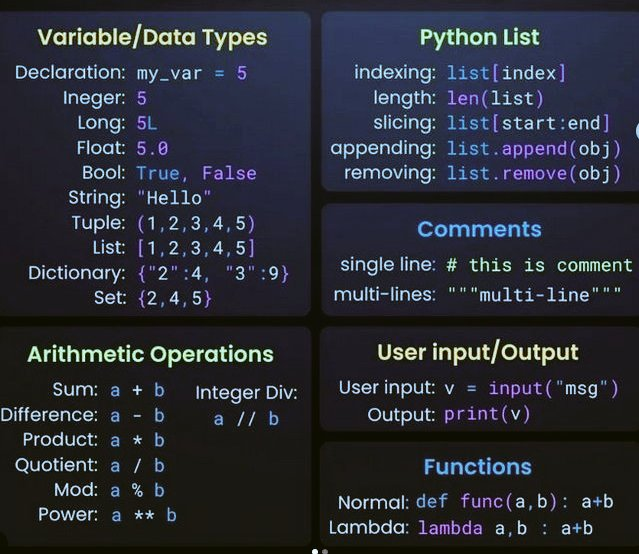

**Source:** [https://twitter.com/i/web/status/1880786299449495703](https://twitter.com/i/web/status/1880786299449495703)
**Original Post Date:** 2025-05-27 22:11:50

# Python Syntax Cheatsheet

## Introduction
This cheatsheet provides a concise overview of essential Python concepts, including variable declaration, data types, list operations, commenting code, basic arithmetic, handling user input and output, and defining functions. It serves as a quick reference guide for beginners and intermediate Python programmers.

The guide is structured into six key sections: Variable/Data Types, Python List, Comments, Arithmetic Operations, User Input/Output, and Functions. Each section offers detailed explanations along with examples to illustrate the concepts.

## Variable/Data Types

This section explains how to declare and use different data types in Python. Variables can be declared using the assignment operator (=). For example, `my_var = 5` declares a variable named `my_var` and assigns it the value 5.

Python supports several data types including integers (`5`), floats (`5.0`), booleans (`True`, `False`), strings (`"Hello"`), tuples (`(1, 2, 3)`), lists (`[1, 2, 3]`), and dictionaries (`{"key": "value"}`)).

_Declaring a variable `my_var` and printing its value._

```python
my_var = 5
print(my_var)
```

## Python List

This section delves into operations and methods related to Python lists. Lists are mutable sequences of elements that can be accessed by their index.

Common list operations include indexing (`list[index]`), getting the length (`len(list)`), slicing (`list[start:end]`), appending (`list.append(obj)`), and removing elements (`list.remove(obj)`).

_Accessing the first element of a list and appending a new element._

```python
my_list = [1, 2, 3]
print(my_list[0])
my_list.append(4)
print(my_list)
```

## Comments

Comments are crucial for code readability and understanding. Python supports single-line comments (using `#`) and multi-line comments (using triple quotes `"""` or `'''`).

_Examples of single-line and multi-line comments in Python._

```python
# This is a single-line comment
"""This is a multi-line comment"""
```

## Arithmetic Operations

Basic arithmetic operations in Python include addition (`a + b`), subtraction (`a - b`), multiplication (`a * b`), division (`a / b`), integer division (`a // b`), modulus (`a % b`), and exponentiation (`a ** b`).

_Performing addition and printing the result._

```python
result = 5 + 3
print(result)
```

## User Input/Output

Handling user input is done using the `input()` function, which returns a string. Output to the console can be achieved with the `print()` function.

For example, `v = input("Enter your name: ")` prompts the user for their name and stores it in `v`. Then, `print(v)` prints out the entered value.

_Taking user input for their name and greeting them._

```python
name = input("What is your name? ")
print("Hello, " + name)
```

## Functions

Functions are reusable blocks of code that perform a specific task. They can be defined using the `def` keyword.

Python also supports lambda functions, which are small anonymous functions that can take any number of arguments but can only have one expression.

_Defining a function to greet someone by their name and calling it._

```python
def greet(name):
    print("Hello, " + name)
greet("Alice")
```

_Defining a lambda function for addition and using it._

```python
sum = lambda x, y: x + y
print(sum(3, 4))
```

## Key Takeaways

- Understand the basic data types in Python including integers, floats, strings, lists, tuples, dictionaries, and sets.
- Learn how to perform common operations on lists such as indexing, slicing, appending, and removing elements.
- Use comments effectively to document your code for better readability and maintainability.
- Familiarize yourself with basic arithmetic operations and how to handle user input/output in Python.
- Master the art of defining and using both regular functions and lambda functions for more concise and reusable code.

## Conclusion
This cheatsheet has covered a wide range of fundamental concepts in Python, from variable declaration and data types to list operations, comments, arithmetic, input/output, and functions. By mastering these basics, you'll have a solid foundation to dive deeper into the world of Python programming and tackle more complex projects with confidence.

## External References

- [Official Python Documentation](https://docs.python.org/3/)
- [W3Schools Python Tutorial](https://www.w3schools.com/python/)


## Media

**Image Description:** The image is a comprehensive reference sheet for Python programming, covering various fundamental concepts and operations. It is divided into six sections, each detailing different aspects of Python programming. Below is a detailed breakdown of each section:

---

### **1. Variable/Data Types**
- **Title**: Variable/Data Types
- **Description**: This section explains how to declare and use different data types in Python.
  - **Declaration**: `my_var = 5` (Example of variable declaration)
  - **Data Types**:
    - **Integer**: `5` (Example: `5`)
    - **Long**: `5L` (Python 2.x specific, not used in Python 3.x)
    - **Float**: `5.0` (Example: `5.0`)
    - **Bool**: `True, False` (Boolean values)
    - **String**: `"Hello"` (Example: `"Hello"`)
    - **Tuple**: `(1, 2, 3, 4, 5)` (Immutable sequence of elements)
    - **List**: `[1, 2, 3, 4, 5]` (Mutable sequence of elements)
    - **Dictionary**: `{"2": 4, "3": 9}` (Key-value pairs)
    - **Set**: `{2, 4, 5}` (Unordered collection of unique elements)

---

### **2. Python List**
- **Title**: Python List
- **Description**: This section explains operations and methods related to Python lists.
  - **Indexing**: `list[index]` (Accessing elements by index)
  - **Length**: `len(list)` (Returns the number of elements in the list)
  - **Slicing**: `list[start:end]` (Extracting a portion of the list)
  - **Appending**: `list.append(obj)` (Adding an element to the end of the list)
  - **Removing**: `list.remove(obj)` (Removing the first occurrence of an element)

---

### **3. Comments**
- **Title**: Comments
- **Description**: This section explains how to write comments in Python.
  - **Single-line Comment**: `# this is a comment`
  - **Multi-line Comment**: `"""multi-line comment multi-line comment multi-line comment """` (Using triple quotes)

---

### **4. Arithmetic Operations**
- **Title**: Arithmetic Operations
- **Description**: This section lists basic arithmetic operations in Python.
  - **Sum**: `a + b`
  - **Difference**: `a - b`
  - **Product**: `a * b`
  - **Quotient**: `a / b` (Floating-point division)
  - **Integer Division**: `a // b` (Floor division)
  - **Modulus**: `a % b` (Remainder of division)
  - **Power**: `a ** b` (Exponentiation)

---

### **5. User Input/Output**
- **Title**: User Input/Output
- **Description**: This section explains how to handle user input and output in Python.
  - **User Input**: `v = input("msg")` (Prompts the user for input and stores it in `v`)
  - **Output**: `print(v)` (Prints the value of `v` to the console)

---

### **6. Functions**
- **Title**: Functions
- **Description**: This section explains how to define and use functions in Python.
  - **Normal Function**: 
    ```python
    def func(a, b):
        return a + b
    ```
  - **Lambda Function**: 
    ```python
    lambda a, b: a + b
    ```

---

### **Visual Layout**
- The image is divided into six rectangular sections, each with a dark background and text in contrasting colors (e.g., green, blue, white) for readability.
- The sections are organized in a grid format, with two columns and three rows.
- The text is concise and uses examples to illustrate each concept.

---

### **Key Technical Details**
1. **Data Types**: The image covers both primitive types (e.g., integers, floats, booleans) and complex types (e.g., lists, dictionaries, sets).
2. **List Operations**: It provides a concise summary of common list methods and operations.
3. **Comments**: It distinguishes between single-line and multi-line comments.
4. **Arithmetic Operations**: It includes both basic and advanced operations like floor division and exponentiation.
5. **Input/Output**: It demonstrates how to use the `input()` and `print()` functions.
6. **Functions**: It explains both regular functions and lambda functions, highlighting their syntax and usage.

This reference sheet is a useful quick guide for beginners and intermediate Python programmers, providing a concise overview of essential Python concepts.
