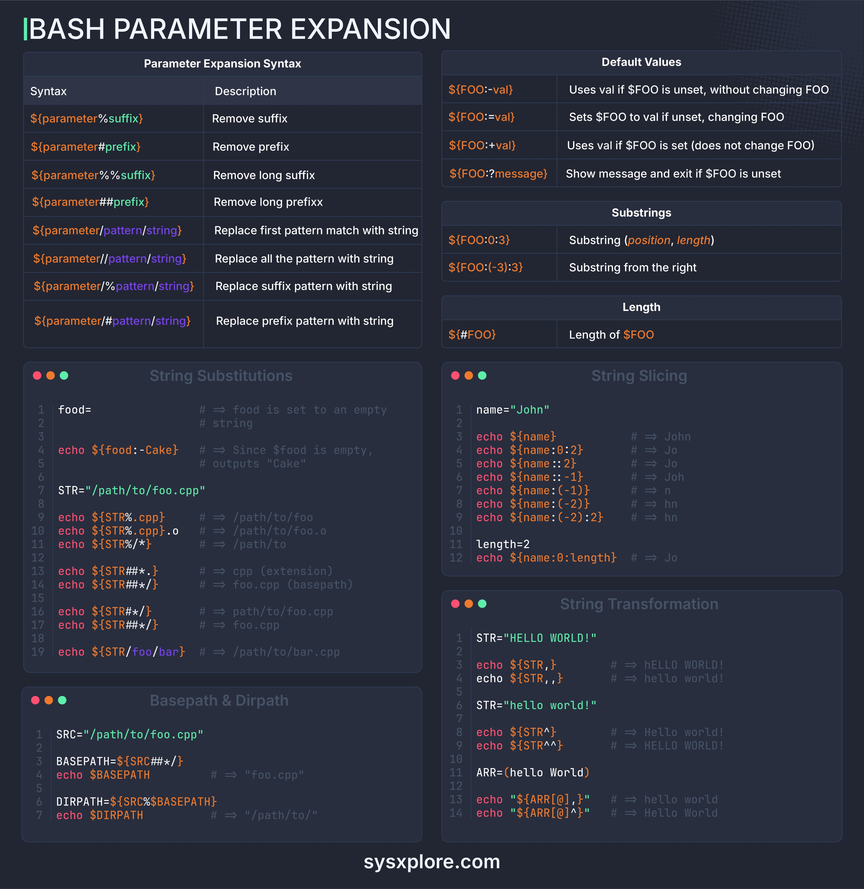

# Bash Parameter Expansion

## Description
Bash paremeter expansion 101...

## Content
Bash paremeter expansion 101

## Category Information

- Main Category: programming_languages
- Sub Category: shell_scripting
- Item Name: bash_parameter_expansion

## Source

- Original Tweet: [https://twitter.com/i/web/status/1875561282302357530](https://twitter.com/i/web/status/1875561282302357530)
- Date: 2025-02-20 15:36:34

## Media

### Media 1

**Description:** The image presents a comprehensive guide to Bash parameter expansion, featuring a dark blue background with white text and vibrant orange accents. The title "BASH PARAMETER EXPANSION" is prominently displayed at the top.

**Parameter Expansion Syntax**

*   **Syntax**: The syntax for parameter expansion is provided in a table format, outlining the various options available.
*   **Description**: A brief description of each option is included to facilitate understanding.

**Default Values**

*   A table lists default values for parameters, providing insight into their behavior when not explicitly defined.
*   **Substrings**: The table also includes information on substrings, which can be used to manipulate parameter values.

**String Substitutions**

*   This section provides examples of string substitutions, demonstrating how to replace placeholders in strings with actual values.
*   **Echo Statements**: Echo statements are used to print output, and their syntax is illustrated in the code snippets.

**String Slicing**

*   The image showcases how to slice strings using Bash's built-in functions, such as `echo` and `${parameter}`.
*   **Code Snippets**: Code snippets are included to demonstrate the usage of string slicing in practice.

**String Transformation**

*   This section highlights various string transformation techniques available in Bash, including concatenation, substitution, and insertion.
*   **Examples**: Examples are provided to illustrate each technique, making it easier for users to understand and apply them.

In summary, the image offers a thorough introduction to Bash parameter expansion, covering essential concepts such as syntax, default values, string substitutions, slicing, and transformation. By following along with the examples and code snippets, users can gain a solid understanding of how to effectively utilize these features in their Bash scripts.

*Last updated: 2025-02-20 15:36:34*