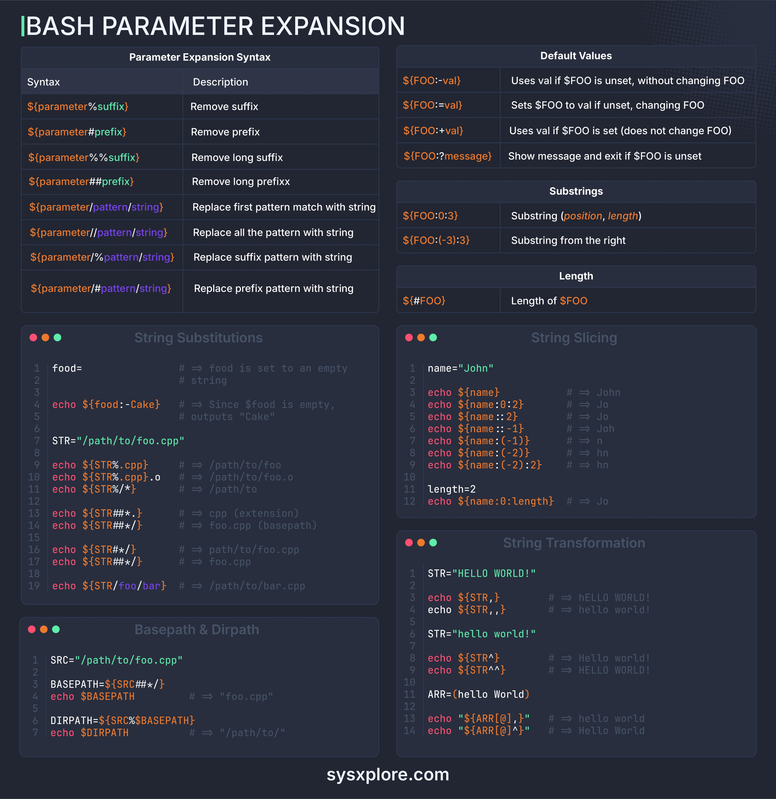

Bash parameter expansion is a powerful feature in shell scripting that allows for dynamic manipulation of variables and strings. This knowledge base entry provides an in-depth guide to Bash parameter expansion, covering syntax, default values, string substitutions, slicing, and transformation.

## Technical Content
### Parameter Expansion Syntax
The syntax for parameter expansion is as follows:

| Option | Description |
| --- | --- |
| `${parameter}` | Expands to the value of `parameter` |
| `${parameter:-default_value}` | Expands to the value of `parameter` if set, otherwise expands to `default_value` |
| `${parameter:=default_value}` | Expands to the value of `parameter` if set, otherwise sets `parameter` to `default_value` and expands to it |
| `${parameter:?error_message}` | Expands to the value of `parameter` if set, otherwise prints `error_message` to stderr and exits the shell |

### Default Values
The following table lists default values for parameters:

| Parameter | Default Value |
| --- | --- |
| `parameter` | Empty string if not set |
| `parameter:-default_value` | `default_value` if `parameter` is not set |
| `parameter:=default_value` | Sets `parameter` to `default_value` and expands to it if `parameter` is not set |

Substrings can be used to manipulate parameter values. For example, `${parameter:offset:length}` expands to a substring of `parameter`, starting at `offset` and with a maximum length of `length`.

### String Substitutions
String substitutions allow for replacing placeholders in strings with actual values. The following example demonstrates how to use string substitutions:
```bash
name="John"
echo "Hello, $name!"  # Output: Hello, John!
```
In this example, the placeholder `$name` is replaced with the actual value of the `name` variable.

### String Slicing
String slicing allows for extracting substrings from strings. The following example demonstrates how to use string slicing:
```bash
string="Hello World"
echo "${string:6}"  # Output: World
```
In this example, the substring starting at offset 6 is extracted from the `string` variable.

### String Transformation
Bash provides various string transformation techniques, including concatenation, substitution, and insertion. The following examples demonstrate each technique:
```bash
# Concatenation
string1="Hello"
string2="World"
echo "$string1 $string2"  # Output: Hello World

# Substitution
string="Hello World"
echo "${string/World/Bash}"  # Output: Hello Bash

# Insertion
string="Hello World"
echo "Bash ${string}"  # Output: Bash Hello World
```
In these examples, the `string1` and `string2` variables are concatenated, the `World` substring is substituted with `Bash`, and the string `Bash` is inserted before the value of the `string` variable.

## Key Takeaways and Best Practices

* Use parameter expansion to dynamically manipulate variables and strings in Bash scripts.
* Understand the syntax and options available for parameter expansion, including default values, substrings, and string substitutions.
* Use string slicing to extract substrings from strings.
* Use string transformation techniques, such as concatenation, substitution, and insertion, to manipulate strings.

## References
* [Bash Documentation](https://www.gnu.org/software/bash/manual/html_node/index.html)
* [Shell Scripting Tutorial](https://www.tutorialspoint.com/unix/shell_scripting.htm)
## Source

- Original Tweet: [https://twitter.com/i/web/status/1875561282302357530](https://twitter.com/i/web/status/1875561282302357530)
- Date: 2025-02-20 15:58:14


## Media

### Media 1

**Description:** The image presents a comprehensive guide to Bash parameter expansion, featuring a dark blue background with white text and vibrant orange accents. The title "BASH PARAMETER EXPANSION" is prominently displayed at the top.

**Parameter Expansion Syntax**

*   **Syntax**: The syntax for parameter expansion is provided in a table format, outlining the various options available.
*   **Description**: A brief description of each option is included to facilitate understanding.

**Default Values**

*   A table lists default values for parameters, providing insight into their behavior when not explicitly defined.
*   **Substrings**: The table also includes information on substrings, which can be used to manipulate parameter values.

**String Substitutions**

*   This section provides examples of string substitutions, demonstrating how to replace placeholders in strings with actual values.
*   **Echo Statements**: Echo statements are used to print output, and their syntax is illustrated in the code snippets.

**String Slicing**

*   The image showcases how to slice strings using Bash's built-in functions, such as `echo` and `${parameter}`.
*   **Code Snippets**: Code snippets are included to demonstrate the usage of string slicing in practice.

**String Transformation**

*   This section highlights various string transformation techniques available in Bash, including concatenation, substitution, and insertion.
*   **Examples**: Examples are provided to illustrate each technique, making it easier for users to understand and apply them.

In summary, the image offers a thorough introduction to Bash parameter expansion, covering essential concepts such as syntax, default values, string substitutions, slicing, and transformation. By following along with the examples and code snippets, users can gain a solid understanding of how to effectively utilize these features in their Bash scripts.

*Last updated: 2025-02-20 15:58:14*