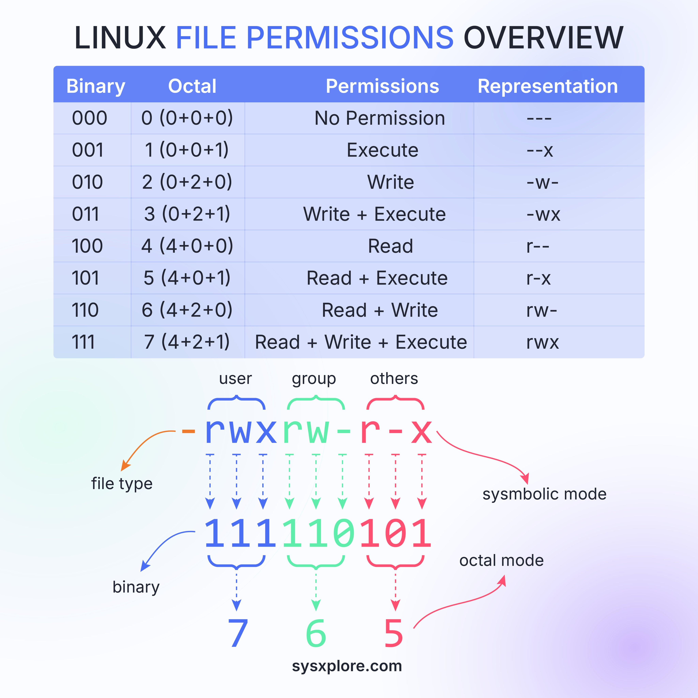

Linux file permissions are a crucial aspect of system security, controlling access to files and directories. This overview provides a comprehensive breakdown of Linux file permissions, including their binary and octal representations, as well as the key components that contribute to these permissions.

#### Technical Content
Linux file permissions are represented using a combination of three types of users: **User**, **Group**, and **Others**. Each user type has three permission bits: **read (r)**, **write (w)**, and **execute (x)**. These permission bits can be represented in binary or octal notation.

##### Binary Representation
The binary representation of Linux file permissions consists of nine bits, divided into three groups of three bits each. The first group represents the **User** permissions, the second group represents the **Group** permissions, and the third group represents the **Others** permissions. Each group has a read (r), write (w), and execute (x) bit.

| Binary | Octal | Permissions | Representation |
| --- | --- | --- | --- |
| 000 | 0   | ---        | No permissions    |
| 001 | 1   | --x        | Execute only     |
| 010 | 2   | -w-        | Write only       |
| 011 | 3   | -wx        | Write and execute |
| 100 | 4   | r--        | Read only        |
| 101 | 5   | r-x        | Read and execute  |
| 110 | 6   | rw-        | Read and write    |
| 111 | 7   | rwx        | Read, write, and execute |

##### Octal Representation
The octal representation of Linux file permissions is a shorthand way of representing the binary values. Each octal digit represents three binary bits.

For example, the octal value `755` can be broken down as follows:
- **7** (rwx) for the **User**
- **5** (r-x) for the **Group**
- **5** (r-x) for the **Others**

This means that the **User** has read, write, and execute permissions, while the **Group** and **Others** have read and execute permissions.

##### Key Components
The key components of Linux file permissions are:
* **User**: The owner of the file or directory.
* **Group**: The group to which the file or directory belongs.
* **Others**: All other users who are not the owner or part of the group.
* **File type**: The type of file (e.g., regular file, directory, symbolic link).
* **Binary value**: The binary representation of the permission bits.

#### Key Takeaways and Best Practices
* Use the `chmod` command to change file permissions in Linux.
* Use the `chown` command to change the owner or group of a file or directory.
* Use the `umask` command to set the default permissions for new files and directories.
* Always use the most restrictive permissions necessary to ensure system security.

#### References
* [Linux man page for chmod](https://man7.org/linux/man-pages/man1/chmod.1.html)
* [Linux man page for chown](https://man7.org/linux/man-pages/man1/chown.1.html)
* [Linux man page for umask](https://man7.org/linux/man-pages/man1/umask.1p.html)
## Source

- Original Tweet: [https://twitter.com/i/web/status/1869450507770601891](https://twitter.com/i/web/status/1869450507770601891)
- Date: 2025-02-20 18:01:58

## Media

### Media 1

**Description:** The image presents a comprehensive overview of Linux file permissions, organized into three distinct sections.

**Section 1: Table of Permissions**

* A table with four columns:
	+ Binary
	+ Octal
	+ Permissions
	+ Representation
* The first row lists the binary values for each permission bit (0-7), followed by their corresponding octal values and permissions.
* The subsequent rows display various combinations of permission bits, along with their resulting octal values and descriptive labels.

**Section 2: Diagram**

* A diagram illustrating how file permissions are represented in Linux.
* Arrows connect different components:
	+ User (rwx)
	+ Group (rw-)
	+ Others (r--)
	+ File type
	+ Binary value

**Section 3: Key Components**

* Key elements that contribute to the overall understanding of Linux file permissions:
	+ User
	+ Group
	+ Others
	+ File type
	+ Binary value

In summary, this image provides a detailed breakdown of Linux file permissions, including their binary and octal representations, as well as the various components that contribute to these permissions.

*Last updated: 2025-02-20 18:01:58*