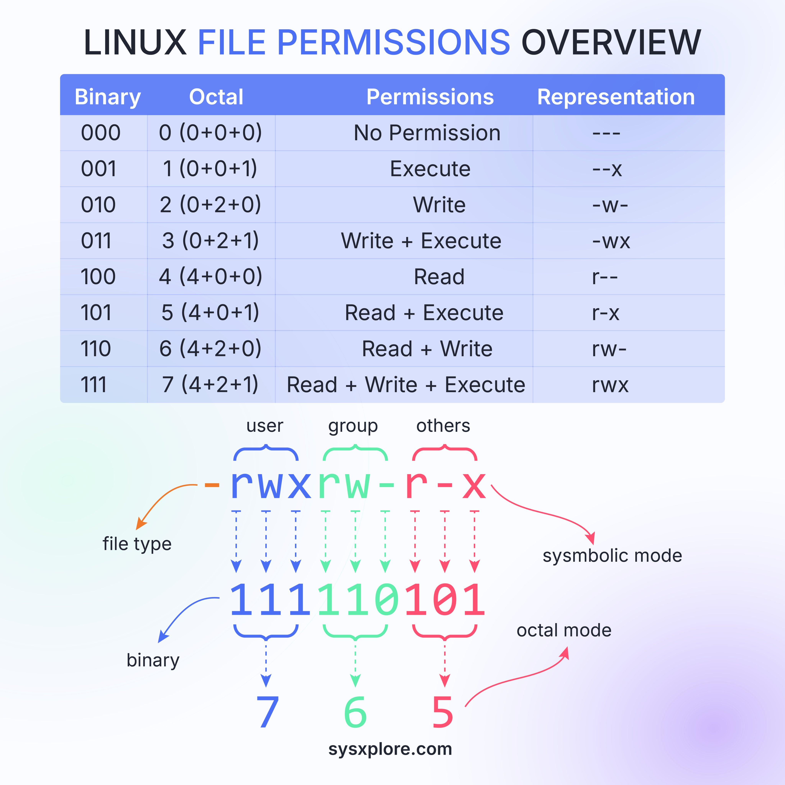

# Linux File Permissions

## Description
Linux File Permissions Overview...

## Content
Linux File Permissions Overview

## Category Information

- Main Category: programming_languages
- Sub Category: shell_scripting
- Item Name: linux_file_permissions

## Source

- Original Tweet: [https://twitter.com/i/web/status/1869450507770601891](https://twitter.com/i/web/status/1869450507770601891)
- Date: 2025-02-20 15:36:34

## Media

### Media 1

**Description:** The image presents a comprehensive overview of Linux file permissions, organized into three distinct sections.

**Section 1: Table of Permissions**

* A table with four columns:
	+ Binary
	+ Octal
	+ Permissions
	+ Representation
* The first row lists the binary values for each permission bit (0-7), followed by their corresponding octal values and permissions.
* The subsequent rows display various combinations of permission bits, along with their resulting octal values and descriptive labels.

**Section 2: Diagram**

* A diagram illustrating how file permissions are represented in Linux.
* Arrows connect different components:
	+ User (rwx)
	+ Group (rw-)
	+ Others (r--)
	+ File type
	+ Binary value

**Section 3: Key Components**

* Key elements that contribute to the overall understanding of Linux file permissions:
	+ User
	+ Group
	+ Others
	+ File type
	+ Binary value

In summary, this image provides a detailed breakdown of Linux file permissions, including their binary and octal representations, as well as the various components that contribute to these permissions.

*Last updated: 2025-02-20 15:36:34*