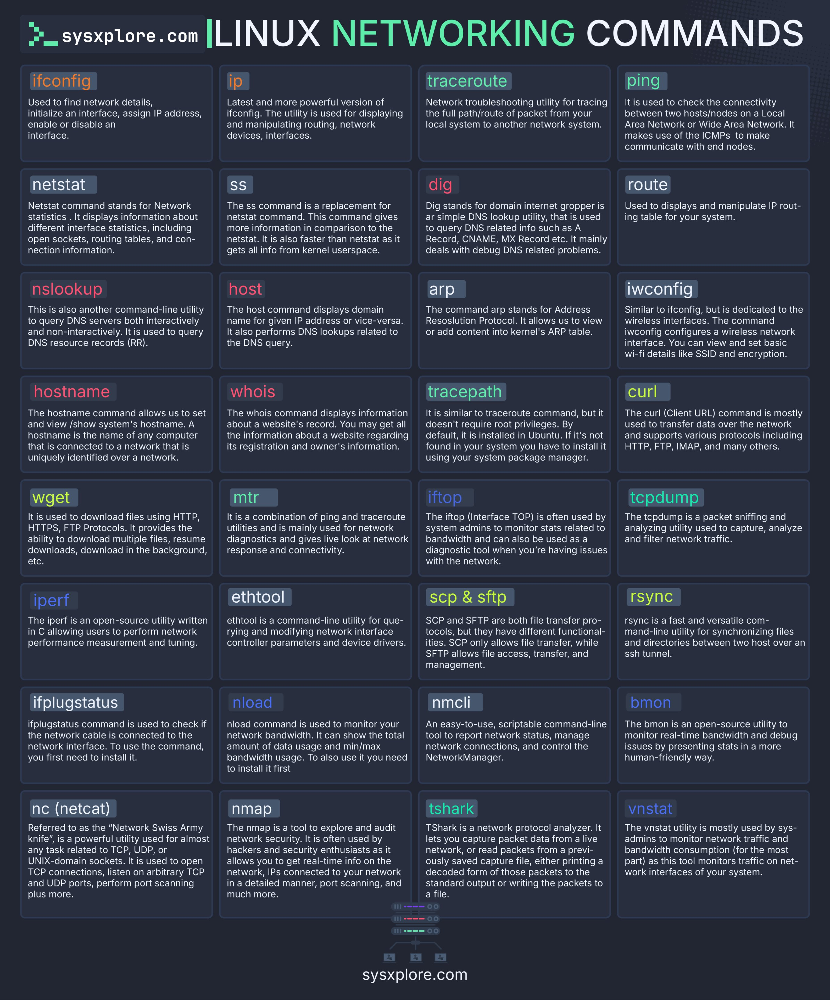

This entry provides an overview of essential Linux networking commands, covering various aspects of network configuration, troubleshooting, and management. It serves as a quick reference guide for system administrators and users who need to navigate and manage Linux networks efficiently.

#### Detailed Technical Content
Linux offers a wide array of commands for managing and troubleshooting network connections. These commands can be categorized based on their functionality:

##### Network Interface Configuration
- **ip addr show**: Displays IP addresses and other information about network interfaces.
- **ip link set**: Modifies the state of network interfaces (e.g., up/down).
- **ifconfig**: Configures network interfaces (though largely superseded by the `ip` command).

##### Network Connectivity and Troubleshooting
- **ping**: Tests whether a host is reachable across an IP network.
- **traceroute**: Displays the route taken by packets to reach a specified destination host.
- **mtr**: Combines the functionality of ping and traceroute, providing detailed statistics.

##### Domain Name System (DNS) Resolution
- **host**: Performs DNS lookups.
- **dig**: A more powerful tool for performing DNS lookups, offering detailed output and diagnostic capabilities.

##### Network Service Management
- **ss**: Displays socket statistics, useful for diagnosing network services.
- **netstat**: Displays active Internet connections, routing tables, interface statistics, and more.
- **lsof -i**: Lists open internet sockets, helpful for identifying which processes are using network resources.

##### Firewall and Security
- **iptables**: Configures the Linux kernel firewall.
- **ufw**: A simpler interface to manage firewall rules (commonly used on Ubuntu systems).
- **nmap**: Scans networks for open ports and services, useful for security auditing.

#### Examples
To illustrate how these commands are used:
```bash
# Example: Checking network interfaces with ip addr show
$ ip addr show

# Example: Pinging a host to check connectivity
$ ping google.com

# Example: Performing a DNS lookup using dig
$ dig sysxplore.com
```

#### Key Takeaways and Best Practices
- **Regularly Update Your Knowledge**: Linux networking commands evolve, so it's essential to stay updated with the latest tools and practices.
- **Use Commands Effectively**: Understand the purpose of each command to efficiently troubleshoot or configure network settings.
- **Practice Security**: Regularly audit your system's security using tools like `nmap`, and ensure firewalls are properly configured.

#### References
- [sysxplore.com](https://sysxplore.com): The source website credited in the infographic, likely offering detailed guides and tutorials on Linux networking commands and more.
- **Man Pages**: For most Linux commands, extensive documentation is available via the `man` command (e.g., `man ip`).
- **Linux Documentation Project**: A comprehensive resource covering various aspects of Linux administration, including networking.
## Source

- Original Tweet: [https://twitter.com/i/web/status/1878048744999997441](https://twitter.com/i/web/status/1878048744999997441)
- Date: 2025-02-20 17:58:38


## Media

### Media 1

**Description:** The infographic, titled "LINUX NETWORKING COMMANDS," presents a comprehensive list of 30 Linux networking commands, organized into six columns with five rows each. The title is prominently displayed at the top in white and green text.

Each command is accompanied by a brief description, providing users with a clear understanding of its purpose and functionality. The background of the image features a dark blue color scheme, which effectively contrasts with the white and green text used throughout.

At the bottom of the image, the website "sysxplore.com" is credited as the source, indicating that this infographic was likely created by or in collaboration with sysxplore.com. Overall, the infographic provides a valuable resource for Linux users seeking to learn more about networking commands and their applications.

*Last updated: 2025-02-20 17:58:38*