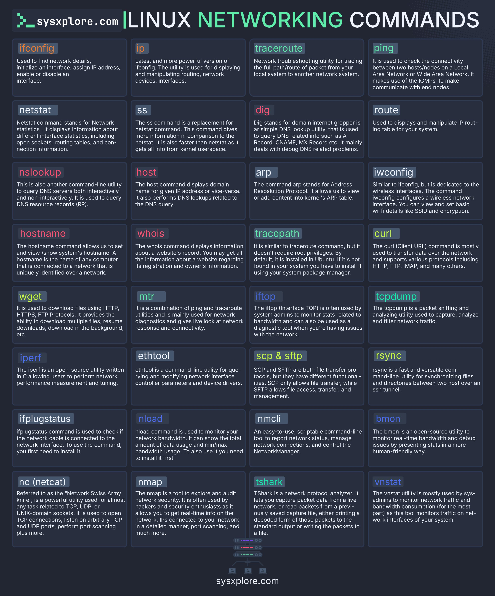

# Linux Networking Commands

## Description
Linux networking commands at a glance...

## Content
Linux networking commands at a glance

## Category Information

- Main Category: programming_languages
- Sub Category: shell_scripting
- Item Name: linux_networking_commands

## Source

- Original Tweet: [https://twitter.com/i/web/status/1878048744999997441](https://twitter.com/i/web/status/1878048744999997441)
- Date: 2025-02-20 15:36:34

## Media

### Media 1

**Description:** The infographic, titled "LINUX NETWORKING COMMANDS," presents a comprehensive list of 30 Linux networking commands, organized into six columns with five rows each. The title is prominently displayed at the top in white and green text.

Each command is accompanied by a brief description, providing users with a clear understanding of its purpose and functionality. The background of the image features a dark blue color scheme, which effectively contrasts with the white and green text used throughout.

At the bottom of the image, the website "sysxplore.com" is credited as the source, indicating that this infographic was likely created by or in collaboration with sysxplore.com. Overall, the infographic provides a valuable resource for Linux users seeking to learn more about networking commands and their applications.

*Last updated: 2025-02-20 15:36:34*