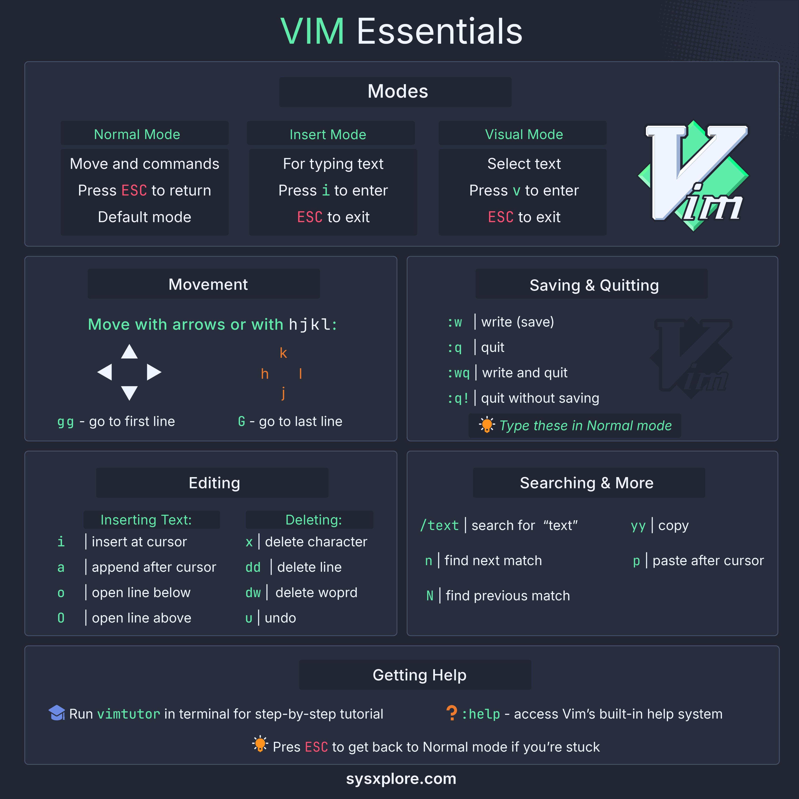

**Source:** [https://twitter.com/i/web/status/1919110045687595120](https://twitter.com/i/web/status/1919110045687595120)
**Original Post Date:** 2025-05-28 07:09:55

# Vim Essentials Guide: Modes, Navigation, Editing Commands

## Introduction
Vim is an essential tool in any developer's toolkit, providing powerful command-line text editing capabilities. This guide focuses on core concepts for newcomers, covering fundamental modes, movement techniques, file operations, and common editing tasks that form the foundation of effective Vim usage.

## Modes and Basic Operations

Vim operates in different modes to separate navigation from text modification. The primary modes are Normal Mode (default), Insert Mode (for typing), and Visual Mode (for selecting text).

To switch between modes: press 'i' for Insert, 'ESC' for Normal, or 'v' for Visual mode. Always return to Normal mode using 'ESC' before executing commands.

- Normal Mode: Default state for commands and navigation
- Insert Mode: For typing new text or overwriting existing content
- Visual Mode: Select text blocks for operations like copying or deleting

> **Note/Tip:** Use 'ESC' repeatedly if unsure of current mode

> **Note/Tip:** Check mode status with ':echo mode()' in Normal mode

## Navigation and Movement

Efficient navigation is crucial in Vim. The 'hjkl' keys provide precise cursor movement, while special commands enable quick jumps to specific file positions.

- 'h', 'j', 'k', 'l': Left, down, up, right respectively
- 'gg': Jump to first line
- 'G': Jump to last line

> **Note/Tip:** Practice 'hjkl' navigation for faster editing

> **Note/Tip:** Combine numbers with movement commands (e.g., '5j' moves down 5 lines)

## File Operations and Exit

Proper file management in Vim involves saving changes, exiting the editor, or both. All these operations are executed from Normal mode using command-line commands.

- :w - Save current file
- :q - Quit without saving
- :wq - Save and quit
- :x - Alternative save-and-quit command

> **Note/Tip:** ':q!' forces exit without saving changes

> **Note/Tip:** Always check unsaved changes before quitting

## Editing Operations

Vim's editing capabilities are powerful yet straightforward. Learn essential commands for inserting, deleting, and modifying text.

- 'i': Insert before cursor
- 'a': Append after cursor
- 'dd': Delete current line
- 'dw': Delete word forward

> **Note/Tip:** Use 'u' to undo last change

> **Note/Tip:** Combine numbers with commands (e.g., '3dd' deletes three lines)

## Searching and Text Manipulation

Vim's search functionality enables efficient text location, while copy-paste operations are straightforward once mastered.

- '/text': Search forward for 'text'
- 'n': Next match
- 'yy': Copy current line
- 'p': Paste after cursor

> **Note/Tip:** Use '?text' to search backward

> **Note/Tip:** Copy multiple lines by selecting in Visual mode first

## Key Takeaways

- Master the three primary modes (Normal, Insert, Visual) for efficient editing
- Memorize 'hjkl' navigation keys and common movement commands
- Learn essential file operations (:w, :q, :wq)
- Practice basic text manipulation (insert, delete, undo)

## Conclusion
Understanding these Vim essentials provides a solid foundation for advanced usage. Regular practice with basic commands builds muscle memory, leading to increased productivity in daily coding tasks.

## External References

- [Vim Online Documentation](https://vimdoc.sourceforge.net/)
- [Official Vim Website](https://www.vim.org/)

## Media

**Image Description:** The image is a comprehensive guide to the **Vim text editor**, titled **"VIM Essentials"**, designed to help users understand the essential features and commands of Vim. The layout is clean and organized, with a dark theme and white/green text for readability. Below is a detailed breakdown of the image:

---

### **Header**
- **Title**: "VIM Essentials" is prominently displayed at the top in white text.
- **Logo**: On the right side of the header, there is the Vim logo, which consists of a stylized "V" in white and green, accompanied by the text "Vim" in a smaller font.

---

### **Main Sections**
The guide is divided into several sections, each focusing on a specific aspect of Vim. These sections are organized in a grid layout.

#### **1. Modes**
- **Normal Mode**:
  - **Description**: The default mode for Vim, used for moving around and executing commands.
  - **Key Feature**: Pressing `ESC` returns to Normal Mode.
  - **Color Highlight**: The text "ESC" is highlighted in red to emphasize its importance.

- **Insert Mode**:
  - **Description**: Used for typing text.
  - **Key Feature**: Press `i` to enter Insert Mode and `ESC` to exit.
  - **Color Highlight**: The text "ESC" is highlighted in red.

- **Visual Mode**:
  - **Description**: Used for selecting text.
  - **Key Feature**: Press `v` to enter Visual Mode and `ESC` to exit.
  - **Color Highlight**: The text "ESC" is highlighted in red.

---

#### **2. Movement**
- **Description**: Commands for navigating within the text.
- **Key Features**:
  - Use arrows or `hjkl` for movement:
    - `h`: Move left
    - `j`: Move down
    - `k`: Move up
    - `l`: Move right
  - Special commands:
    - `gg`: Go to the first line.
    - `G`: Go to the last line.
- **Visual Representation**: Arrows are used to illustrate movement directions.

---

#### **3. Saving & Quitting**
- **Description**: Commands for saving, quitting, and combining both actions.
- **Key Features**:
  - `:w`: Write (save) the file.
  - `:q`: Quit Vim.
  - `:wq` or `:x`: Write and quit.
  - `:q!`: Quit without saving.
- **Note**: These commands must be typed in Normal Mode.
- **Color Highlight**: The text "ESC" is highlighted in red to remind users to be in Normal Mode.

---

#### **4. Editing**
- **Description**: Commands for inserting, deleting, and undoing text.
- **Key Features**:
  - **Inserting Text**:
    - `i`: Insert text before the cursor.
    - `a`: Append text after the cursor.
    - `o`: Open a new line below the cursor.
    - `O`: Open a new line above the cursor.
  - **Deleting**:
    - `x`: Delete a character.
    - `dd`: Delete a line.
    - `dw`: Delete a word.
  - **Undo**:
    - `u`: Undo the last action.

---

#### **5. Searching & More**
- **Description**: Commands for searching, copying, and pasting text.
- **Key Features**:
  - **Searching**:
    - `/text`: Search for "text" in the file.
    - `n`: Find the next match.
    - `N`: Find the previous match.
  - **Copying & Pasting**:
    - `yy`: Copy the current line.
    - `p`: Paste after the cursor.
  - **Color Highlight**: The text "ESC" is highlighted in red to remind users to be in Normal Mode.

---

### **Footer**
- **Getting Help**:
  - **Vim Tutor**: A command-line tutorial for learning Vim.
    - `vimtutor`: Run this in the terminal for a step-by-step tutorial.
  - **Built-in Help System**:
    - `:help`: Access Vim's built-in help system.
  - **Reminder**: Press `ESC` to return to Normal Mode if stuck.

- **Website**: The footer includes the website URL: `sysxplore.com`.

---

### **Design Elements**
- **Color Scheme**: Dark background with white and green text for clarity.
- **Icons**: Small icons are used to emphasize key points, such as a light bulb for reminders.
- **Typography**: Bold and clear fonts are used for headings and important commands.
- **Layout**: The grid layout ensures that information is organized and easy to scan.

---

### **Overall Purpose**
The image serves as a quick reference guide for beginners and intermediate users of Vim, covering essential commands and modes in a concise and visually appealing manner. It is designed to help users navigate, edit, and manage text efficiently using Vim.
