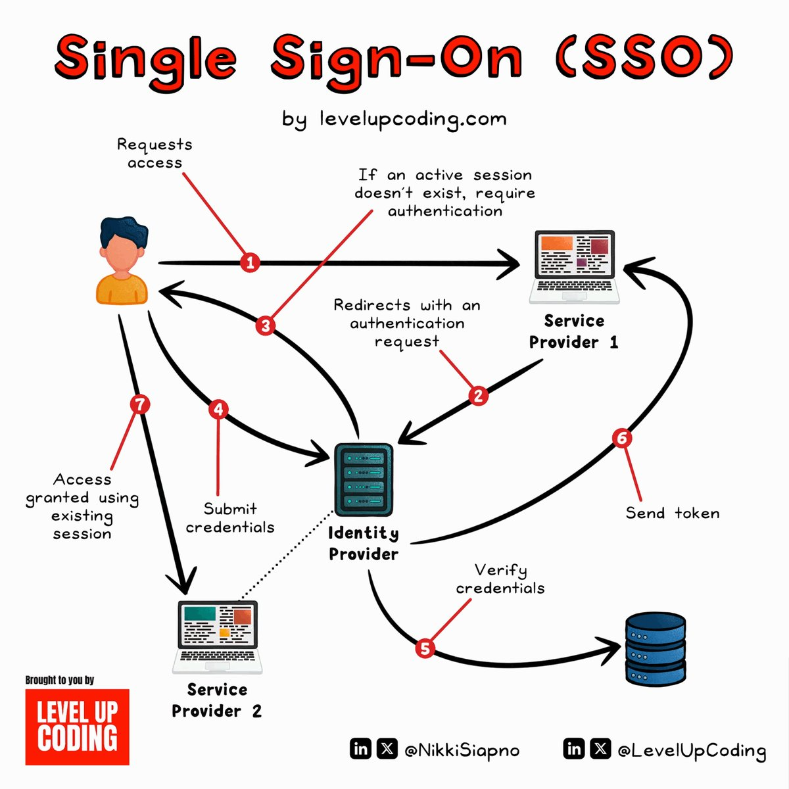

# single_sign_on

**Tweet URL:** [https://x.com/NikkiSiapno/status/1867087693454491692](https://x.com/NikkiSiapno/status/1867087693454491692)

**Tweet Text:** SSO (Single Sign-On) Explained.

SSO can be thought of as a master key to open all different locks. It allows a user to log in to different systems using a single set of credentials.

In a time where we are accessing more applications than ever before, this is a big help to mitigate password fatigue and streamlines user experience.

To fully understand the SSO process, let’s take a look at how a user would log into LinkedIn using Google as the identity provider:

1) User requests access

First, the user would attempt to access the Service Provider (LinkedIn). At this point, a user would be presented with login options, and in this example, they would select "Sign in with Google".

2) Authentication request

From here, the Service Provider (LinkedIn) will redirect the user to the Identity Provider (Google) with an authentication request.

3) IdP checks for active session

Once the Identity Provider (Google) has received the request, it will check for an active session. If it doesn't find one, authentication will be requested.

4) User submits credentials

At this stage, the user will submit their login credentials (username and password) to the Identity Provider (IdP).

5) IdP verifies credentials

The Identity Provider will then verify the submitted credentials against its User Directory (database). If the credentials are correct, the IdP will create an authentication token or assertion.

6) IdP sends token to Service Provider

Once the token or assertion has been created, the IdP sends it back to the Service Provider confirming the user's identity. The user is now authenticated and can access the Service Provier (LinkedIn).

7) Access granted using existing session

Since the Identity Provider has established a session, when the user goes to access a different Service Provider (eg; GitHub), they won't need to re-enter their credentials. Future service providers will request authentication from the Identity Provider, recognize the existing session, and grant access to the user based on the previously authenticated session.

SSO workflows like the above operate on SSO protocols, which are a set of rules that govern how the IdP and SP communicate and trust each other. Common protocols include Security Assertion Markup Language (SAML), OpenID Connect, and OAuth.

 What's your favorite way to go about authentication? 

~~
Thanks to our partner Kestra who keeps our content free to the community.

How much easier would it be if you could define all your workflows from simple YAML files, and visualize them all from a UI?

Kestra makes that possible. 

Check it out: [https://drp.li/kestra-z7tp](https://drp.li/kestra-z7tp)

**Image 1 Description:** The infographic, titled "Single Sign-On (SSO) by levelupcoding.com," illustrates the process of SSO in a clear and concise manner. The diagram is divided into seven steps, each represented by a numbered red circle with an arrow pointing to the next step.

**Step 1: Requests Access**
* A user requests access to a system or application.
* If an active session does not exist, authentication is required.

**Step 2: Redirects with Authentication Request**
* The user is redirected to an authentication page.
* They enter their credentials and submit them.

**Step 3: Verifies Credentials**
* The authentication request is sent to the Identity Provider (IDP).
* The IDP verifies the user's credentials and returns a token.

**Step 4: Submits Credentials**
* The user submits their verified credentials to the Service Provider.
* The Service Provider redirects the user back to the original application.

**Step 5: Verifies Token**
* The application verifies the token received from the IDP.
* If valid, the user is granted access to the system or application.

**Step 6: Sends Token**
* The IDP sends a token to the user's browser.
* The token is used to authenticate the user across multiple applications.

**Step 7: Access Granted Using Existing Session**
* The user gains access to the system or application using their existing session.

In summary, the infographic provides a step-by-step guide to the SSO process, highlighting the key steps involved in authenticating users and granting them access to systems or applications.

