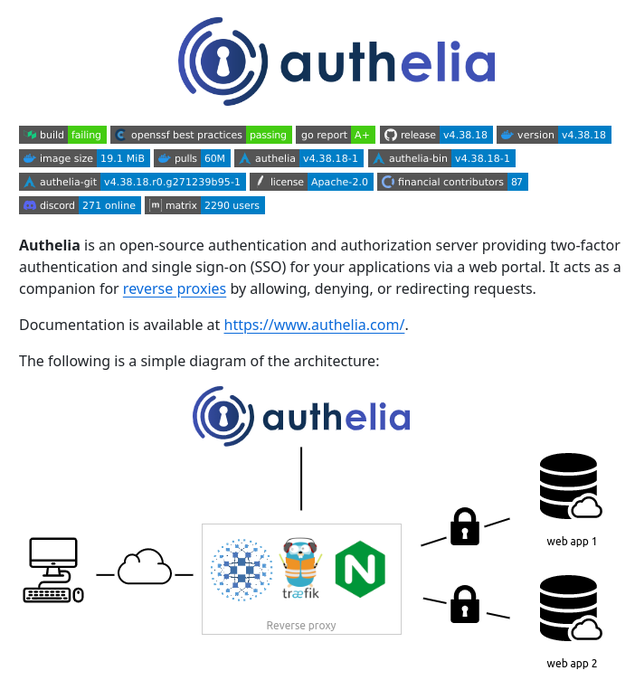

# auth_server

**Tweet URL:** [https://x.com/tom_doerr/status/1878731182965248452](https://x.com/tom_doerr/status/1878731182965248452)

**Tweet Text:** Open-source auth and SSO server

**Image 1 Description:** The image presents information about Authelia, an open-source authentication and authorization server. The main points are:

*   **Title**: 
    *   The title of the image is "Authelia" in large blue text at the top.
*   **Description**:
    *   Below the title, there is a description that reads: "Authelia is an open-source authentication and authorization server providing two-factor authentication and single sign-on (SSO) for your applications via a web portal."
*   **Key Features**:
    *   The image highlights several key features of Authelia, including:
        *   Two-factor authentication
        *   Single sign-on (SSO)
        *   Web portal access
*   **Architecture Diagram**:
    *   A simple diagram illustrates the architecture of Authelia, showing how it integrates with other systems.
*   **Logo and Tagline**:
    *   The Authelia logo is displayed prominently at the top of the image, accompanied by a tagline that reads: "Unlocking Secure Access to Your Applications."
*   **Color Scheme**:
    *   The dominant colors used in the image are blue and white, with accents of green and gray.
*   **Overall Design**:
    *   The design is clean and modern, with clear typography and ample whitespace.

In summary, the image effectively communicates the main points about Authelia, including its key features, architecture, and logo. The use of a simple diagram helps to illustrate how the system works, making it easier for users to understand and visualize the process. Overall, the design is visually appealing and easy to navigate, providing a clear overview of Authelia's capabilities and benefits.

