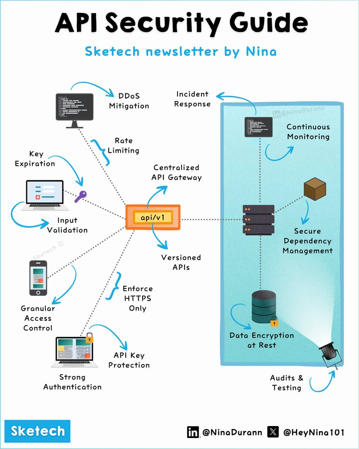

# api_security_guide

**Tweet URL:** [https://x.com/HeyNina101/status/1872396449209553107](https://x.com/HeyNina101/status/1872396449209553107)

**Tweet Text:** How do you identify if an API is being silently exploited (through seemingly normal but malicious traffic)?

Explore 
@HeyNina101
  & @SketechNews 

Catch you in the comments!

-.-.-.-.-.-.-.-.-.-.-.-.-.-.-.-.-.-.-.-.-.-.-.-.-.-.-
API Security Guide: Best Practices 
.-.-.-.-.-.-.-.-.-.-.-.-.-.-.-.-.-.-.-.-.-.-.-.-.-.-.

1. Authentication & Authorization

Use OpenID Connect and OAuth 2.0.
Access Control: Apply RBAC or ABAC.
API Keys: Store securely with secrets managers.
Token Rotation: Automate expiration and revocation.

Goal: Restrict access to verified entities.

2. Data Protection

Data Encryption at Rest
HTTPS: Enforce HSTS.
Input Validation: Prevent SQL Injection and XSS.
Key Rotation: Automate key updates.

Goal: Keep data secure at rest and in transit.

3. Traffic Management

Rate Limiting: Control request frequency.
DDoS Mitigation: Use Web Application Firewalls.
API Gateway: Centralize routing.
Timeouts: Avoid resource exhaustion.

Goal: Ensure stable API performance.

4. Monitoring

Continuous Monitoring: Use Prometheus or Datadog.
Audit Trails: Log anomalies.
Alerts: Detect traffic spikes.

Goal: Respond to threats in real-time.

5. Dependency Management

Update Libraries
Secure Configs: Enforce security policies.
Secrets Management: Avoid hardcoded credentials.

Goal: Reduce dependency-related risks.

6. API Versioning

Versioned APIs: Avoid breaking changes.
Deprecation Policies: Announce changes early.

Goal: Enable seamless version transitions.

7. Development Security

Shift-Left Security: Integrate in CI/CD.
API Testing: Use tools like OWASP ZAP, Burp Suite, and Postman for penetration testing, vulnerability scanning, and functional validation.

Goal: Build APIs securely from the start.

8. Incident Response

Playbooks: Define response plans.
Drills: Test readiness.

Goal: Minimize breach impact.

.-.-.-.-.-.-.-.-.-.-.-.-.-.-.-.-.-.-.-.-.-.-.-.-.-.-.-.-.

Catch you in the comments!

**Image 1 Description:** The image presents a comprehensive API Security Guide, titled "API Security Guide" in bold black text at the top. The guide is divided into two sections: the left side features a flowchart illustrating various security measures, while the right side displays an infographic highlighting key points.

**Left Section: Flowchart**

* **Input Validation**: Ensures that user input is validated to prevent malicious data from entering the system.
	+ Statistics: Not provided
* **Rate Limiting**: Limits the number of requests made to the API within a certain time frame to prevent abuse and denial-of-service attacks.
	+ Statistics: Not provided
* **DDoS Mitigation**: Protects against distributed denial-of-service (DDoS) attacks by filtering out malicious traffic.
	+ Statistics: Not provided
* **Key Expiration**: Ensures that API keys are regularly updated or replaced to maintain security.
	+ Statistics: Not provided
* **Input Validation**: Validates user input to prevent malicious data from entering the system.
	+ Statistics: Not provided

**Right Section: Infographic**

* **API Security Measures**
	+ Continuous Monitoring: Monitors API performance and detects potential security threats in real-time.
	+ Secure Dependency Management: Ensures that dependencies used by the API are secure and up-to-date.
	+ Data Encryption at Rest: Protects sensitive data stored on servers or databases using encryption algorithms.
	+ Audits & Testing: Regularly tests and audits the API to identify vulnerabilities and ensure compliance with security standards.

In summary, the image provides a comprehensive guide to API security, covering various measures such as input validation, rate limiting, DDoS mitigation, key expiration, continuous monitoring, secure dependency management, data encryption at rest, and audits & testing. By implementing these measures, developers can significantly improve the security of their APIs and protect against potential threats.

