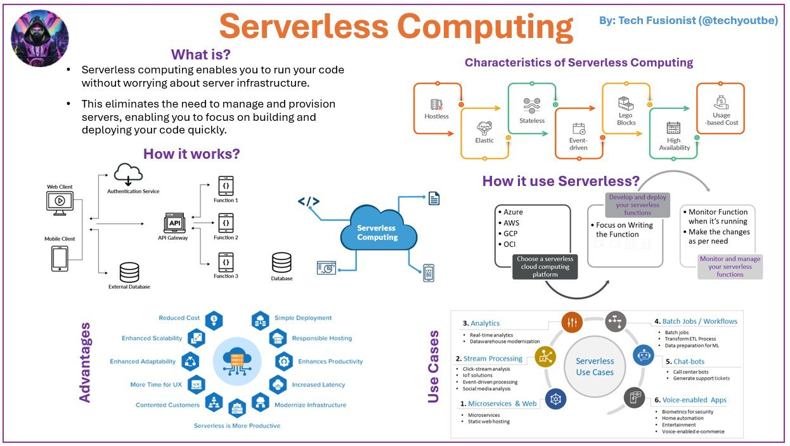

**Source:** [https://twitter.com/i/web/status/1936167325902029107](https://twitter.com/i/web/status/1936167325902029107)
**Original Post Date:** 2025-07-12 22:03:11

# Serverless Function Invocation: A Deep Dive into Architecture, Patterns, and Best Practices

## Introduction
Serverless computing has revolutionized how applications are built and deployed by abstracting away infrastructure management. At its core lies the concept of serverless function invocation, where functions are triggered by events and executed in a managed environment. This article delves into the architecture, patterns, and best practices surrounding serverless function invocation to help software engineers design scalable, efficient, and secure applications.

## Understanding Serverless Function Invocation

Serverless function invocation refers to the process of triggering and executing functions in a cloud environment without managing underlying servers. This model is event-driven, meaning functions are invoked in response to specific triggers such as HTTP requests, database changes, or messages from queues.

The key components involved in serverless function invocation include an API gateway for routing requests, authentication services for security, the serverless function itself, and databases or external services for data processing. The workflow typically involves a client sending a request, which is authenticated and routed to the appropriate function, which then processes the request and sends back a response.

- No server management required.
- Automatic scaling based on demand.
- Stateless execution model.
- Event-driven triggers (e.g., HTTP requests, database changes).
- Modular and composable functions.

> **Note/Tip:** Ensure your functions are stateless to leverage the scalability benefits of serverless computing.

> **Note/Tip:** Use environment variables for configuration management in serverless functions.

## Event-Driven Patterns

Serverless function invocation is inherently event-driven. Common patterns include HTTP-triggered functions, database change triggers, and message queue-based invocations.

For example, an HTTP request to an API endpoint can trigger a serverless function that processes the request and returns a response. Similarly, changes in a database can trigger a function to update or analyze data.

- HTTP requests via API gateways.
- Database change events (e.g., inserts, updates, deletes).
- Message queue triggers (e.g., SQS, RabbitMQ).

> **Note/Tip:** Design your functions to handle retries and dead-letter queues for robust error handling.

> **Note/Tip:** Consider using event sourcing patterns for complex workflows.

## Performance Optimization

Optimizing performance in serverless function invocation involves minimizing cold starts, efficient resource usage, and proper function sizing.

Cold starts occur when a function is invoked after being idle. To mitigate this, consider using provisioned concurrency or keeping functions warm with scheduled pings.

- Minimize cold starts with provisioned concurrency.
- Optimize function size by removing unnecessary dependencies.
- Use efficient algorithms and data structures to reduce execution time.

> **Note/Tip:** Monitor performance metrics such as latency, error rates, and invocation counts to identify bottlenecks.

> **Note/Tip:** Consider using asynchronous processing for long-running tasks to improve user experience.

## Security Best Practices

Security is a critical aspect of serverless function invocation. Key practices include proper authentication, authorization, and data protection.

Use API gateways with built-in authentication mechanisms such as OAuth or JWT to secure endpoints. Ensure that sensitive data is encrypted in transit and at rest.

- Secure API endpoints with authentication (e.g., OAuth, JWT).
- Encrypt sensitive data in transit and at rest.
- Use least privilege principles for IAM roles and permissions.

> **Note/Tip:** Regularly audit your function's dependencies to avoid vulnerabilities from outdated libraries.

> **Note/Tip:** Implement logging and monitoring to detect and respond to security incidents promptly.

## Monitoring and Logging

Effective monitoring and logging are essential for maintaining the reliability and performance of serverless functions.

Use cloud provider tools or third-party services to monitor invocation counts, error rates, and latency. Implement comprehensive logging to trace requests and diagnose issues.

- Monitor key metrics: invocation count, error rate, latency.
- Implement structured logging for easy debugging.
- Use distributed tracing for complex workflows.

> **Note/Tip:** Set up alerts for anomalies in your monitoring data to proactively address issues.

> **Note/Tip:** Consider using centralized logging solutions for better visibility across multiple functions.

## Use Cases and Examples

Serverless function invocation is versatile and can be applied to various use cases such as microservices, real-time data processing, analytics, batch jobs, chatbots, voice-enabled apps, and biometric security.

For example, a static web hosting solution can leverage serverless functions for dynamic content generation. Similarly, real-time analytics can be achieved by triggering functions on database changes.

- Static web hosting with dynamic content generation.
- Real-time data processing and analytics.
- Batch jobs and ETL processes.
- Chatbots and conversational AI.
- Voice-enabled applications.

> **Note/Tip:** Evaluate the cost implications of serverless functions for high-volume use cases.

> **Note/Tip:** Consider combining serverless with other cloud services for comprehensive solutions.

## Conclusion

Serverless function invocation offers a powerful and flexible way to build modern applications by abstracting away infrastructure management. By understanding the underlying architecture, event-driven patterns, performance optimization techniques, security best practices, and monitoring strategies, software engineers can design scalable, efficient, and secure serverless solutions.

> **Note/Tip:** Continuously evaluate and optimize your serverless functions based on real-world usage data.

> **Note/Tip:** Stay updated with the latest advancements in serverless computing to leverage new features and best practices.

## Key Takeaways

- Serverless function invocation is event-driven, with key components including API gateways, authentication services, functions, and databases.
- Common patterns include HTTP-triggered functions, database change triggers, and message queue-based invocations.
- Optimizing performance involves minimizing cold starts, efficient resource usage, and proper function sizing.
- Security best practices include proper authentication, authorization, data encryption, and least privilege principles for IAM roles.
- Effective monitoring and logging are essential for maintaining reliability and performance.

## External References

- [AWS Lambda Documentation](https://docs.aws.amazon.com/lambda/latest/dg/welcome.html)
- [Azure Functions Documentation](https://docs.microsoft.com/en-us/azure/azure-functions/functions-overview)

## Media

**Image Description:** ### Image Description: Serverless Computing Overview

The image is a comprehensive infographic titled **"Serverless Computing"** by **Tech Fusionist (@techyoutbe)**. It provides an in-depth overview of serverless computing, its characteristics, how it works, its advantages, use cases, and how to implement it. Below is a detailed breakdown of the image:

---

### **1. Title and Introduction**
- **Title**: "Serverless Computing" is prominently displayed at the top in bold, orange text.
- **Author/Creditor**: The infographic is credited to **Tech Fusionist (@techyoutbe)**, as noted in the top-right corner.

---

### **2. What is Serverless Computing?**
- **Definition**: 
  - Serverless computing enables you to run your code on a cloud platform without worrying about server infrastructure.
  - It eliminates the need to manage, provision, or scale servers, allowing developers to focus on building and deploying code quickly.
- **Key Points**:
  - No server management.
  - Focus on code development.
  - Scalability and cost-efficiency.

---

### **3. Characteristics of Serverless Computing**
- **Key Characteristics** are illustrated in a circular flowchart with icons and labels:
  1. **Hostless**: No server management required.
  2. **Elastic**: Automatically scales based on demand.
  3. **Stateless**: Functions are stateless, ensuring scalability and reliability.
  4. **Event-Driven**: Functions are triggered by events (e.g., HTTP requests, database changes).
  5. **Lego Blocks**: Functions are modular and can be composed like building blocks.
  6. **High Availability**: Ensures consistent performance and uptime.
  7. **Usage-Based Cost**: Pay only for the compute resources used.

---

### **4. How It Works**
- **Diagram**: A flowchart illustrates the workflow of serverless computing:
  1. **Client Requests**: 
     - A **Web Client** or **Mobile Client** sends a request.
  2. **Authentication**: 
     - The request passes through an **Authentication Service**.
  3. **API Gateway**: 
     - The request is routed through an **API Gateway**.
  4. **Function Execution**: 
     - The API Gateway triggers a **Serverless Function** (e.g., Function 1, Function 2, Function 3).
  5. **Database Interaction**: 
     - Functions interact with a **Database** or **External Database**.
  6. **Response**: 
     - The function processes the request and sends a response back to the client.

---

### **5. How to Use Serverless Computing**
- **Steps**:
  1. **Choose a Cloud Platform**: Select a serverless provider (e.g., **AWS Lambda**, **Azure Functions**, **Google Cloud Functions**, **Oracle Functions**).
  2. **Develop and Deploy Functions**: Write and deploy serverless functions.
  3. **Monitor and Manage**: Use tools to monitor and manage the functions.
- **Icons**:
  - Cloud platforms are represented with icons for AWS, Azure, GCP, and OCI.

---

### **6. Advantages of Serverless Computing**
- **Icons and Labels**:
  - **Reduced Cost**: Pay only for the compute resources used.
  - **Enhanced Scalability**: Automatically scales based on demand.
  - **Simple Deployment**: Easy to deploy and manage functions.
  - **Enhanced Adaptability**: Quickly adapt to changing workloads.
  - **Responsible Hosting**: Focuses on efficient resource usage.
  - **Enhances Productivity**: Developers can focus on code, not infrastructure.
  - **More Time for UX**: Allows more time for user experience improvements.
  - **Modernize Infrastructure**: Simplifies infrastructure management.

---

### **7. Use Cases of Serverless Computing**
- **Circular Diagram** with icons and labels:
  1. **Microservices & Web**:
     - Static web hosting.
     - API-driven web applications.
  2. **Stream Processing**:
     - Real-time data processing.
     - Clickstream analysis.
  3. **Analytics**:
     - Real-time analytics.
     - Data warehouse modernization.
  4. **Batch Jobs / Workflows**:
     - Scheduled batch processing.
     - ETL (Extract, Transform, Load) processes.
  5. **Chatbots**:
     - Conversational AI.
     - Call center bots.
     - Support ticket generation.
  6. **Voice-Enabled Apps**:
     - Voice-enabled e-commerce.
     - Home automation.
     - Entertainment automation.
  7. **Biometrics-Enabled Security Apps**:
     - Security applications using biometrics.

---

### **8. Visual Elements**
- **Color Scheme**: 
  - Orange for headings and key points.
  - Purple for subheadings.
  - Blue for the central cloud icon.
  - Green for characteristics.
  - White background with colorful icons.
- **Icons**: 
  - Represent various components (e.g., cloud, database, mobile client, API gateway).
- **Layout**: 
  - Organized into sections with clear headings and flowcharts.

---

### **9. Additional Notes**
- The infographic emphasizes the productivity and efficiency gains of serverless computing.
- It highlights the flexibility and cost-effectiveness of the model.
- The use of icons and flowcharts makes the content visually engaging and easy to understand.

---

### **Conclusion**
The infographic provides a comprehensive overview of serverless computing, covering its definition, characteristics, workflow, advantages, and use cases. It is designed to be informative and visually appealing, making it an excellent resource for understanding the core concepts of serverless computing.
