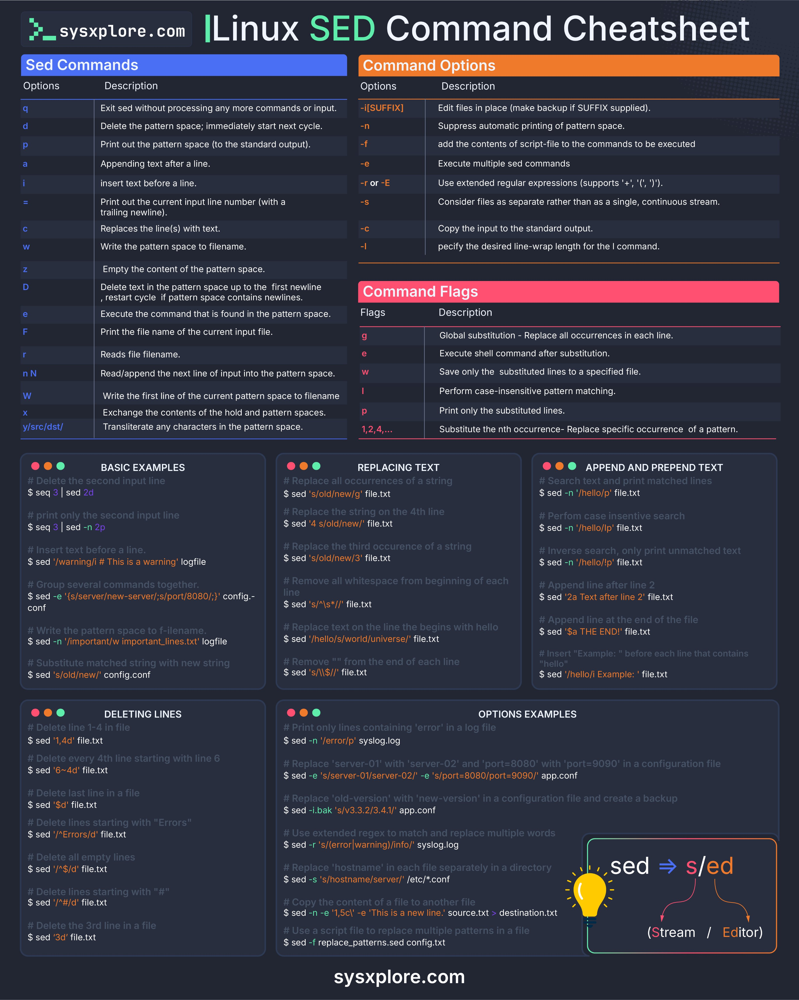

**Source:** [https://twitter.com/i/web/status/1881322615945777273](https://twitter.com/i/web/status/1881322615945777273)
**Original Post Date:** 2025-05-27 23:31:18

# Linux Sed Command: A Comprehensive Guide for Stream Editing

## Introduction
The stream editor (sed) is a powerful Unix utility designed for automated pattern scanning and textual manipulation. This tutorial provides an in-depth exploration of sed's capabilities through its core components: basic commands, command-line options, substitution flags, and practical applications.

Understanding sed is crucial for system administrators, developers, and anyone working with text processing tasks. This guide covers everything from fundamental operations to advanced techniques.

## Core Sed Commands

Sed operates on a pattern space model, allowing precise control over text transformation.

_Demonstrates basic command usage for exiting and deleting lines._

```sed
# Print only third line
2q
# Delete fifth line
d
```

- - q: Exit sed immediately after current line
- - d: Delete entire pattern space and proceed to next cycle
- - p: Print the pattern space (default action)
- - a: Append text after specified line

## Command Options & Flags

Options modify sed's behavior, while flags control substitution operations.

The -i option enables in-place editing with optional backup file creation.

_Creates backup before modifying original file._

```sed
# Edit file in-place
sed -i.bak 's/old/new/g' file.txt
```

1. - Use -n to suppress automatic printing of pattern space
1. - Combine multiple commands using the -e flag
1. - Enable extended regex support with -r or -E

## Text Manipulation Examples

Practical examples demonstrate common use cases for text processing.

These patterns are essential for automation and log analysis.

```sed
# Replace all instances
cat file.txt | sed 's/old/new/g'

# Case-insensitive search
cat logfile | sed '/error/i'
```

## Key Takeaways

- Master core commands for efficient text manipulation
- Understand the pattern space and hold space concepts
- Leverage in-place editing with backup options
- Use substitution flags for precise control

## Conclusion
Proficiency in sed is essential for any Unix/Linux environment. This guide provides a foundation for using sed effectively, from basic operations to advanced text processing.

## External References

- [sysxplore.com Sed Cheatsheet](https://www.sysxplore.com)


## Media

**Image Description:** ### Description of the Image

The image is a comprehensive **Linux SED Command Cheatsheet** designed to provide a detailed overview of the `sed` (Stream Editor) command in Linux. The cheatsheet is structured into several sections, each focusing on different aspects of the `sed` command, including commands, options, flags, and examples. Below is a detailed breakdown:

---

#### **Header**
- **Title**: The title at the top reads **"Linux SED Command Cheatsheet"**.
- **Website**: The website mentioned is **sysxplore.com**, indicating the source of the cheatsheet.

---

#### **Main Sections**
The cheatsheet is divided into three primary sections: **Sed Commands**, **Command Options**, and **Command Flags**. Each section is color-coded for easy navigation.

---

### **1. Sed Commands**
- **Background Color**: Dark blue.
- **Structure**: This section lists the basic commands of `sed` along with their descriptions.
- **Commands Listed**:
  - **q**: Exit `sed` without processing any more commands or input.
  - **d**: Delete the pattern space; immediately start the next cycle.
  - **p**: Print out the pattern space (to the standard output).
  - **a**: Append text after a line.
  - **i**: Insert text before a line.
  - **=**: Print out the current input line number (with a trailing newline).
  - **G**: Append the contents of the hold space to the pattern space.
  - **w**: Write the pattern space to a filename.
  - **z**: Empty the content of the pattern space.
  - **D**: Delete text in the pattern space up to the first newline.
  - **x**: Exchange the contents of the hold and pattern spaces.
  - **y/src/dst/**: Transliterate any characters in the pattern space.

---

### **2. Command Options**
- **Background Color**: Orange.
- **Structure**: This section lists the command-line options for `sed` along with their descriptions.
- **Options Listed**:
  - **-i[SUFFIX]**: Edit files in place (make backup if SUFFIX is supplied).
  - **-n**: Suppress automatic printing of pattern space.
  - **-f**: Add the contents of a script file to the commands to be executed.
  - **-e**: Execute multiple `sed` commands.
  - **-r or -E**: Use extended regular expressions.
  - **-s**: Consider files as separate rather than as a single, continuous stream.
  - **-c**: Copy the input to the standard output.
  - **-l**: Specify the desired line-wrap length for the `l` command.

---

### **3. Command Flags**
- **Background Color**: Red.
- **Structure**: This section lists the flags that can be used with `sed` commands, along with their descriptions.
- **Flags Listed**:
  - **g**: Global substitution (replace all occurrences in each line).
  - **r**: Execute shell command after substitution.
  - **e**: Execute the `sed` command after substitution.
  - **w**: Save only the substituted lines to a specified file.
  - **W**: Write the first line of the current pattern space to a filename.
  - **i**: Perform case-insensitive pattern matching.
  - **p**: Print only the substituted lines.
  - **1,4,...**: Substitute the nth occurrence of a pattern.

---

### **4. Basic Examples**
- **Background Color**: Dark blue.
- **Structure**: This section provides basic examples of using `sed` commands.
- **Examples**:
  - Deleting the second input line: `sed '2d' file.txt`
  - Printing only the second input line: `sed -n '2p' file.txt`
  - Inserting text before a line: `sed 'i This is a warning' logfile`
  - Writing the pattern space to a filename: `sed 'w filename' config.conf`

---

### **5. Replacing Text**
- **Background Color**: Dark blue.
- **Structure**: This section provides examples of replacing text using `sed`.
- **Examples**:
  - Replacing all occurrences of a string: `sed 's/old/new/g' file.txt`
  - Replacing text on the 4th line: `sed '4s/old/new/' file.txt`
  - Replacing the third occurrence of a string: `sed 's/old/new/3' file.txt`
  - Performing case-insensitive search and replace: `sed '/hello/i' file.txt`
  - Inverting search and printing unmatched lines: `sed '/hello/p' file.txt`

---

### **6. Append and Prepend Text**
- **Background Color**: Dark blue.
- **Structure**: This section provides examples of appending and prepending text.
- **Examples**:
  - Appending text at the end of the file: `sed '$a THE END' file.txt`
  - Prepending text at the beginning of the file: `sed '1i Example:' file.txt`

---

### **7. Deleting Lines**
- **Background Color**: Dark blue.
- **Structure**: This section provides examples of deleting lines using `sed`.
- **Examples**:
  - Deleting the 4th line: `sed '4d' file.txt`
  - Deleting every 4th line starting from line 6: `sed '6~4d' file.txt`
  - Deleting lines starting with "Errors": `sed '/^Errors/d' file.txt`
  - Deleting empty lines: `sed '/^$/d' file.txt`

---

### **8. Options Examples**
- **Background Color**: Dark blue.
- **Structure**: This section provides examples of using `sed` options.
- **Examples**:
  - Searching for lines containing "error": `sed -n '/error/p' syslog.log`
  - Replacing multiple patterns in a configuration file: `sed -e 's/server-01/server-02/g' -e 's/port=8080/port=9090/g' app.conf`
  - Creating a backup while editing in place: `sed -i.bak 's/v3.3.2/v3.3.4/g' app.conf`

---

### **9. Visual Elements**
- **Lightbulb Icon**: A lightbulb icon is present in the bottom-right corner, symbolizing a tip or important note.
- **Text Inside Lightbulb**: The text inside the lightbulb reads:
  ```
  sed => s/ed
  (Stream / Editor)
  ```
  This emphasizes that `sed` stands for **Stream Editor**.

---

### **Footer**
- **Website**: The website **sysxplore.com** is mentioned at the bottom of the image.

---

### **Design and Layout**
- **Color Coding**: Different sections are color-coded for easy navigation.
- **Consistent Formatting**: Each section follows a consistent format with headings, descriptions, and examples.
- **Readable Font**: The font is clear and legible, making it easy to read and understand.

---

### **Purpose**
The cheatsheet serves as a quick reference guide for users who want to learn or quickly recall how to use the `sed` command in Linux. It covers a wide range of use cases, from basic commands to advanced options and flags, making it a valuable resource for both beginners and experienced users. 

---

This detailed description should provide a comprehensive understanding of the image and its contents. Let me know if you need further clarification!
