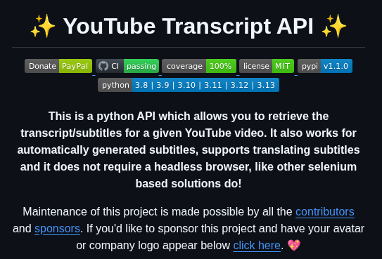

**Source:** [https://twitter.com/i/web/status/1937219047038288220](https://twitter.com/i/web/status/1937219047038288220)
**Original Post Date:** 2025-07-14 20:52:46

# YouTube Transcript API: A Python-Based Solution for Retrieving YouTube Subtitles

## Introduction
The YouTube Transcript API is a Python library designed to simplify the process of accessing and translating subtitles for YouTube videos. Unlike other solutions that rely on headless browsers like Selenium, this API provides a more efficient and straightforward approach. It supports multiple Python versions and offers comprehensive testing coverage, making it a reliable tool for developers.

## Main Features

The YouTube Transcript API is primarily designed to retrieve automatically generated subtitles from YouTube videos. This feature is particularly useful for applications that require text-based processing of video content, such as transcription services or content analysis tools.

In addition to retrieving subtitles, the API also supports automatic translation, making it a versatile tool for multilingual applications.

- Retrieves automatically generated subtitles from YouTube videos
- Supports automatic translation of subtitles
- Does not require a headless browser, unlike Selenium-based solutions

## Technical Details

The API is written in Python and supports multiple versions, including 3.8 through 3.13. This broad compatibility ensures that it can be integrated into a wide range of Python-based projects.

One of the key advantages of this API is its simplicity. Unlike other solutions that require complex setups involving headless browsers, the YouTube Transcript API provides a straightforward interface for accessing subtitles.

_This code snippet demonstrates how to retrieve a video's transcript using the API. The function `get_transcript` takes a YouTube video ID and returns the concatenated text of all subtitles._

```python
from youtube_transcript_api import YouTubeTranscriptApi

def get_transcript(video_id):
    try:
        transcript = YouTubeTranscriptApi.get_transcript(video_id)
        return ''.join([entry['text'] for entry in transcript])
    except Exception as e:
        return str(e)
```

> **Note/Tip:** Ensure you have Python 3.8 or later installed before using this API.

> **Note/Tip:** The API is licensed under the MIT License, which allows for free use, modification, and distribution.

## Installation and Usage

To install the YouTube Transcript API, you can use pip. Simply run `pip install youtube_transcript_api` in your terminal.

Once installed, you can import the library in your Python script and start retrieving subtitles by providing the video ID of the YouTube video.

1. Install the API using pip: `pip install youtube_transcript_api`
1. Import the library in your Python script: `from youtube_transcript_api import YouTubeTranscriptApi`
1. Retrieve subtitles by calling `YouTubeTranscriptApi.get_transcript(video_id)`

## Community and Contributions

The project is maintained by contributors and sponsors. The GitHub repository includes a call-to-action for users to sponsor the project, with sponsors having their avatar or company logo displayed below a clickable link.

This community-driven approach ensures that the API remains up-to-date and well-maintained.

> **Note/Tip:** Consider sponsoring the project to support its development and maintenance.

> **Note/Tip:** Contributions in the form of code, documentation, or financial support are always welcome.

## Key Takeaways

- The YouTube Transcript API simplifies the process of retrieving subtitles from YouTube videos without requiring a headless browser.
- It supports multiple Python versions and offers comprehensive testing coverage.
- The API is licensed under the MIT License, allowing for free use and modification.
- Community contributions and sponsorships play a crucial role in the project's maintenance and development.

## Conclusion
In summary, the YouTube Transcript API is a powerful tool for developers who need to retrieve and translate subtitles from YouTube videos. Its simplicity, broad compatibility with Python versions, and community-driven maintenance make it an excellent choice for various applications.

## External References

- [YouTube Transcript API GitHub Repository](https://github.com/youngwly/youtube-transcript-api)
- [MIT License Information](https://opensource.org/licenses/MIT)


## Media

**Image Description:** The image is a screenshot of a GitHub repository page for a Python API called **YouTube Transcript API**. Below is a detailed description of the image, focusing on the main subject and relevant technical details:

### **Main Subject**
The main subject of the image is the **YouTube Transcript API**, a Python-based API designed to retrieve automatically generated subtitles for YouTube videos. The API is highlighted as a tool that simplifies the process of accessing subtitles without requiring a headless browser, unlike other Selenium-based solutions.

### **Key Elements in the Image**

1. **Title and Logo**:
   - The title at the top reads: **"YouTube Transcript API"**.
   - The title is accompanied by two yellow star emojis (✨) on either side, adding a decorative touch.

2. **Badges**:
   - **Donate (PayPal)**: A badge indicating that contributions or donations can be made via PayPal.
   - **CI (Continuous Integration)**: A green badge labeled "passing," indicating that the continuous integration tests are successful.
   - **Coverage**: A badge showing "100%" coverage, suggesting that the codebase is fully tested.
   - **License**: A badge indicating the project is licensed under the **MIT License**.
   - **PyPI**: A badge showing the version number **v1.0**, indicating the API is available on the Python Package Index (PyPI).

3. **Python Versions Supported**:
   - A list of Python versions supported by the API is displayed: **3.8, 3.9, 3.10, 3.11, 3.12, 3.13**. This indicates the API is compatible with multiple Python versions.

4. **Description**:
   - The description provides an overview of the API's functionality:
     - It retrieves automatically generated subtitles for YouTube videos.
     - It supports translating subtitles automatically.
     - Unlike other solutions, it does not require a headless browser (e.g., Selenium-based solutions).

5. **Maintenance and Contributions**:
   - The description mentions that the project is maintained by contributors and sponsors.
   - A call-to-action is included, encouraging users to sponsor the project. Sponsors can have their avatar or company logo displayed below a clickable link.

6. **Call-to-Action**:
   - A "click here" link is provided for users to sponsor the project.
   - A heart emoji (❤️) is used to add a friendly and engaging touch.

### **Technical Details**
- **Language**: The API is written in Python.
- **Dependencies**: The API does not require a headless browser, distinguishing it from other solutions that rely on Selenium.
- **Versioning**: The API is versioned as **v1.0**, indicating it is a stable release.
- **Testing**: The "100% coverage" badge suggests comprehensive testing of the codebase.
- **License**: The MIT License allows for free use, modification, and distribution of the API.

### **Design and Layout**
- The page uses a dark theme with white and light-colored text, making it visually appealing and easy to read.
- Badges are prominently displayed, providing quick insights into the project's status and features.
- The description is concise and informative, highlighting the API's key benefits and distinguishing features.

### **Overall Impression**
The image effectively communicates the purpose, features, and technical details of the YouTube Transcript API. It emphasizes the API's ease of use, compatibility with multiple Python versions, and its unique advantage of not requiring a headless browser. The inclusion of badges and a call-to-action for sponsorship adds a professional and community-oriented touch.
