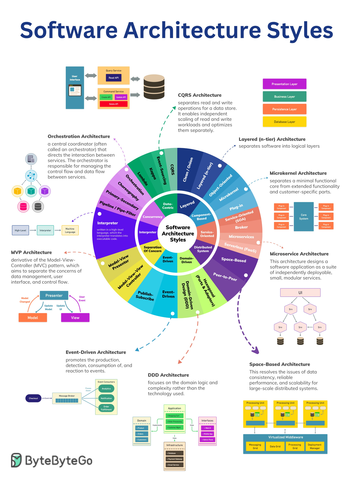

**Source:** [https://twitter.com/i/web/status/1926308392575877157](https://twitter.com/i/web/status/1926308392575877157)
**Original Post Date:** 2025-05-28 09:52:38

# Software Architecture Styles and API Design Patterns: A Comprehensive Guide

## Introduction
Understanding different architectural styles is fundamental to building robust, scalable systems. This guide explores twelve major architectural patterns from traditional layered designs to contemporary distributed approaches like microservices and serverless architectures. Each pattern has unique trade-offs that make it suitable for specific use cases in API design and system architecture.

Modern software development requires a deep understanding of these patterns to choose the right approach based on factors such as scalability requirements, team expertise, deployment environment, and business constraints.

## Overview of Software Architecture Styles

Software architecture styles represent different approaches to organizing code, data, and system components. The twelve major architectural patterns can be broadly categorized into monolithic (layered), modular (component-based), distributed (microservices), event-driven, and domain-centric approaches.

Each style offers unique advantages in terms of maintainability, scalability, deployment flexibility, and development workflow. Understanding these differences enables architects to make informed decisions about system design.

1. Layered architecture emphasizes separation of concerns through distinct layers
1. Microservices promote independent deployable services with dedicated databases
1. Event-driven architectures decouple components using event streams and brokers
1. CQRS separates read and write operations for scalability optimization
1. Domain-Driven Design focuses on business domain modeling and complexity management

> **Note/Tip:** Choose architecture styles based on specific requirements rather than following trends blindly.

> **Note/Tip:** Consider the trade-offs between maintainability, deployment complexity, and operational overhead.

## Key Architectural Patterns and Their Characteristics

Layered Architecture (n-tier) separates concerns into distinct layers such as presentation, business logic, persistence, and database. This approach provides clear boundaries between different functional areas.

Microservices architecture decomposes an application into small, independently deployable services with their own databases. Each service implements a specific business capability and communicates via APIs or message brokers.

Component-based architecture organizes code into reusable components that can be assembled to create complete applications. This approach supports modularity and promotes code reuse.

- Layered Architecture: Supports vertical scaling but may introduce tight coupling between layers
- Microservices: Enhances scalability and deployment flexibility but increases operational complexity
- Component-based: Promotes code reuse but requires careful interface design to prevent tight coupling

> **Note/Tip:** Hybrid approaches often combine elements from multiple architectural patterns.

> **Note/Tip:** Consider the organizational structure when choosing an architecture - some teams may not have the expertise required for more complex patterns.

## Modern API Design Patterns

API design follows specific patterns that align with underlying architectural styles. REST is commonly used in layered architectures, while GraphQL and gRPC are popular choices for microservices due to their flexibility.

Event-driven APIs often use asynchronous communication patterns such as pub/sub or message queues, which decouple components and improve system resilience.

_Example of an event-driven API payload structure using a message broker._

```JSON
{
  "title": "Event-Driven API Design",
  "description": "Using message brokers for decoupled communication", 
  "example_payload": {
    "event_type": "user_created",
    "payload": {
      "user_id": "123",
      "timestamp": "2024-05-16T10:00:00Z"
    }
  }
}
```

1. REST APIs follow stateless principles with CRUD operations mapped to HTTP methods
1. GraphQL provides flexible data querying capabilities for client-driven interfaces
1. gRPC enables efficient binary communication over HTTP/2 with strong typing via Protocol Buffers

## Implementation Considerations

When implementing these architectural patterns, consider factors such as team size, deployment environment, operational requirements, and development workflow.

Security must be addressed at every layer - authentication, authorization, data encryption, and access control should be implemented according to the chosen architecture.

- Monitor performance metrics specific to the architectural style (e.g., response times for REST APIs or event processing latency for event-driven systems)
- Implement circuit breakers and bulkheads in distributed architectures to manage failure scenarios
- Use appropriate tooling for each pattern (e.g., API gateways for microservices, message brokers for event-driven architectures)

> **Note/Tip:** Start with a simple architecture and evolve as requirements change rather than over-engineering from the beginning.

> **Note/Tip:** Document architectural decisions clearly to ensure alignment across teams.

## Key Takeaways

- Choose architectural patterns based on specific business needs, not just technical trends
- Layered architectures are simpler but less scalable than distributed approaches
- API design should align with underlying architecture for consistency and maintainability
- Modern distributed systems often combine multiple architectural patterns to address different aspects of the system

## Conclusion
Selecting appropriate architectural styles is crucial for building resilient, scalable software systems. Consider factors such as team expertise, operational requirements, and business constraints when choosing between monolithic, microservices, event-driven, or domain-centric approaches. Remember that architecture decisions have long-term implications on maintenance costs, deployment complexity, and system evolution.

## External References

- [Domain-Driven Design by Eric Evans](https://www.amazon.com/Domain-Driven-Design-Tackling-Complexity-Software/dp/0321125215)
- [Building Microservices by Sam Newman](https://www.oreilly.com/library/view/building-microservices/9781491950343/)


## Media

**Image Description:** ### Description of the Image: Software Architecture Styles

The image is a comprehensive infographic titled **"Software Architecture Styles"**, which provides an overview of various software architecture patterns and styles. The infographic is visually organized into multiple sections, with a central circular diagram summarizing the different architecture styles and their relationships. Below is a detailed breakdown of the image:

---

#### **1. Central Circular Diagram**
- The central part of the infographic is a **circular diagram** that categorizes software architecture styles into **12 major groups**. Each group is represented by a segment of the circle, with a distinct color and label.
- The segments are arranged in a clockwise manner, and each segment is connected to a detailed explanation or diagram in the surrounding sections of the infographic.

#### **2. Major Architecture Styles**
The 12 major architecture styles are categorized into the following groups:

##### **(a) Layered (n-tier) Architecture**
- **Description**: Separates software into logical layers, such as the **Presentation Layer**, **Business Layer**, **Persistence Layer**, and **Database Layer**.
- **Key Layers**:
  - **Presentation Layer**: Handles user interface and interaction.
  - **Business Layer**: Contains business logic.
  - **Persistence Layer**: Manages data storage.
  - **Database Layer**: Stores data.

##### **(b) Microkernel Architecture**
- **Description**: Separates a minimal functional core from extended functionality and customer-specific parts.
- **Key Features**:
  - Core functionality is kept minimal.
  - Extensions and customer-specific features are added as plugins or modules.

##### **(c) Plug-in-Oriented Architecture**
- **Description**: Similar to the Microkernel Architecture, but focuses on the use of plugins to extend functionality.
- **Key Features**:
  - Core system is modular.
  - Plugins can be dynamically added or removed.

##### **(d) Service-Oriented Architecture (SOA)**
- **Description**: Based on services that communicate with each other using well-defined interfaces.
- **Key Features**:
  - Services are loosely coupled.
  - Communication is typically via standardized protocols (e.g., SOAP, REST).

##### **(e) Broker Architecture**
- **Description**: Uses a central broker to manage communication between services.
- **Key Features**:
  - Centralized message routing.
  - Decouples services from direct communication.

##### **(f) Component-Based Architecture**
- **Description**: Software is composed of reusable, interchangeable components.
- **Key Features**:
  - Components are self-contained and can be reused.
  - Supports modularity and scalability.

##### **(g) Object-Oriented Architecture**
- **Description**: Based on the principles of object-oriented programming.
- **Key Features**:
  - Uses objects and classes.
  - Encapsulation, inheritance, and polymorphism are key.

##### **(h) Data-Centric Architecture**
- **Description**: Focuses on the data and its management.
- **Key Features**:
  - Data is the central element.
  - Operations are designed around data access and manipulation.

##### **(i) Layered Architecture**
- **Description**: Similar to the n-tier architecture but emphasizes horizontal layers.
- **Key Features**:
  - Layers are stacked horizontally.
  - Each layer has a specific responsibility.

##### **(j) Component-Oriented Architecture**
- **Description**: Focuses on components as the primary building blocks.
- **Key Features**:
  - Components are reusable and replaceable.
  - Supports modularity and scalability.

##### **(k) Microservices Architecture**
- **Description**: Decomposes an application into small, independently deployable services.
- **Key Features**:
  - Services are loosely coupled.
  - Each service has its own database and can be developed and deployed independently.

##### **(l) Space-Based Architecture**
- **Description**: Designed as a suite of independently deployable, small, modular services.
- **Key Features**:
  - Services are distributed and can be deployed in different locations.
  - Supports scalability and fault tolerance.

##### **(m) Peer-to-Peer Architecture**
- **Description**: Nodes in the network are equal and can communicate directly with each other.
- **Key Features**:
  - No central server.
  - Nodes share resources and responsibilities.

##### **(n) Distributed-Oriented Architecture**
- **Description**: Focuses on distributing components across multiple nodes.
- **Key Features**:
  - Components are spread across different machines.
  - Supports scalability and fault tolerance.

##### **(o) Event-Driven Architecture**
- **Description**: Based on the production, detection, and reaction to events.
- **Key Features**:
  - Events trigger actions.
  - Decouples components by using event buses or message brokers.

##### **(p) Domain-Driven Design (DDD) Architecture**
- **Description**: Focuses on domain logic and complexity rather than technology.
- **Key Features**:
  - Models the domain using domain-driven design principles.
  - Supports complex business logic.

##### **(q) MVP Architecture**
- **Description**: Derivative of the Model-View-Controller (MVC) pattern.
- **Key Features**:
  - Separates concerns into Model, View, and Presenter.
  - Promotes clean separation of logic and presentation.

##### **(r) Orchestration Architecture**
- **Description**: Uses a central coordinator (orchestrator) to manage service interactions.
- **Key Features**:
  - Centralized control flow.
  - Orchestrator directs the interaction between services.

##### **(s) CQRS Architecture**
- **Description**: Separates read and write operations for a data store.
- **Key Features**:
  - Read and write operations are handled by separate APIs.
  - Supports independent scaling of read and write workloads.

---

#### **3. Detailed Explanations and Diagrams**
- Each architecture style is accompanied by a **detailed explanation** and a **diagram** in the surrounding sections of the infographic.
- For example:
  - **CQRS Architecture**: Explains how read and write operations are separated, with diagrams showing the flow between the **User Interface**, **Query Service (Read API)**, **Command Service (Write API)**, and the **Database**.
  - **Microservices Architecture**: Shows a diagram of multiple microservices deployed independently, each with its own database.
  - **Event-Driven Architecture**: Illustrates the use of an **Event Broker** to manage event production, detection, and reaction.

---

#### **4. Color Coding and Organization**
- Each architecture style is represented by a distinct **color** in the central circular diagram, which helps in visual differentiation.
- The **diagrams** are organized in a way that aligns with the corresponding segment in the central circle, making it easy to navigate.

---

#### **5. Additional Notes**
- The infographic includes a **footer** with the text **"ByteByteByteGo"**, which might be the source or creator of the infographic.
- The overall design is clean and visually appealing, with a focus on clarity and organization.

---

### Summary
The image is a detailed and well-organized infographic that provides an overview of **12 major software architecture styles**. Each style is explained with a brief description and a supporting diagram, making it a valuable resource for understanding the different approaches to software architecture design. The use of color coding and clear visual organization enhances the readability and usability of the infographic.
