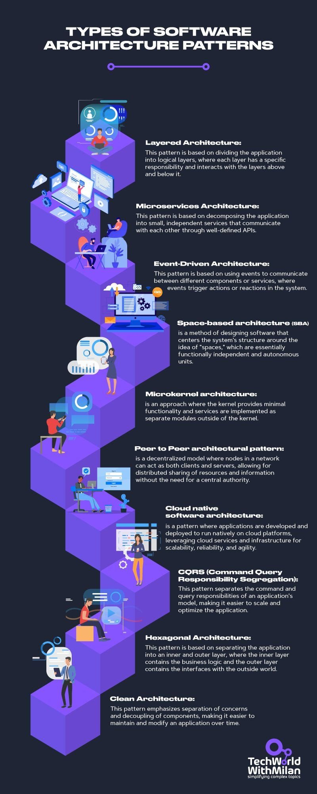

**Source:** [https://twitter.com/i/web/status/1914574010328695117](https://twitter.com/i/web/status/1914574010328695117)
**Original Post Date:** 2025-05-27 21:04:11

# Comprehensive Guide: Essential Software Architecture Patterns

## Introduction
Software architecture patterns are foundational principles that guide the structural organization of applications. This knowledge base provides a detailed analysis of ten essential patterns, each serving distinct purposes in modern software development. Understanding these patterns is crucial for making informed architectural decisions that impact scalability, maintainability, and overall system performance.

Each pattern addresses specific technical challenges and use cases, from monolithic to distributed systems. This guide explores their characteristics, implementation considerations, and real-world applications.

## Layered Architecture

The layered architecture divides an application into discrete logical layers, each responsible for specific functionality. Common layers include presentation, business logic, and data access.

This pattern enforces separation of concerns and simplifies maintenance by isolating changes to specific layers without affecting others.

- Clear boundaries between responsibilities
- Easier testing at individual layer level
- Standardized communication patterns

## Microservices Architecture

A distributed architecture where applications are composed of independently deployable services communicating via APIs. Each service operates autonomously and can be scaled independently.

This pattern enables teams to choose different technologies for each service while maintaining system-wide consistency through well-defined contracts.

1. Independent deployment of services
1. Technology flexibility per service
1. Organized around business capabilities

> **Note/Tip:** Consider service boundaries carefully to avoid excessive coupling.

> **Note/Tip:** Implement robust monitoring and circuit breakers for resilience.

## Event-Driven Architecture

Systems respond to state changes through events, enabling asynchronous communication between decoupled components. This pattern promotes loose coupling and high scalability.

Common implementations include message brokers like Kafka or RabbitMQ for event distribution.

- Decoupling of producers and consumers
- Event sourcing capabilities
- Support for eventual consistency

## Clean Architecture

Emphasizes business logic independence from infrastructure details through concentric circles. The innermost layer contains pure business rules, while outer layers handle adapters and external concerns.

This pattern ensures system maintainability by preventing dependencies on frameworks or technologies.

- Business logic independence
- Testable core without infrastructure
- Technology-agnostic design

## Key Takeaways

- Layered architecture provides clear separation but may introduce tight coupling between layers.
- Microservices offer scalability and team autonomy but require robust DevOps practices.
- Event-driven systems enable decoupling but demand careful event handling strategies.
- Clean architecture ensures maintainability by isolating business logic.

## Conclusion
Understanding these architecture patterns is fundamental to designing scalable, maintainable software systems. Each pattern offers unique benefits and trade-offs that must be carefully considered based on specific project requirements and constraints.

The choice of architectural pattern significantly impacts system flexibility, development velocity, and long-term maintenance costs.

## External References

- [TechWorldWithMilan](https://techworldwithmilan.com)

## Media

**Image Description:** ### Description of the Image

The image is an infographic titled **"Types of Software Architecture Patterns"**. It provides a detailed overview of various software architecture patterns, each explained with a brief description and accompanied by an illustrative icon or diagram. The infographic is visually structured in a vertical format, with each pattern represented as a distinct layer or block, creating a cohesive and organized layout. The background is dark, and the text and illustrations are in bright colors (primarily purple and white), making the content stand out clearly.

### Main Subject: Software Architecture Patterns

The infographic lists and explains **10 different software architecture patterns**, each described with a concise definition and visual representation. Below is a detailed breakdown of each pattern:

---

#### 1. **Layered Architecture**
   - **Description**: This pattern divides the application into logical layers, where each layer has a specific responsibility and interacts with the layers above and below it.
   - **Visual**: A stack of layers, with icons representing different components (e.g., database, business logic, presentation layer).
   - **Key Concept**: Separation of concerns based on functional layers.

---

#### 2. **Microservices Architecture**
   - **Description**: This pattern decomposes the application into small, independent services that communicate with each other through well-defined APIs.
   - **Visual**: A set of interconnected services, with icons representing individual microservices and API communication.
   - **Key Concept**: Decentralized, independent services that can scale and evolve independently.

---

#### 3. **Event-Driven Architecture**
   - **Description**: This pattern uses events to trigger actions or reactions in the system, enabling communication between different components or services.
   - **Visual**: Icons representing event producers, event consumers, and event buses.
   - **Key Concept**: Asynchronous communication based on events.

---

#### 4. **Space-Based Architecture (SBA)**
   - **Description**: This pattern designs software around the idea of "spaces," which are functionally independent and autonomous units.
   - **Visual**: A grid or network of spaces, with icons representing independent units.
   - **Key Concept**: Autonomous, self-contained spaces that can operate independently.

---

#### 5. **Microkernel Architecture**
   - **Description**: This pattern provides a minimal kernel with essential functionality, while implementing additional services as separate modules outside the kernel.
   - **Visual**: A central kernel with modular extensions, represented by icons for the kernel and external modules.
   - **Key Concept**: Minimalist kernel with modular extensibility.

---

#### 6. **Peer-to-Peer (P2P) Architecture**
   - **Description**: A decentralized model where nodes act as both clients and servers, enabling distributed sharing of resources without a central authority.
   - **Visual**: A network of interconnected nodes, with icons representing peer nodes.
   - **Key Concept**: Decentralized, peer-to-peer communication.

---

#### 7. **Cloud-Native Architecture**
   - **Description**: This pattern develops applications to run natively on cloud platforms, leveraging cloud services for scalability, reliability, and agility.
   - **Visual**: Cloud icons, containers, and infrastructure elements.
   - **Key Concept**: Cloud-based, scalable, and agile applications.

---

#### 8. **CQRS (Command Query Responsibility Segregation)**
   - **Description**: This pattern separates command (write) and query (read) responsibilities, making it easier to scale and optimize the application.
   - **Visual**: Icons representing command and query operations, with separate data stores.
   - **Key Concept**: Separation of read and write operations for better scalability.

---

#### 9. **Hexagonal Architecture**
   - **Description**: This pattern separates the application into an inner (business logic) and outer (interfaces) layer, decoupling the core logic from external interactions.
   - **Visual**: A hexagonal shape with inner and outer layers, representing the core and interfaces.
   - **Key Concept**: Decoupled core logic and external interfaces.

---

#### 10. **Clean Architecture**
   - **Description**: This pattern emphasizes separation of concerns and decoupling of components, making it easier to maintain and modify applications over time.
   - **Visual**: Layers representing different concerns (e.g., entities, use cases, interfaces), with icons for each layer.
   - **Key Concept**: Modular, maintainable architecture with clear separation of concerns.

---

### Visual Design Elements
- **Color Scheme**: The infographic uses a dark background with bright purple and white text, making the content highly readable.
- **Icons and Illustrations**: Each pattern is accompanied by relevant icons or diagrams, such as layers, microservices, event buses, and hexagons, to visually represent the concept.
- **Typography**: The text is clean and organized, with headings in bold and descriptions in a clear, concise font.
- **Layout**: The patterns are stacked vertically, creating a logical flow from top to bottom, which aligns with the hierarchical nature of the content.

---

### Branding and Footer
- **Branding**: The infographic is created by **TechWorldWithMilan**, as indicated in the bottom right corner.
- **Tagline**: The tagline "simplifying complex topics" is included, emphasizing the goal of making technical concepts accessible.

---

### Overall Impression
The infographic is well-structured, visually appealing, and informative. It effectively communicates the key concepts of each software architecture pattern using a combination of text and visuals, making it a valuable resource for understanding different architectural approaches in software development.
