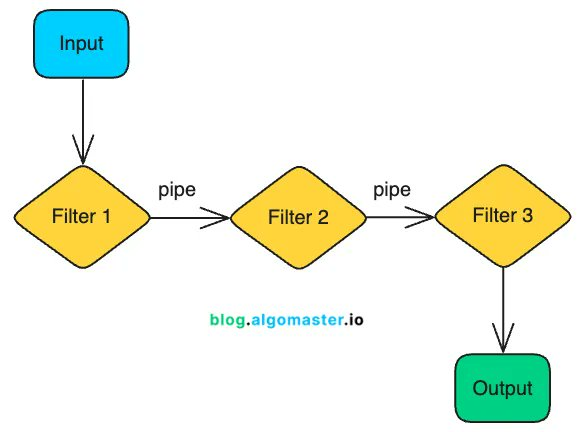

**Source:** [https://twitter.com/i/web/status/1867562953266147369](https://twitter.com/i/web/status/1867562953266147369)
**Original Post Date:** 2025-05-27 16:48:07

# Data Processing Pipeline Pattern: Sequential Filtering Architecture

## Introduction
Data processing pipelines represent a fundamental architectural pattern used across various domains including ETL processes, real-time data streams, and analytics systems. This knowledge base item explores the sequential filtering pattern shown in the diagram, detailing its structure, components, and implementation considerations.

This pattern's strength lies in its linear, composable nature, enabling modular processing stages while maintaining clear data flow direction.

## Overview of Pipeline Architecture

A pipeline architecture represents a sequential series of transformation steps where each stage processes data before passing it to the next. This pattern is particularly valuable for breaking down complex processing into manageable, loosely-coupled stages.

The diagram demonstrates three core components: Input source, Processing filters (F1-F3), and Output sink. Each filter performs discrete operations, enabling independent modification or replacement without affecting other stages.

_A simple implementation showing how filters are chained sequentially_

```python
class Pipeline:
    def __init__(self):
        self.filters = []

    def add_filter(self, filter_fn):
        self.filters.append(filter_fn)

    def process(self, data):
        for f in self.filters:
            data = f(data)
        return data
```

## Component Analysis and Implementation

Each filter stage represents a processing unit that transforms input data into output data. Filters can implement various operations such as validation, transformation, enrichment, or filtering.

Pipes serve as the communication mechanism between stages, handling data transfer while providing opportunities for monitoring, logging, and error handling.

- Filters should be stateless when possible for better scalability
- Error handling should propagate up the pipeline but allow graceful degradation
- Monitoring points should exist between each filter stage

## Design Considerations and Best Practices

When implementing pipeline architectures, consider separation of concerns, loose coupling between stages, and error handling strategies. Each filter should perform a single, well-defined operation.

Performance characteristics may vary based on processing complexity in each stage. Consider asynchronous processing for I/O-bound operations.

> **Note/Tip:** Design filters to be independently testable

> **Note/Tip:** Implement circuit breakers between stages for fault tolerance

> **Note/Tip:** Use metrics at stage boundaries for operational visibility

## Key Takeaways

- Pipeline architecture enables modular, maintainable data processing systems through sequential composition of filters.
- Each filter should perform a single responsibility to ensure clarity and testability.
- Error handling and monitoring between stages are crucial for robust pipeline operation.

## Conclusion
The sequential filtering pattern provides a structured approach to complex data processing challenges. By implementing clear stage boundaries, well-defined interfaces, and proper error handling, teams can build scalable and maintainable systems that evolve with business needs.

## External References

- [Blog Post on Pipeline Architecture](blog.algomastermaster.io)
- [Apache Kafka Streams Documentation](https://kafka.apache.org/documentation/streams/)


## Media

**Image Description:** The image depicts a flowchart that illustrates a data processing pipeline, where input data is processed through a series of filters before producing an output. Below is a detailed description of the image:

### **Main Components and Structure**
1. **Input**:
   - The flowchart begins with a **blue rectangular box** labeled **"Input"**. This represents the initial data or information that enters the pipeline.

2. **Filters**:
   - The input data flows into a series of **diamond-shaped nodes**, each labeled as **"Filter 1"**, **"Filter 2"**, and **"Filter 3"**.
   - These filters are connected in a sequential manner, indicating that the data passes through each filter in order.
   - Each filter is represented by a **diamond shape**, which is a common symbol in flowcharts to denote decision or processing steps.

3. **Pipes**:
   - The connections between the filters are labeled as **"pipe"**, indicating the flow of data from one filter to the next.
   - The pipes are depicted as arrows pointing from one filter to the next, showing the direction of data flow.

4. **Output**:
   - After passing through all the filters, the data reaches a **green rectangular box** labeled **"Output"**. This represents the final processed data or result of the pipeline.

### **Flow of Data**
- The data starts at the **Input** box.
- It then flows into **Filter 1**, where some processing or filtering is applied.
- The output of **Filter 1** is passed through a **pipe** to **Filter 2**.
- Similarly, the output of **Filter 2** is passed through another **pipe** to **Filter 3**.
- Finally, the output of **Filter 3** is directed to the **Output** box, which represents the final result.

### **Technical Details**
1. **Sequential Processing**:
   - The flowchart shows a **linear, sequential processing pipeline**, where each filter processes the data before passing it to the next filter.
   - This structure is typical in data processing pipelines, where each stage refines or transforms the data.

2. **Filter Representation**:
   - The use of **diamond shapes** for filters suggests that these steps may involve decision-making or transformation processes. However, the diagram does not specify the nature of the filtering operations.

3. **Pipes as Data Flow**:
   - The **pipes** (arrows labeled "pipe") explicitly show the direction of data flow, emphasizing the sequential nature of the pipeline.

4. **Output**:
   - The **Output** box signifies the final result after all filters have been applied. This could represent cleaned, transformed, or analyzed data, depending on the context of the pipeline.

### **Additional Notes**
- The flowchart is clean and straightforward, with clear labels and directional arrows.
- The inclusion of the URL **"blog.algomastermaster.io"** at the bottom suggests that this diagram may be part of a blog or educational content related to algorithms or data processing pipelines.

### **Summary**
The image is a visual representation of a data processing pipeline, where input data is sequentially processed through three filters (Filter 1, Filter 2, and Filter 3) before producing an output. The use of pipes and clear labels ensures that the flow of data is easy to follow, making it a useful diagram for explaining sequential data processing workflows.
